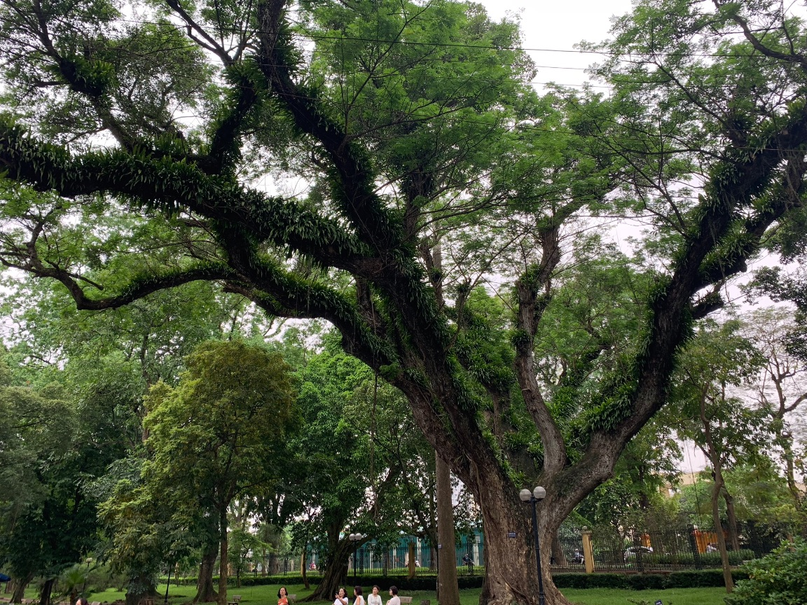
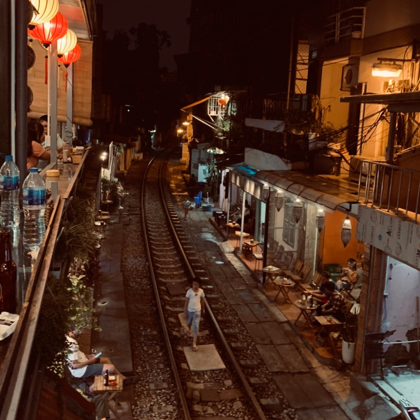
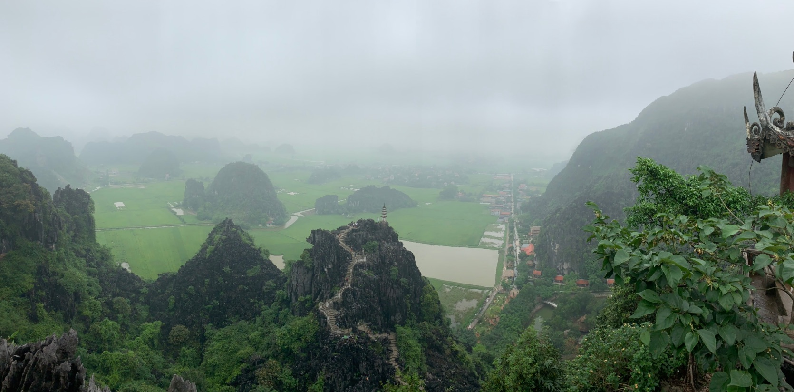
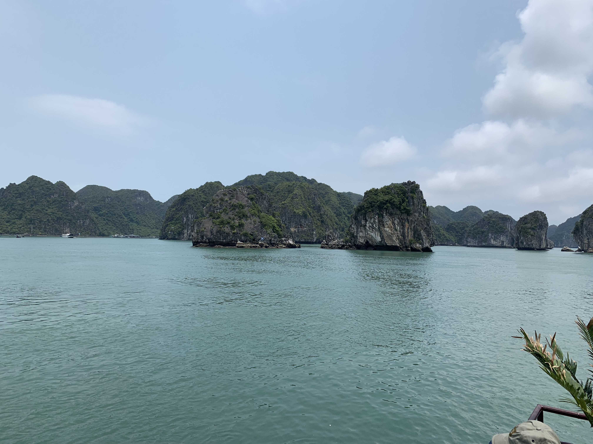
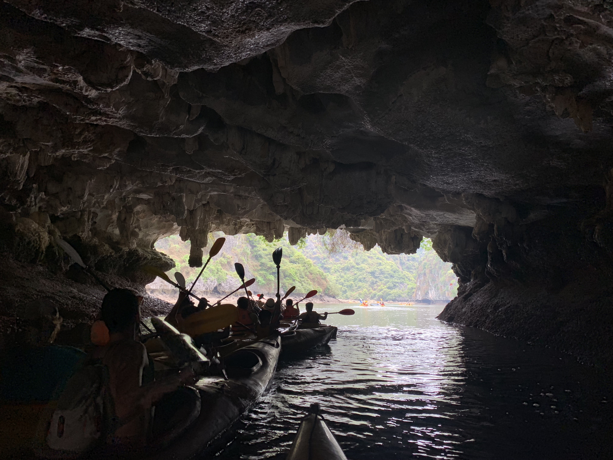
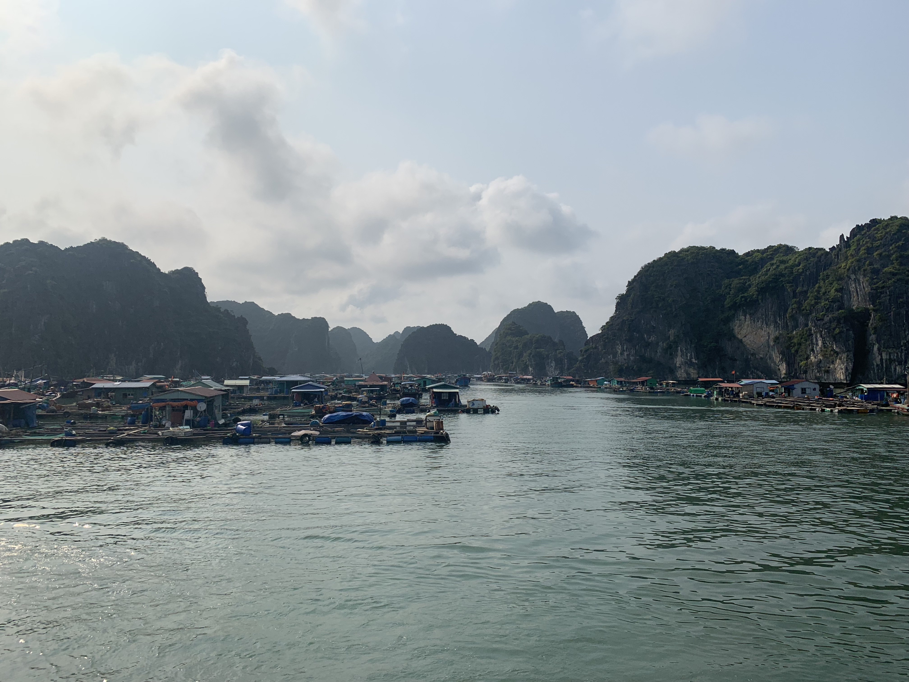
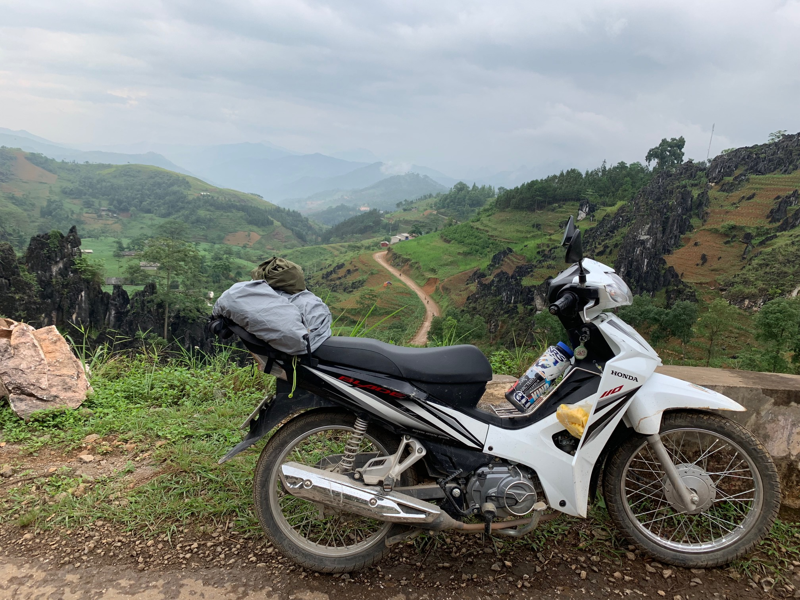
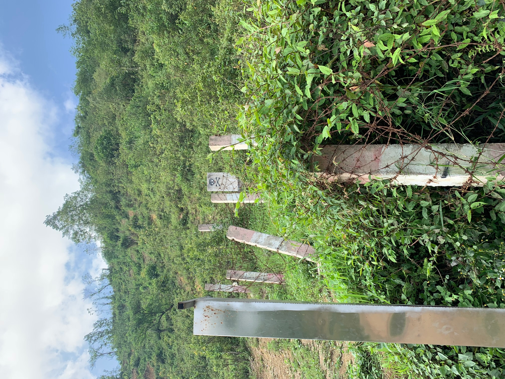
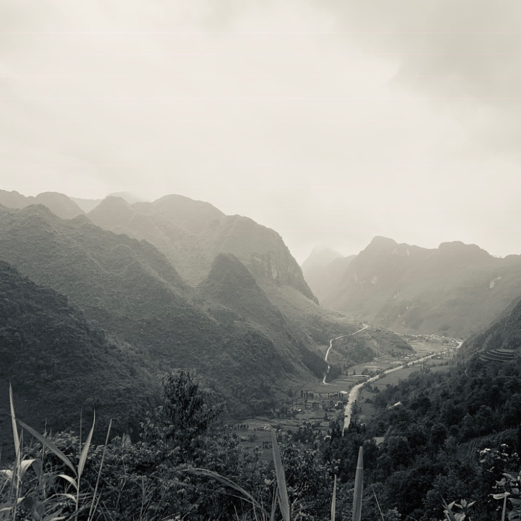

# Việt Nam: A Retrospective

*I visited Vietnam in May of 2019 for an all-too-brief two weeks. This following is a smattering of notes I took in hostels, trains, and planes along the way.*

## Sunday, May 5th
The first day was... not ideal.  The morning of initially went smoothly; I arrived at MSP on time, didn't forget anything, and I was feeling calm and collected. That is until I went up to get my boarding pass for LAX. The attendant casually informed that I had missed the flight. Oops. In my all my careful spreadsheeting of dates and times, I had transposed the arrival and departure times!

In the end, I was able to find a flight to LAX in time to catch the connection to Guangzhou and avoided salvaging an entirely new itinerary. A single Delta flight fit the bill, and at just the right time too! Still, it was a $418 mistake. Not how I had hoped to start this trip.

The Delta flight and layover at LAX were smooth in comparison. It still didn't feel real, even as I sitting in California watching the heat ripple off the pavement. The next flight crosses the Pacific and should plunk me down in Asia. Am I really about to fly across the Pacific? To *China*? In my head, Asia was still an abstract idea.

## Monday, May 6th
Boy, nothing screws up your internal clock like an international flight. The flight served only beef (no thanks), and I was not able to sleep much during the 14 hour flight. However, once in  Guangzhou, the international transfer process was so easy a sleepy foreigner could do it. The airport was clean with a pleasant abundance of real, live plants. This even an included a entire wall of bromeliads and ferns. I was able to (wordlessly) order one of the few vegetarian options available at midnight: okra and beer. Yum!

The final leg of the flight was on a smaller Southern China airbus to Hanoi, where I arrived at midnight local time. I told myself I'd have planned out some smaller details by this point (such as reaching the hostel from the airport), but I still don’t have a real plan. My itinerary just had a single word for tonight: "taxi". At this point, without a SIM card, it seems my only option is to withdraw cash wherever I can and hope the taxis idling out front don't rip me off too hard. I *probably* could have planned this a little better. Tuesday should be more telling and set the tone of the trip proper. Very much looking forward to a bed where I can sleep, horizontally, like a human being and not whatever airplane designers think people are.

## Tuesday, May 7th
Even in the early morning hours I was able to buy a SIM card in the very quiet Nội Bài International Airport. The modern way to get a ride in Vietnam is apparently an app called Grab, like our version of Uber or Lyft. A few clicks get you a ride on your choice of car or motorbike (more on that later). A short ride later, and I was plunked in front of my destination. The hostel was clean and air conditioned. A blessing. I tossed my bag on the bunk and fell asleep on top of it. In the morning I took a shower, and feeling like a human again, decided to take a walk around the legendary [Hoàn Kiếm lake](https://en.wikipedia.org/wiki/Ho%C3%A0n_Ki%E1%BA%BFm_Lake). 

Getting there was hairy. the traffic here has no western comparison. At least in the old quarter, there are no center lines, dividers, or rules. Driving on the right side of the street is a suggestion. Driving on the street at all is a suggestion. The sidewalk works just as well, after all. Despite the apparent chaos accidents seem relatively rare. My first encounter with Hanoian traffic was startling, but went smoothly. The strategy is something like this: pick a lull in the traffic to cross at, say a prayer, and just start walking. The locals will weave around you.

Everywhere there are tiny shops offering noodle dishes. Much of it is prepared right off the side of the street. There’s a good number of wild, exotic trees on the street and especially surrounding the lake. Their gnarled bark splits off into branches that merge back into the trunk, and large fruit hangs from many of them. I didn't recognize a single species.

*Epiphytes cover the trunk of a tree in Bach Thao Park.*

I continued on to West Lake (Hồ Tây), stopping  at the Hanoi Botanical garden on the way. Admittance was a cool eight cents (2,000₫). It was a welcome break from the cacophony of the street. Inside were many palms and a carpet of thick grass. Most enticingly there were also very few other people. There were also a few sad looking peacocks and macaques (con khỉ). I also managed to scammed on the way and paid $8 for a few slices of fried banana bread, which was more than my 22km taxi ride to the Hostel. I wasn't yet adjusted to the hustle and noise, so I decided to take a Grab bike back instead of walking. A biker in a green Grab jacket pulls up, hands you a helmet, you get on the back, and then you're off! This did not feel very safe, but it was very fun. Plus, it only cost 22k₫, which was less than a dollar. 

After lunch I settled into the hostel commons for awhile. The man working the front desk asked if I was going on the walking tour, and having no planned alternative yet, I said yes. I chatted with the first fellow tourist to arrive as people trickled in. The tour was alright, stopping first at a Buddhist temple and then at narrow alleyway full of food vendors. I ordered some spring rolls in Vietnamese (or, more likely, my finger gesturing was sufficient) and my tour group disappeared down the alley. The street vendor was insistent I sit down, so I obliged. When I caught up in the trinket market another tourist, pulled me aside and suggested we ditch the tour, which we did. She had accrued a solid list of foods to try and sights to see, so we set about tasting fresh beer and mango shakes. After a plate of Phở Chiền Phống (fried Phở) we stopped back at the hostel. The backpacking circuit there is always full of naïve English speaking [PMCs](https://en.wikipedia.org/wiki/Professional–managerial_class) to be just like me, so socializing was easy. We met a few new friends and headed back out into the city.

From there we departed to ‘Train Street’, a narrow alleyway with train tracks leaving a spare foot on each side. We enjoyed Bia Hanoi and waited for the train to come. When it did, a loud honk startled us out of our tipsy conversation and rattled the buildings as it went by. We stopped for a butter pastry on the way back to the hostel and a hard earned nights’ sleep.

*It's no joke. When the train comes, there's less than two feet of clearance on either side.*

## Wednesday, May 8
I woke early and headed downstairs for a free breakfast and to plan out what I was doing next. I had decided after talking with some hostel mates the night before that [Ninh Bình](https://en.wikipedia.org/wiki/Ninh_B%C3%ACnh_Province) was next on the docket. Ninh Bình is a smaller and more rural province south of Hanoi. I booked a hostel outside of the city of Ninh Binh and a train ticket to get there. I decided to kill some time around Hoàn Kiếm lake and got to try the famed coffee and condensed milk (Cá Phê Sữa) on the way. Shortly after arriving at the lake, a woman ran after me and begged for help -- first I thought she might be a scammer, but she just wanted homework help! It turns out English fluency is a hot commodity here. After only a year of study, she was already nearly fluent. Conjugation is a tough topic because the Vietnamese language does not do much of it. I tried to explain how prepositions work (turns out she knew more than I did), and in return she helped me a little with my Vietnamese pronunciation. A lost cause, unfortunately. When I told her I was scammed into spending $8 on a fried banana the day before she didn’t believe me. She informed me I could have purchased *one hundred bananas* for that price. She pointed out a local supermarket (inconspicuous to my eyes) and very firmly told me not buy food anywhere else. Always refuse the street vendors! We said goodbye and I took a Grab bike to the station and found my train without issue.

## Thursday, May 9
On the train, I ended up next to a Vinh local on his way back to university. He spoke little English, but we were able to converse through Google Translate. When a trolley came around with snacks, I tried to buy a bag of what I thought were plums with a large note (500,000₫, $21), which is all the ATMs dispense. Note to future visitors: get some foreign cash from your bank before leaving, because nobody can break a bill that large. The woman working the trolley cart shook her head no. In retrospect I had offered an outrageous sum. Something akin to waving Benjamins around at a gas station. Not smart. I was embarrassed and motioned to return the snacks, but my new friend paid for me. The friendliness of your average Vietnamese citizen is hard to overstate. We chatted a little more. He asked if I know what Buddhism was, and I tried to explain I knew *of* it, but not much *about* it. Google struggles with Vietnamese a lot, in no small part to the tendency of the Vietnamese to omit diacritics while typing. Not an easy mapping to make with a tonal language! He eventually reached into his bag and handed me a necklace of prayer beads and insisted I keep them. He demonstrated how to slowly count the beads to cultivate calmness. When we rolled into Ninh Bình, he said goodbye watched me through the window as the train lurched forward once again.

Right away I was besieged by taxi operators offering to take me places. Remembering my lesson on street venders earlier, I turned them all down (multiple times). For the most part this works, but in this case one persistent man followed me outside. Despite my better judgments, I relented and asked what his prices were. He offered a motorbike rental for “today, tomorrow, and second tomorrow” for a 2,000,000₫ ($86). A great deal, he claimed. In the end he was right; it was a better price than my hostel was offering. Still, probably enough purchasing power to buy a new bike. Regardless, I didn't want to deal with getting rid of or licensing my own vehicle. He let me take it around the block, showed me how to operate the lights, and where the gas tank was. When I explained my destination his face lit up. He told me he lived that way and I could follow him halfway there! Great, I thought, I'll just get on this bike I can't ride and follow you at dusk, through the rain, to a hostel that isn't on Google Maps, with 5% left on my phone battery.

Now, if this sounds like a terrible idea to you, then you have better instincts that I do! I certainly could have crashed; I had never ridden a motorbike before. I could have also gotten robbed, or found myself on the wrong end of the law for driving without a license. Regardless, motorbikes are **the** way to get around Vietnam. There was no alternative at this time of day. Something a sane person would have planned for in advance, I suppose.

So, I found myself following a stranger through the bustling Ninh Bình traffic on a moped. We arrived at a city gate where he left me with the vague instructions to go forward and eventually turn right. It was still raining, but thankfully it was a just warm tropical drizzle and not something more serious. I mapped my way with the dregs of my phone's battery and ended up way down a dirt road in the jungle. Wrong — a river separated me and the hostel. I took a few guesses and eventually found my destination, which turned out to be a very pleasant little homestay in the countryside.

I conversed for awhile with the other guests and played pool with two fellow solo travelers named Florian and Nikolas from France and Switzerland, respectively. Florian was on his way out; Nico had just arrived. Nico and I decide to see see the town and the scenery at Hang Múa in the morning. After a decent meal of fried tofu, I fell asleep in the most humid place I'd ever been.

## Friday, May 10th
At 4:30am the entire jungle was awake. The roosters started half an hour before that. The dogs next door were fighting. It was already 72° and the humidity was pushing 97%. I gave up on sleeping and went for an early shower, which I shared with an enormous banana slug.

I killed some time and watched the rest neighborhood wake up. A tiny cat yowled at me for trespassing on his turf. A few hours later, Nico woke up and we chatted, deciding to get breakfast at the hostel. We made a rough plan to stock up in Ninh Bình (I didn’t need anything but motorbike practice) and headed off. The riding was easy, but Ninh Bình is relatively dusty and not as enjoyable as the countryside. At least it was calmer than Hanoi! After Nico found all his supplies (and I found some bandages for my blistered feet) we continue on to Hang Múa, taking a leisurely route though the rice fields. Hang Múa is a little expensive and touristy, but very picturesque. Our version of exploring this area involved climbing a small karst mountain. At the top, there were incredible views of Vietnam's signature topography and the statue of a slender dragon snaking across the peak. Beside the dragon was a small Buddhist shrine. Almost everyone there is a tourist, but at least one visitor paid respects.

We took another long route back through a stone carving district where endless rows of warehouses were staffed by the locals wielding angle grinders against the soft grey of local karst rock. They were sculpting the stone into cherubic lions, stately tomb markers and enormous ornate decorations. A fine white dust settled on my rear view mirrors. That night we drank Bia Hanoi and played pool, falling asleep at the now familiar 8:30pm. At least in the north, everything stops shortly after sunset.

The next day we took another leisurely breakfast before riding out to the main road. We exchanged emails before parting ways. I went on to see the old capital of Ninh Bình, stopping to smell the flowers. A woman tries to sell me gas for an outrageous $8/liter. I was more confident now, and willing to backtrack into town to avoid getting ripped off again. I called her out: Too expensive! Không! Quá đắt! Surprisingly, she seemed  amused that I knew any Vietnamese at all, and offered me a much fairer price which I accepted. The ride back to Ninh Bính was easier than I expected, and I sipped on some juice while waiting for the train. Despite their antiquated exteriors, the trains here always seem to always arrive on time. Priorities, I guess.

My seat on the train was next to an older Vietnamese woman who insisted on teaching me some stretching exercises while a few passengers chuckled at the sight. The trains in Vietnam are so social! Maybe I just stick out as a pale Minnesotan. She kept handing me strange purple fruits - plums? I later learned these "plums" were [star apples](https://en.wikipedia.org/wiki/Chrysophyllum_cainito). At first I ate the seeds, which were _extremely_ bitter. She demonstrated how to eat them, spitting the seeds out and eating only the soft fleshy meat. They had a fine and delicate flavor, but the slimy texture disagreed with me. I thought it rude to decline, so I ate as much as I could. She shows me photos of plants and grand kids on an ancient Nokia phone. We waved goodbye she reaches her stop, and I was left with two dozen star apples.

In Hanoi I’m once again feeling tired and feeling overwhelmed. Even after living on one of the busiest streets in Minneapolis for a year, the cacophony of Hanoi is a lot to handle. I walked around awhile and decide to splurge at a high end restaurant. The one I find is spectacular: It's tucked away and unassuming. Diners can sit on small islands in an indoor koi pond surrounded by live plant walls, entirely isolated from the bustle of Hanoi. I'm the only patron at 6pm on a Friday night.

## Saturday, May 11th
The next morning I booked a bus to Cat Ba island, east of Hanoi.

A man on a scooter lead me out to the street where another woman and I waited for almost half an hour for the bus to appear. It’s a long drive out into the country. I sat next to a Ukrainian woman who alternates between flirting and showing me photos of her wedding, which was last month. Interesting. The bus ride is pretty comfortable, and it's a shock to leave the quiet cocoon of the bus.

The ferry dock was crazy. We disembarked into the searing heat are herded towards the boat. It’s dirty, smelly, and loud. After the ferry we board a second bus, where I booked a room the nearest hostel. It happens to be called ‘Woodstock’. Interesting. I thought I had booked a *room* of some kind. A ceiling, three or even four walls, maybe a bed. It turned out what I actually booked was a tent on the beach for some all-night festival. Marijuana and LSD are on sale at the front desk. No judgement, but I didn't come all this way to do just to LSD. I decided to book an all-day tour of the nearby [Hạ Long Bay](https://en.wikipedia.org/wiki/H%E1%BA%A1_Long_Bay) the very next day.

## Sunday, May 12th
The tour left at 8am. We’re all taken to a dock where I was asked if I planned to be back by 4pm (that was the deal, wasn't it?). Turns out the itinerary is different than I thought. If I wanted to be on the 4pm bus to Hà Giang the next day (yes please), then I should have brought my luggage with me! Whoops. Hạ Long bay is beautiful, but touristy. We stopped at a floating dock to kayak (lots of tourists) and and a beach to swim where I got do a little climbing. After an interlude caused by an exploding isopropyl alcohol bottle left on the hot deck, our last stop is the aptly named "monkey island". My first sight off the boat: a macaque monkey shotgunning a Coca Cola. The monkeys had taken a  firm control of the food court set up near the beach. Interesting.

I changed boats once, and someone picked me up in a van from the ferry dock. He spoke no English and drove while talking on the phone. A Korean family is in the back with me and we're all a little nervous. Either the driver wasn't paying enough attention or the brakes failed, and he slams into the side of a a coach bus. Both drivers get out. The intersection is still incredibly busy. There's shouting. One of the Koreans turns to me and says "Bye!" and they pile out of the van. I supposed that I ought to be leaving too, so I got out, pull up the hostel on Google Maps, and paid someone $20 to drive me there on a bike. Whew.

I developed a mild case of food poisoning on bus ride to Hà Giang, and the ride is bumpy and uncomfortable. It's a six hour drive on paper and an eight hour drive in reality. Night comes, and in some Hanoian suburb I'm ordered off the bus. The replacement/transfer bus is even worse, smelling of mildew, cigarettes, and incredibly humid. I spend most of this time queasy, feeling like I might die, and trying to decide whether or not to throw up. When we arrive I find out the city of Hà Giang is sprawling, and my hostel is tens of kilometers away. I'm not sure if my bus ticket has covered fare to the hostel, and it's now 3am. Two Australians greet me at the bus stop, presumably working for the hostel we're now standing in. They arrange for someone's brother to pick me up in a taxi. I can't remember if I paid him or not. I arrive at the hostel and a woman opens the door. I'm once again exhausted and sleep on top of my backpack.

## Addendum

*At this point I fell of the schedule of keeping a daily log. The following was written almost a year afterward.*

Hà Giang was *easily* the highlight of the trip. After suffering a little to get there, I found the scenery of this region was worth it. I remember bits and pieces... initially I fell in with a group leaving the hostel at the same time. A few Australians who were nice enough, but I eventually left for preference of solitude. The roads became steep and winding. Jungle coats the hills here, like a verdant blanket stitched together by massive, prehistoric ferns. I ended up on a bike again, and it's a huge improvement over my first. The feeling of riding a semiautomatic bike through Vietnam is hard to capture.

*The venerable Honda Blade*

The first day is cold and misty. I'm still with the Australians as we get higher and higher into the mountains. My cheap plastic poncho is not doing much against the cold and damp. My glasses are totally obscured by rain and steam: Impossibly steep cliffs start cropping up. On a slick, mossy switchback one of the Australians wipes out. He asks me if I thought he was going too fast (you crashed, didn't you?). I hold my tongue and leave them behind after awhile.

I stop at a mountain tea house. Hot-chili squid flavored Lay's chips are for sale, but I go for tea instead. I hoped for something local, but a woman serves me a cup of Lipton. Sipping, I watch a cloud tear itself apart softly over the hills. The rest of the ride curves and gracefully weaves through the hills. It takes me past an incredible 50' tall carved stone monument to... socialism?

Some of those locals would give me strange looks, like I was an alien. Some were receptive, especially children. Some would run after you shouting whatever English they knew (HENLO!!). Women in richly colored dresses tended to fields. Even the kids work. I realize it more than ever then: I'm a white westerner who lives in the first world, with super markets and iPads and air conditioning. These people were subsistence farming. I'm wearing a $200 backpack. It is disgusting that I am here like this. A bike passes me carrying another western couple. A man drives, and a woman is perched on the back snapping photos of the locals with a DSLR. With those thoughts swirling in my head, the sight is revolting.

I continue on to Lũng Cú -- the tip of the bike loop and officially my furthest point of 'exploration'. China is a stone's throw. From here, getting home means a two day motorcycle ride, an eight hour bus ride, 45 minutes in a taxi and two plane flights totaling 23 hours just to return to the Minneapolis airport.

This region has a militant history: In 1979, China invaded Vietnam during the [Sino-Vietnamese war](https://en.wikipedia.org/wiki/Sino-Vietnamese_War) as retribution for toppling the genocidal [Khmer Rouge dictatorship](https://en.wikipedia.org/wiki/Khmer_Rouge) in neighboring Cambodia. The United States, of course, chose to back the Red Khmer regime to the end. I was told to stay off uncleared portions of the border as it might still have live land mines. Duly noted. 

*Perhaps another route would be better*

In Lũng Cú, Vietnam has recently constructed a massive granite flag tower overlooking China. I climb to the top. Two young army officers are working taking down the huge scarlet one-starred Vietnamese flag. The view is spectacular, and I share the summit with a group of Chinese tourists. As I leave, an even bigger Vietnamese flag is hoisted up the flagpole.

I ride on, past cinderblock houses with chickens in front; past a moonscape of twisted black igneous rock and neon green algae; past a valley entirely planted with corn, where the houses hide below the tall stalks. Suddenly the new road ends at an embankment and I have to pull the bike up the other side. A modern, freeway grade road takes up the other side. When I have to stop for gas and water, I find myself at a strangely western styled convenience store. The shop is set up very professionally, but a team of six close friends or family are manning it. They're playing karaoke. I'm the only customer there. One of the employees is extremely drunk. He offers me rice wine, and demand I sing. I do my best, but it's a rough show.

*20 kilometers south of the Chinese border*

The rest of the ride is uneventful. Knowing the trip is over was painful. On the bus back, I meet a (white, western) Cambodian journalist and a German who's been traveling for six months. They're both on the tail end of their trips as well, and none of us make an effort to know each other. We're all tired. The driver switches on very loud house music, and I can already tell it's going to be a long ride. Incredibly, the German is already asleep. When she woke up, I inquired and she explained that even the most powerful sedatives don't require a prescription here.

I'm grateful to be back among my many creature comforts, but sitting at a cubicle makes me wistful. Now, in the grip of COVID-19, travel seems like a very remote possibility. I'm not sure why I wrote this all down; maybe as a way of venting frustration that I can't do this again anytime soon. That I'm locked into an office life for the foreseeable future. I ought to count my blessings though; to be able to go at all was an act of wealthy privilege. International travel for leisure is a luxury enjoyed by very few.

Vietnam is hard to describe. I hope I've done it justice. Sometimes words aren't enough though, so I'll leave the reader with a [small montage](https://vimeo.com/356092347) of my time there.