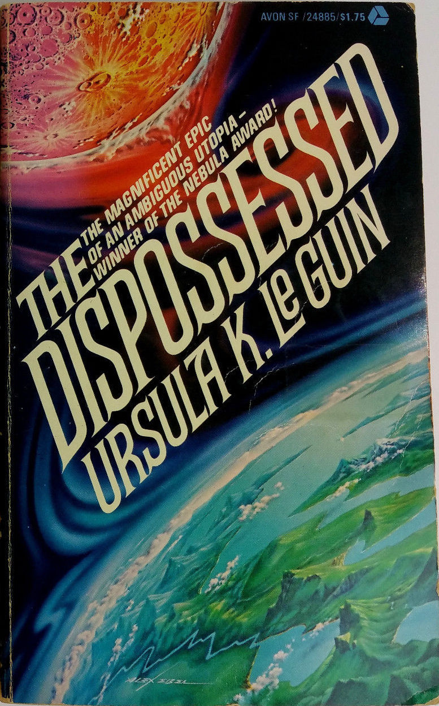

I recently finished (and very much enjoyed) this book, so I figured I'd give it a short review along with some background. The novel follows a few of Le Guin's signature topics, namely society, gender, and sexuality in her classic context of science fiction. This review will contain mild spoilers.

---
### Background

*The Dispossessed* was published in 1974, a turbulent time on Earth. It manages to encapsulate the cold war zeitgeist of the decade while also exploring an alternative, utopian future. The novel begins on a plant called Anarres, part of a star system called Tau Ceti containing only one other planet, Urras. Each planet's inhabitants regards the other as moon containing a strange and indecipherable race. Urras appears to be a microcosm of Earth, specifically the interactions of the United States and Soviet Russia. On Urras only three major powers are mentioned:
- *A-Io*, a thoroughly capitalist society (referred to by the inhabitants of Anarres as "propertarians")
- *Thu*, an authoritarian socialist society (what an American would consider Communist)
- *Benbili*, an undeveloped land fought over in [proxy wars](https://en.wikipedia.org/wiki/Vietnam_War) between A-Io and Thu.

Where things become interesting is on the "moon" world of *Anarres*. Here, Le Guin proposes an alternative middle way between the rugged individualism of *A-Io* and the uncompromising totalitarianism of *Thu*. Over the course of the novel it is slowly revealed that the *Anarresti* are followers of a philosophy called Odonianism, which encourages socialism through mutual aid without the coercion of a powerful state. In fact, they shun any and all hierarchical structures in society, but willingly form cooperative groups called 'syndicates' when it is beneficial to the collective. If this sounds familiar to you, it is likely because it is a nearly word-for-word adaptation of Russian revolutionary Mikhail Bakunin's ideals of non-authoritarian (libertarian) socialism. Phrased another way, it's an anarchistic society.

---
### Mikhail Bakunin
As a brief aside, I'll try to introduce the Russian revolutionary [Mikhail Bakunin](https://en.wikipedia.org/wiki/Mikhail_Bakunin). He's a flawed (antisemitic) but interesting figure who was the subject of extreme persecution which moulded his hatred of hierarchy.

---
Bakunin was born in Russia in 1814 and lived as a contemporary (and later opponent) of Karl Marx. By the 1840s he had developed a fascination with philosophy and had trotted around much of Europe. Both Bakunin and Marx became interested in overthrowing the aristocracy of Europe, viewing it as an oppressor, but a schism developed between the two over what should replace it. Marx favored the contentious dictatorship of the proletariat, whereas Bakunin developed a distaste for all things authoritarian. Bakunin refined these ideals over many years of exile, spending time in the Russian Empire's gulags, amongst the intelligentsia enclaves of Switzerland, and travelling abroad as far as Japan and the United States. His story is well chronicled in season ten of Mike Duncan's [Revolutions](https://thehistoryofrome.typepad.com/revolutions_podcast/) podcast, which I highly recommend.

---
### the rule of none
> "Where the state begins, individual liberty ceases."

Bakunin did not seek to destroy mankind, and true libertarian socialism does not reflect the flavor of anarchism so colorfully described by the American right wing of violent, angry mobs. Anarchism reserves violence for property, not people. While Bakunin did support a sworn freemason-like society dedicated to the destruction of hierarchy, this was not borne of some hatred for mankind or peace. Instead, Bakunin valued the freedom of man over all other ideals. This led him to a series of ideas mirrored by the Odonians on Anarres:
- Any hierarchy should be destroyed along with its apparatus.
- Wealth should not be accumulated, as this will naturally lead to a hierarchy.
- True liberty comes from equality (yes, including feminism!)

In the ideal anarchist society, there is no property. You do not own a house, there is no money, and there can be no theft. That is not to say there is no organization: It is still beneficial, after all, for a group of farmers to collaborate on a grain mill, or for communities to create institutions like universities. In the spirit of freedom, there are no police and no jails. If you are unable to cooperate with society, you simply cease to enjoy its cooperative benefits. If you find cannot work with a syndicate, you are free to work independently or create a new syndicate. This "bottom-up" organization is often referred to as [syndicalism](https://en.wikipedia.org/wiki/Syndicate). Communities can cooperate on a larger scale through direct democracy and federalism.

---
### anarchy on Anarres
> “The individual cannot bargain with the State. The State recognizes no coinage but power: and it issues the coins itself.” 

The true value of Le Guin's utopian depiction of anarcho-socialism is that it does *not* present the picture of a perfect society. It does not present mutual aid as a panacea for Earthly woes. There is suffering and death. People go hungry. The ideals of anarchism, though widely professed, are not always met. Hierarchy seeps in through the cracks of institutions. However, it addresses a key question: is an *attempt* at true equality better than the alternative? Though initially painted as peaceful and prosperous, the rich metaphorical nations on Urras are shown to be fundamentally flawed. In *The Dispossessed*, Le Guin makes the case that brotherhood and freedom are worth more than the sum of their parts. 

Superficially, *The Dispossessed* enjoys all the hallmarks of a good read. The setting is interesting, the dialog believable, and the pacing tight. I do not recommend it here only for its academic usefulness as it's a genuinely enjoyable novel. Le Guin has yet to disappoint me with any of her novels. For a deeper look at gender and society I would further recommend her novel *Left hand of Darkness*, which follows an explorer in an androgynous land. On a final note, Ursua Le Guin would have have turned 90 last week. Happy birthday, Ursula.

> “It is our suffering that brings us together. It is not love. Love does not obey the mind, and turns to hate when forced. The bond that binds us is beyond choice. We are brothers. We are brothers in what we share. In pain, which each of us must suffer alone, in hunger, in poverty, in hope, we know our brotherhood. We know it, because we have had to learn it. We know that there is no help for us but from one another, that no hand will save us if we do not reach out our hand. And the hand that you reach out is empty, as mine is. You have nothing. You possess nothing. You own nothing. You are free. All you have is what you are, and what you give.”