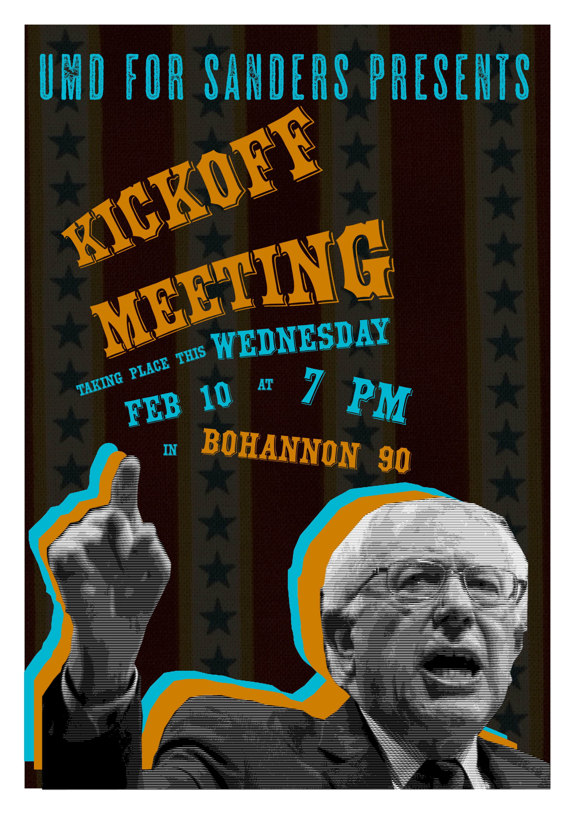

The 2016 and 2020 democratic presidential primaries were sham elections, both [by design](https://en.wikipedia.org/wiki/Superdelegate) and through [a coordinated effort by the candidates](https://www.salon.com/2019/11/27/obama-privately-vowed-to-intervene-in-primary-to-stop-bernie-sanders-from-winning-nomination-report/) to maintain the neoliberal flavor of the party.

Consider that within three days of Super Tuesday; [all the moderate candidates dropped out](https://en.wikipedia.org/wiki/2020_Democratic_Party_presidential_primaries#March_2020) to shore up the Biden campaign. This left Biden alone on the moderate side, leaving only Warren and Sanders outside the moderate camp to split the progressive vote. I find it difficult to take Warren in good faith considering her [conservative past](https://fedsoc.org/contributors/elizabeth-warren) and the fact that [Sanders asked personally asked her to run in 2018](https://thehill.com/blogs/ballot-box/presidential-races/190544-bernie-sanders-wont-rule-out-presidential-bid-touts), joining the race only after she first declined to take the reins.

However, putting my cynicism and suspicions aside, it's time to take a look at our presumptive nominee's [campaign website](https://joebiden.com/joes-vision/) and give it a review in good faith. 

### the pandemic
Biden's pandemic plan is a seven point list:

1. Fix Trump’s testing-and-tracing fiasco to ensure all Americans have access to regular, reliable, and free testing.
2. Fix personal protective equipment (PPE) problems for good.
3. Provide clear, consistent, evidence-based national guidance for how communities should navigate the pandemic — and the resources for schools, small businesses, and families to make it through.
4. Plan for the effective, equitable distribution of treatments and vaccines because discovering isn’t enough if they get distributed like Trump’s testing and PPE fiascos.
5. Protect Older Americans and Others at High Risk.
6. Rebuild and expand the defenses that Trump has dismantled to predict, prevent, and mitigate pandemic threats, including those coming from China.
7. Implement mask mandates nationwide by working with governors and mayors and by asking the American people to do what they do best: step up in a time of crisis.

A few things that stands out to me: testing is *not* mentioned to be free, though a future vaccine *is*. The jab at China in number 6 is perplexing as [China has the virus almost entirely contained](https://www.worldometers.info/coronavirus/#countries), reporting only 33 cases today against the US' nearly 9,000. Indeed, this weekend the US [set a world record for the number of newly reported cases](https://www.bbc.com/news/world-us-canada-54751759). Lastly, and most alarmingly, point 7 does not explicitly state Joe plans to set a national mask mandate; merely that he will work to set up mandates with each state. Perhaps the campaign fears a national mandate would be found unconstitutional? Regardless, this is not an issue states should be allowed choose to follow on their own.

### taxes
Modest tax increases on the wealthy.
- The plan correctly mentions Trump's current corporate tax rate of 21% is insane and proposes raising it to 28%. This in itself is fine, but I can't help but notice that is [still down 7% from the Obama administration's corporate tax rate of 35%](https://tradingeconomics.com/united-states/corporate-tax-rate).
- Joe's plan involves a meager 2.6% bump to the top marginal income tax rate from 37% to 39.6%. This doesn't reflect the moving of tax brackets, but it is still a far cry from the [pre-Reagan era of 90+%](https://www.taxpolicycenter.org/statistics/historical-highest-marginal-income-tax-rates).
- The idea of a minimum 15% corporate tax is nice. It also probably won't happen while the democrats continue to pretend that bipartisanship is viable.

### foreign policy
- One stated policy is ending family separation at the southern border. This is obviously desirable, but again I feel obliged to mention that many of these kinds of policies were started under [the Obama administration, including quotas](https://en.wikipedia.org/wiki/Immigration_detention_in_the_United_States#Immigration_detention_under_Obama), and were simply accelerated under Trump.
- Talk of ending torture but no mention of Guantanamo.
- No mention of ending the Cuban embargo.
- Talk of slowing nuclear proliferation, which is always humorous from the most heavily armed nation on Earth.
- Some mentioned positives: ending the [Global Gag Rule](https://www.plannedparenthoodaction.org/communities/planned-parenthood-global/end-global-gag-rule), ending support for the Saudi genocide in Yemen, and ending the [Muslim travel ban](https://en.wikipedia.org/wiki/Executive_Order_13769).

### the money number (economy)
There are some positives to be had here. He acknowledges the of reality massive, chronic wage theft:
> Yet employers steal about $15 billion a year from working people just by paying workers less than the minimum wage.
However, he stops short of proposing anything specific to fix this.

Another nice idea is expanding collective bargaining law to independent contractors. Encouragingly, Biden supports a $15 minimum wage, a $3/hr increase from the concession Clinton was willing to make in 2016.

### immigration
This section makes a good point: 
> Critically, the Obama-Biden administration recognized that irregular migration from the Northern Triangle countries of Central America cannot be effectively addressed if solutions only focus on our southern border. The better answer lies in addressing the root causes that push desperate people to flee their homes in the first place: violence and insecurity, lack of economic opportunity, and corrupt governance. As Vice President, Biden spearheaded the administration’s efforts in El Salvador, Guatemala, and Honduras.
However, it would be nice to hear recognition that the current regional  instability was *directly* caused both by the US war on drugs and by CIA backed killings in [El Salvador](https://en.wikipedia.org/wiki/Salvadoran_Civil_War#JRG_coup_October_1979), [Guatemala](https://en.wikipedia.org/wiki/1954_Guatemalan_coup_d%27%C3%A9tat), and [Honduras](https://en.wikipedia.org/wiki/CIA_activities_in_Guatemala)! 

Some positives:
- Upholding DACA
- Reinstating Temporary Protected Status

However, this section is entirely undermined by the failure to push for the dissolution of ICE and CBP. This section, in particular, must be some kind of satirical joke:
> Ensure that Immigration and Customs Enforcement (ICE) and Customs and Border Protection (CBP) personnel abide by professional standards and are held accountable for inhumane treatment. **Biden will increase resources** for training and demand transparency in and independent oversight over ICE and CBP’s activities.

### healthcare
How many different ways can we dance around universal healthcare?

### climate
Biden starts off with a bold claim:
> Ensure the U.S. achieves a 100% clean energy economy and reaches net-zero emissions no later than 2050. 
This is a surprisingly aggressive timeline, even in a more authoritarian state like China. It's also a more complete proposal than what the democrats floated in 2016, which was [half carbon neutral *just in the generation sector* by 2030](https://ballotpedia.org/Hillary_Clinton_presidential_campaign,_2016/Climate_change). The site also mentions attacking some of the largest polluters, but declines to name any names. Nationalizing these would be a key first step for any serious climate plan.
> Biden’s climate and environmental justice proposal will make a federal investment of $1.7 trillion over the next ten years, leveraging additional private sector and state and local investments to total to more than $5 trillion.
This is nice, but the [Green New Deal](https://berniesanders.com/issues/green-new-deal/) I would have preferred called for **directly** investing $16.3 trillion -- a tenfold reduction in proposed funds *before* reconciliation. He also commits to a $200 billion donation to the Green Climate Fund, which is cute. Our obligation to [countries we've literally destroyed](https://en.wikipedia.org/wiki/Highway_of_Death) in the past hundred years is hard to overstate, and $200 billion is a drop in the bucket. For a case example, take a gander at Season 1 of the [Blowback Podcast](https://blowback.show/) which details the incredible extent of the destruction of infrastructure caused by America in the Iraq war alone.

They can't resist another jab a China here, and correctly note that it is the world's largest polluter. This is also mentioned in [China's latest 5 year plan](https://en.wikipedia.org/wiki/Five-year_plans_of_China#Fourteenth_plan_(2021-2025)) with goals for 2060 net neutral emissions. I'm more inclined to believe China's 2060 claim over the United States' 2050 plan for a few reasons:
- China has more stable leadership (of course stemming from being a relatively authoritarian state)
- China does not fear [large, disruptive infrastructure works](https://en.wikipedia.org/wiki/Three_Gorges_Dam)
- The five year plans have a decent history of meeting goals (at least on paper)

---

That's about all the focus group intern-speak I can handle for the time being. These proposals are milder than I'd prefer but if he actually accomplished them all it would still be an impressive feat. However, I wonder if capitulation to the right in a vain attempt to build the largest tent on Earth might get in the way.