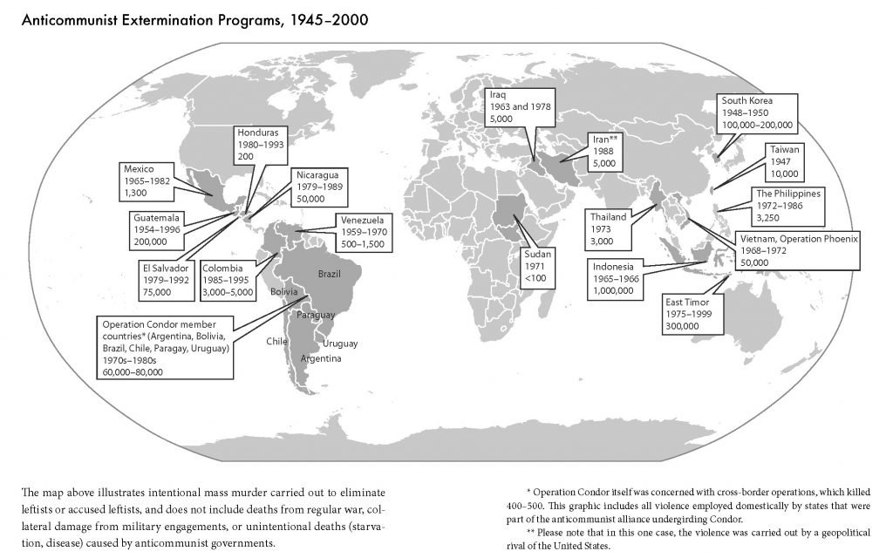

# ballot boxing and *The Jakarta Method*

Well, here we are, post-election. The democrats won the presidential cause célèbre, yet the outcome was far closer than it was supposed to be. It seems the models were correct, but skewed to the "worst case" scenarios for democrats. The presidential race, expected to be a landslide referendum, became a nail-biter. Control of the senate, considered likely, is now up in the air. Ground was lost in the house. All in all, a disappointing performance and setup for an even more disappointing two years of Mitch McConnell blocking anything that crosses his desk. Despite this, Biden will have the opportunity to make *some* progress via executive orders.

### money isn't everything

Democrats raised a huge amount of money, including [seven of the most expensive senate campaigns in US history](https://www.cnn.com/2020/10/15/politics/senate-races-fundraising-2020-election/index.html). In each of these races democrats had larger coffers, usually by a factor of two or more. Despite these impressive fundraising numbers, democrats did not fair well in those races:

1. North Carolina chose republican Thom Tillis over Cal Cunningham in a race worth [$46 million](https://www.opensecrets.org/races/summary?cycle=2020&id=NCS1).
2. Iowa's incumbent republican Joni Ernst won, despite her challenger, Theresa Greenfield, raising [$47 million.](https://www.opensecrets.org/races/summary?cycle=2020&id=IAS2)
3. Arizona's Mark Kelly won a senate seat for the democrats by 3.8% at the cost of [$88 million](https://www.opensecrets.org/races/summary?cycle=2020&id=AZS1). Perhaps the democrats just need more astronauts?
4. In Montana, Steve Bullock [raised $43 million](https://www.opensecrets.org/races/summary?cycle=2020&id=MTS2) and lost to republican incumbent Steve Daines.
5. South Carolina's senate race chose republican incumbent Lindsay Graham despite the democratic challenger Jamie Harrison raising [$107 million]($107,568,737).
6. Maine's democratic challenger Sara Gideon [raised $70 million](https://www.opensecrets.org/races/summary?cycle=2020&id=MES2) in the race against Susan Collins in Maine. She lost by 10 percentage points.
7. Georgia's senate race remains too close to call.

Just for fun, I'll throw in one more comically doomed senate race: Kentucky democrat Amy McGrath [raised almost $88 million](https://www.opensecrets.org/races/summary?cycle=2020&id=KYS1) to challenge senate majority leader Mitch McConnell only to lose by 20 percentage points. In these eight races alone, democrats spent *over $400 million* on losing races. Republicans spent *half* that amount to win six of the seven called races, and usually by large margins. Perhaps the problem is not the volume of messaging, but the message itself.

### the big lyft grift
California likes to do [ballot propositions](https://en.wikipedia.org/wiki/California_ballot_proposition), which are a direct democracy, plebiscite-style question asking voters if they would like to amend a law. This cycle had a fair number, including a particularly sinister one with the catchy title Proposition 22. Here's how it appeared on the ballot:
> EXEMPTS APP-BASED TRANSPORTATION AND DELIVERY COMPANIES FROM PROVIDING EMPLOYEE BENEFITS TO CERTAIN DRIVERS.  INITIATIVE STATUTE.  Classifies app-based drivers as “independent contractors,” instead of “employees,” and provides independent-contractor drivers other compensation, unless certain criteria are met.  Fiscal Impact:  Minor increase in state income taxes paid by rideshare and delivery company drivers and investors.
It's a fairly thick couple of sentences. The effect, however, is simple: it's a loophole that allows companies to avoid paying benefits for full-time workers. This is of course advantagous to companies like Postmates, Instacart, Lyft and Uber who won't have to provide health insurance, paid sick leave, disability, the right to unionize, or any of the other hard-won worker's rights just by labeling them contractors... even if they're working full time! To me, this is the worst news to come from the election cycle as it provides a glimpse into the future of the American gig economy. Despite both Uber and Lyft [hemorrhaging money](https://www.nytimes.com/2019/10/30/technology/lyft-earnings-profitability.html) and reporting $0 profit, they managed to spend [$185 million](https://www.cnn.com/2020/10/08/tech/proposition-22-california/index.html) in propaganda for the ballot measure. The measure passed with 58% approval, sending Uber and Lyft shares up 11%.

---

## The Jakarta Method
In unrelated news, I just finished reading *The Jakarta Method*, and it was an excellent, nearly unbelievable primer on America's most fervent anticommunist operations during the cold war. It is named after the bloody protocol developed in Jakarta, Indonesia for efficient removal of communists and slamming the [Overton window](https://en.wikipedia.org/wiki/Overton_window) shut on politics left of center. By bankrolling fascist pockets of the military, the United States found a much neater method of cracking open hesitant foreign markets than the messy, hands-on approach used in [Guatemala](https://en.wikipedia.org/wiki/Guatemalan_Civil_War), [Viet Nam](https://en.wikipedia.org/wiki/Vietnam_War), or [South Korea](https://en.wikipedia.org/wiki/Korean_War). What's perhaps most striking is the sheer scale and number of involvements:

Many of the atrocities were performed by foreigners on foreigners, but the US remained involved at every level. Before developing this procedure, the United States assisted fascists directly with weaponry as in Guatemala, or thru training and recruitment as in the Bay of Pigs invasion. In other cases, the US promised not to intervene, such as in Suharto's handling of East Timor. After the Iran-Contra affair, we became more discrete. The end result is the same either way: communists, sympathizers, and people perceived as vulnerable to leftist thought ended up dead, and in mass numbers. What's more, the United States knew at the highest levels that these mass murder programs were underway and gave them tacit approval. It serves as an easy answer to anyone lofting the [Black Book of Communism](https://en.wikipedia.org/wiki/The_Black_Book_of_Communism) as justification for political violence.

This is not an easy read, but an important one for an American. Much of the country is well versed in the mistakes and problems in the Soviet Union. What wasn't taught in my highschool is the violence perpetrated by *us* (or anything after 1945 for that matter). If you've ever wonder why the some of the US enjoys such extreme luxury, or why the developing world just doesn't seem to be catching up, this would be a good place to start. To this day, the perpetrators remain popular public figures. Here's Bloomberg news, [politely asking for Henry Kissinger's opinion on China](https://www.bloomberg.com/news/videos/2020-11-16/kissinger-warns-of-catastrophe-if-u-s-and-china-don-t-cooperate-video), even after [his support for the homicidal Pinochet regime](https://www.theguardian.com/world/1999/feb/28/pinochet.chile) came to light. After reading about the full extent of United States war crimes, I find myself siding with Anthony Bourdain on the matter:

> Once you’ve been to Cambodia, you’ll never stop wanting to beat Henry Kissinger to death with your bare hands. You will never again be able to open a newspaper and read about that treacherous, prevaricating, murderous scumbag sitting down for a nice chat with Charlie Rose or attending some black-tie affair for a new glossy magazine without choking. Witness what Henry did in Cambodia – the fruits of his genius for statesmanship – and you will never understand why he’s not sitting in the dock at The Hague next to Milošević. While Henry continues to nibble nori rolls & remaki at A-list parties, Cambodia, the neutral nation he secretly and illegally bombed, invaded, undermined, and then threw to the dogs, is still trying to raise itself up on its one remaining leg. 
- Anthony Bourdain, *A Cook's Tour*