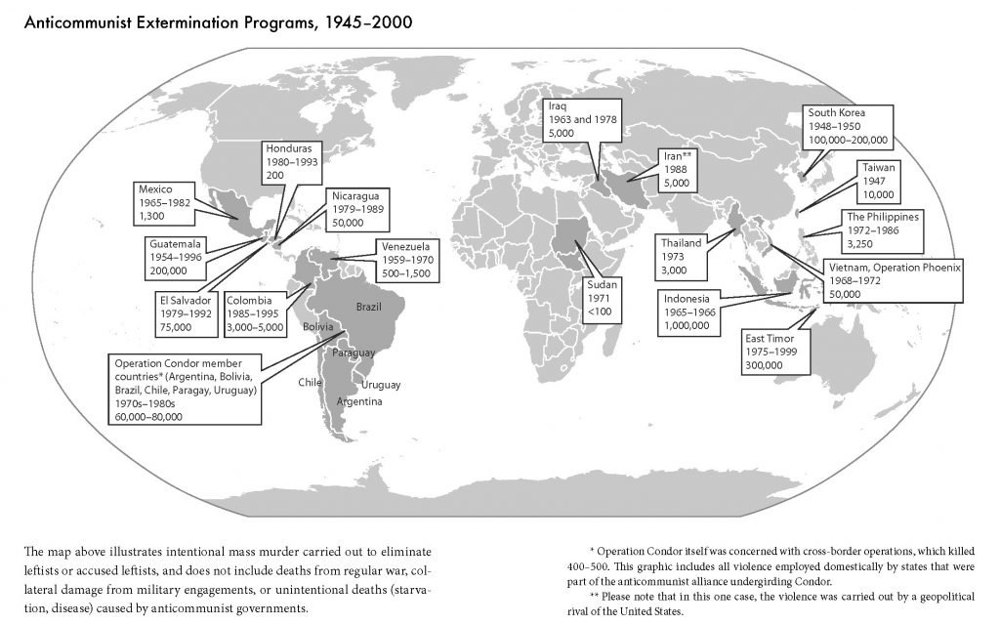

I just finished reading *The Jakarta Method*, and it was a nearly unbelievable primer on America's most fervent anticommunist operations during the cold war. It is named after the bloody protocol developed in Jakarta, Indonesia for efficient removal of communists and slamming the [Overton window](https://en.wikipedia.org/wiki/Overton_window) shut on politics left of center. By bankrolling fascist pockets of the military, the United States found a much neater method of cracking open hesitant foreign markets than the messy, hands-on approach used in [Guatemala](https://en.wikipedia.org/wiki/Guatemalan_Civil_War), [Viet Nam](https://en.wikipedia.org/wiki/Vietnam_War), or [South Korea](https://en.wikipedia.org/wiki/Korean_War). What's perhaps most striking is the sheer scale and number of involvements:

Many of the atrocities were performed by foreigners on foreigners, but the US remained involved at every level. Before developing this procedure, the United States assisted fascists directly with weaponry as in Guatemala, or thru training and recruitment as in the Bay of Pigs invasion. In other cases, the US promised not to intervene, such as in Suharto's handling of East Timor. After the Iran-Contra affair, we became more discrete. The end result is the same either way: communists, sympathizers, and people perceived as vulnerable to leftist thought ended up dead, and in mass numbers. What's more, the United States knew at the highest levels that these mass murder programs were underway and gave them tacit approval. It serves as an easy answer to anyone lofting the [Black Book of Communism](https://en.wikipedia.org/wiki/The_Black_Book_of_Communism) as justification for political violence.

This is not an easy read, but an important one for an American. Much of the country is well versed in the mistakes and problems in the Soviet Union. What wasn't taught in my highschool is the violence perpetrated by *us* (or anything after 1945 for that matter). If you've ever wonder why the some of the US enjoys such extreme luxury, or why the developing world just doesn't seem to be catching up, this would be a good place to start. To this day, the perpetrators remain popular public figures. Here's Bloomberg news, [politely asking for Henry Kissinger's opinion on China](https://www.bloomberg.com/news/videos/2020-11-16/kissinger-warns-of-catastrophe-if-u-s-and-china-don-t-cooperate-video), even after [his support for the homicidal Pinochet regime](https://www.theguardian.com/world/1999/feb/28/pinochet.chile) came to light. After reading about the full extent of United States war crimes, I find myself siding with Anthony Bourdain on the matter:

> Once you’ve been to Cambodia, you’ll never stop wanting to beat Henry Kissinger to death with your bare hands. You will never again be able to open a newspaper and read about that treacherous, prevaricating, murderous scumbag sitting down for a nice chat with Charlie Rose or attending some black-tie affair for a new glossy magazine without choking. Witness what Henry did in Cambodia – the fruits of his genius for statesmanship – and you will never understand why he’s not sitting in the dock at The Hague next to Milošević. While Henry continues to nibble nori rolls & remaki at A-list parties, Cambodia, the neutral nation he secretly and illegally bombed, invaded, undermined, and then threw to the dogs, is still trying to raise itself up on its one remaining leg. 
- Anthony Bourdain, *A Cook's Tour*