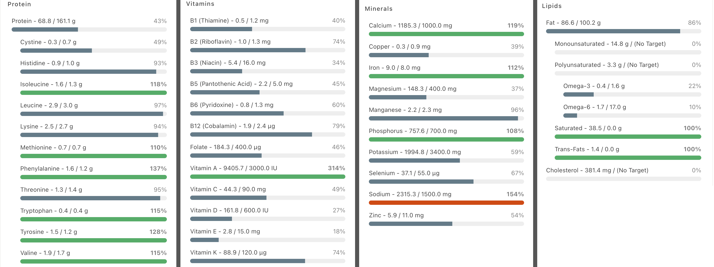
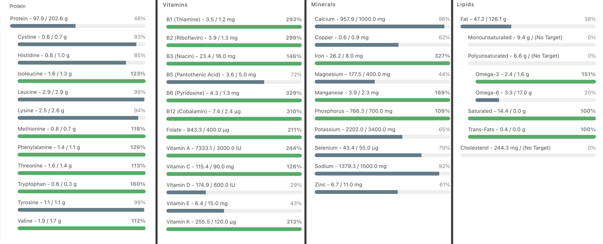

# Bites and Bits
## Gamifying micronutrients

I recently got an ad for a multivitamin aimed specifically at vegetarians. The concept seems sound: vegetarians like myself [have a harder time coming by certain nutrients like the B vitamins](https://www.mayoclinic.org/healthy-lifestyle/nutrition-and-healthy-eating/in-depth/vegetarian-diet/art-20046446). When someone learns I don't consume meat, there is a good chance I'll be asked about protein. Where do you get it from without meat? Until now, I've always just shrugged. I've been entirely meat-free for over 16 years and I've never had trouble running, biking, or climbing. I haven't dropped dead, so surely I'm doing *alright*! When I started looking into multivitamins, however, I found a distinct lack of studies correlating them with wellbeing or a lowered mortality rate, even for vegetarians. Unless you're seriously deficient, most studies conclude that multivitamins are, at best, harmless. The Mayo Clinic agrees, [stating that whole foods are usually a better source of nutrients than multivitamins](https://newsnetwork.mayoclinic.org/discussion/multivitamins-and-supplements-to-take-or-not-to-take/), and appear to be absorbed more efficiently and yield better benefits.

So, how do we know we're eating the right stuff? Coincidentally, my flatmate recently ordered a digital scale and I have no shortage of time, so I've resolved to log everything I eat or drink into a nutrient tracking app for the next week to get a clearer picture. The easy method is to log foods in bulk; entries in most nutritional databases exist for meals like "greek salad" or "pesto pasta". I'm going to go more granular than that, however! There is also an option to log ingredients, individually, down to the gram. Nutritional makeup is provided from databases like [FoodData Central](https://fdc.nal.usda.gov/). It takes awhile to weigh everything as you cook, but hey, it's better than [doomscrolling](https://en.wikipedia.org/wiki/Doomscrolling) on Twitter. The app also presents a list of daily value nutritional targets for macronutrients like carbs, fat, and protein along with micronutrients like vitamins and minerals based on height, weight, sex, and activity level. Macros are easy - if you're short on carbs eat some bread, cheese for fat, and legumes for protein. For that reason, I'll be focusing on micronutrients for this "experiment".

I made no effort to eat differently than I usually do for the first week. Here's how I faired:


After a week of consciously working on hitting nutritional targets I was able to improve in quite a few respects:



Protein intake was increased substantially, vitamins are close to hitting daily value targets, and the recommended intake of omega 3 fatty acids was satisfied. Best of all, it only required a few small changes to my diet:
1. Reintroduction of cereals. I stopped buying cereals some years ago because I saw them as empty carbs. Of course, many breakfast cereals *are*, but others are fortified. Grape Nuts, the cereal your grandparents like, comes stocked with large doses of iron, folate (an artificial form of the B Vitamin folic acid), manganese, niacin, and more. The amounts are not insignificant either, a single bowl will satisfy 100% of your daily value of many of those minerals. When consumed with Vitamin A & D milk, it hits many of these targets. I found oat milk to be a denser nutritional source than dairy milk (yes, including calcium).
2. The lofted bullet blender. A single smoothie can hit many of the remaining targets in one drink. My recipe involves 50g of baby spinach (you can never eat too much); a cup of greek yogurt, providing both 36g of protein and B vitamins; a tablespoon each of nutritional yeast flakes and ground flax seed to fulfill the B vitamins and omega 3 fatty acids; protein powder for, well, protein; a small carrot for vitamin K (seriously, one is all you need); and a generous serving of fruit for taste. I use an assorted frozen berry mix, thawed overnight in the fridge to facilitate blending. It's like soylent, but tastier and, you know, not made of people.
3. More eggs, with mushrooms and bell peppers for the remaining B vitamins and Vitamin C. Compared to citrus, bell peppers are a far more potent ascorbic.


There is of course room for more improvement: particularly concerning vitamins D and E along with a few choice minerals and omega 6 fatty acids. Living in a northern latitude makes vitamin D much tougher to obtain because we can't rely on our skin to [synthesize it through ultraviolet light exposure](https://daily.jstor.org/how-does-the-body-make-vitamin-d-from-sunlight/) during our dark winters like those on the equator can. If I can't find a good source for these remaining nutrients I might end up supplementing them, though whole foods are still my preference. Overall this felt like a worthwhile endeavor. It's a little too tedious to do on a continuous basis, but I could see myself repeating every six months or yearly.

---

## Mystery Music

In unrelated news, I stumbled upon [a new artist on Spotify](https://open.spotify.com/artist/5ZzXaAuivVXuQaHCaRuxlD?si=ACmMUE-EQOqPCYru0mFWvg) that I really liked. When I checked the name, all I was presented with was this:

`00110100 01010100`

Hmm. Who could it be? You probably knew this already, but it appears to be binary. Let's convert it, one chunk at a time:
```
0    0    1    1    0    1    0    0           0    1    0    1    0    1    0    0
2⁷   2⁶   2⁵   2⁴   2³   2²   2¹   2⁰          2⁷   2⁶   2⁵   2⁴   2³   2²   2¹   2⁰
0 +  0 +  32 + 16 + 0 +  4 +  0 +  0           0 +  64 + 0  + 16 + 0 +  4 +  0 +  0
                  52                                             84
```
Taking a *wild* guess, this is probably encoded with [ASCII](https://en.wikipedia.org/wiki/Ascii), a very simple text encoding. Let me just consult my ASCII table for the numbers 52 and 84, and we get...
`4 T`
Ah. I should have known. It's [Four Tet](https://en.wikipedia.org/wiki/Four_Tet)! For anyone listening along at home, my favorite bit is the end of track number five (0181 0005), and the transition into track number six (0181 0006). This isn't really a new or secretive album (it's listed on [his Discogs entry](https://www.discogs.com/artist/3543-Four-Tet)), but I still thought it was a fun puzzle. For further incognito entertainment, check out Four Tet's [Wing Dings](https://open.spotify.com/artist/1TIbqr0x8HoKzKBNtNN8wf?si=mU8FoicbR32Etr4NjhmBTw) album.