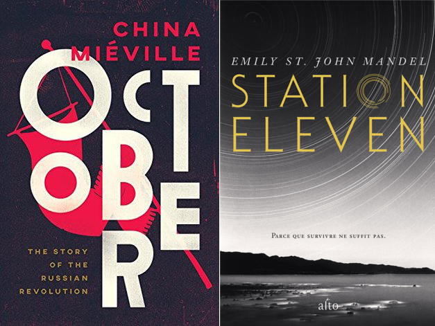

# Lessons on the apocalypse
I recently finished two novels about the end of a world: the first, a nonfictional account of the Russian revolution by China Miéville; the second a fictional anthology from both sides of an apocalypse.

### October
October covers the Russian Revolution in a new way. Instead of taking the purely factual, textbook-style approach, Miéville spins it into an opinionated adventure, a narrative history. In his own words: 
> It is, rather, a short introduction for those curious about an astonishing story, eager to be caught up in the revolution's rhythms. Because here it is precisely as a *story* that I have tried to tell it.
This is a difficult subject matter for a multitude of reasons. Take, for example, the tsars. The last six share only three Monarchical names (Alexander, Nicholas, and Constantine). Then there is the sheer number of characters: can you keep track of Kornilov, Kerensky, Kamenev? How about Nogin, Nestor, Nikolai alongside Nicholas the first, second, and third? I'm exaggerating somewhat here, but I found it to be a nontrivial task. Then there is the matter of organizations, which are frequently shortened down to acronyms. There are the [Kadets](https://en.wikipedia.org/wiki/Constitutional_Democratic_Party), [Zemlya i Volya](https://en.wikipedia.org/wiki/Land_and_Liberty_&lpar;Russia&rpar;) (Land and Liberty, originally The Society of Narodniki) who fracture into [Narodnaya Volya](https://en.wikipedia.org/wiki/Narodnaya_Volya) (People's Will) and the [Chornyi Peredel](https://en.wikipedia.org/wiki/Black_Repartition) (Black Repartition). There is the [Russian Social Democratic Labor Party](https://en.wikipedia.org/wiki/Russian_Social_Democratic_Labour_Party) or RSDLP, who split into Lenin's [Bolsheviks](https://en.wikipedia.org/wiki/Bolsheviks) and Martov's [Mensheviks](https://en.wikipedia.org/wiki/Mensheviks). These are mentioned both by their romanized Russian names, their translated English names, or sometimes by acronym taken from either language.

To make matters worse, key figures in these institutions shift and flow among them, sometimes forging alliances or being ousted forcefully. The organizations themselves evolve over time, and parties deemed radical far-left at the outset can end up comparatively conservative and reactionary when the dust settles. Miéville does a good job of explaining the shifting sands, but no matter how you spin it there's a lot to keep track of here. Keeping a notepad of who's who next to you might make this a little easier. The big picture is one of incredible chaos, skirmishes between parties who don't know a truce has been struck, secret deals, battles and mutinies. 

Miéville's retelling is not perfect. I still found myself confused at times, and he doesn't shy away from flowery language. However, it's an exciting way to fill in a key piece of history, and I'd recommend it to anyone curious about one of the most tumultuous periods in history. 
> Huddled in his hut, on a day of heavy rain, Lenin was startled by the sound of cursing. A [Cossack](https://en.wikipedia.org/wiki/Cossacks) was approaching through the wet undergrowth. The man begged shelter from the downpour. Lenin had little choice but to stand aside and let him in. As they sat together listening to the drumbeat of water, Lenin asked his visitor what brought him to this out of the way spot. A manhunt, the Cossack said. He was after someone by the name of Lenin. To bring him back dead or alive. And what, asked Lenin cautiously, had this reprobate done? The Cossack waved his hand, vague about the details. What he did know, he stressed, was that the fugitive was in some way 'muddled'; that he was dangerous, and that he was nearby. When the skies lightened at last, the visitor thanked his temporary host and set out through the sodden grass to continue the search.
For another deep dive into the topic, check out Mike Duncan's [Revolutions](https://thehistoryofrome.typepad.com/revolutions_podcast/) podcast.

### Station 11
This novel was a reprieve from a spate of [heavy nonfiction books](https://www.penguinrandomhouse.com/books/557121/climate-leviathan-by-joel-wainwright-and-geoff-mann/) I've tried to squeeze in. It coincidentally takes place in a world devastated by a flu pandemic, but unlike our coronavirus, the fictional Georgian Flu eliminates 99.9% of life on Earth. The plot unfolds around a hinge character named Arthur, a washed up actor who happens to tangle with the past and the future in interesting ways. His past lives shape the future, where progeny and fate mingle. The common themes are theatre and loss; performance and coping with the end of everything. The overall tone is melancholic, though it endeavors to end on a positive note. I found the understated writing style to be an interesting contrast with China Miéville's more ornate writing. Along with [The Dispossessed](http://www.strlog.net/2020-10-30) and [The Sparrow](https://en.wikipedia.org/wiki/The_Sparrow_%28novel%29), it is among my top three fiction reads in 2020.