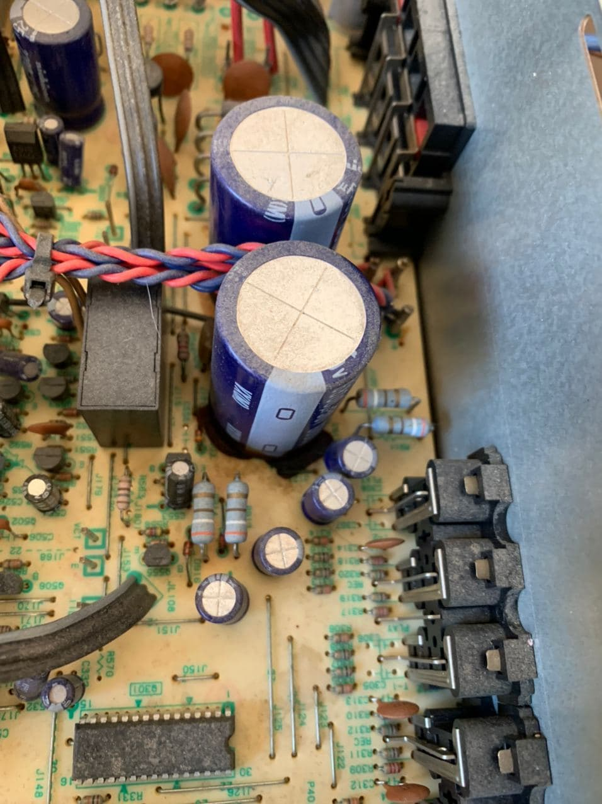
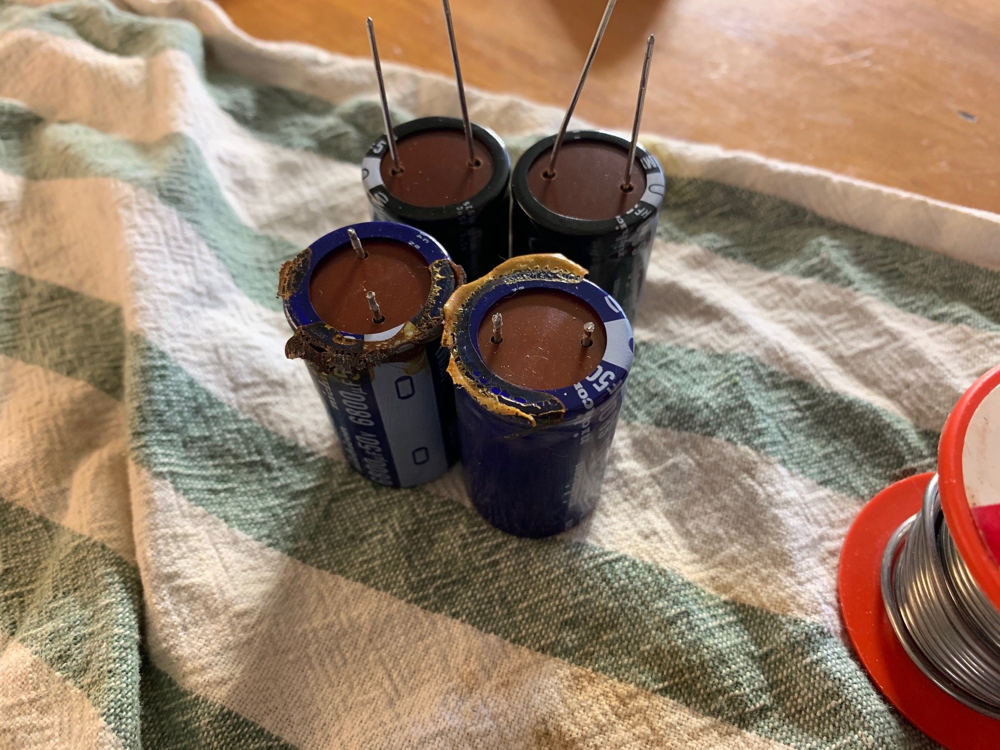
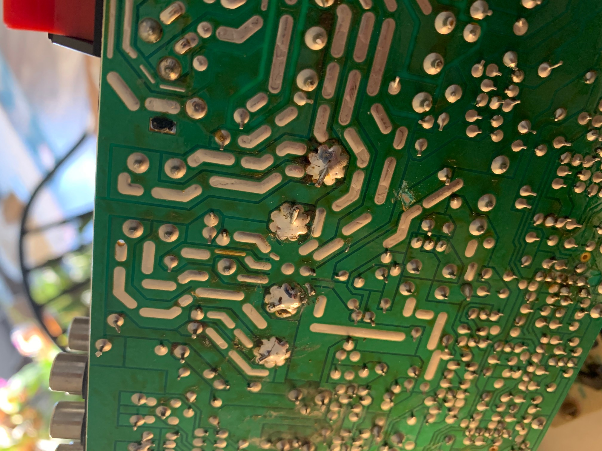
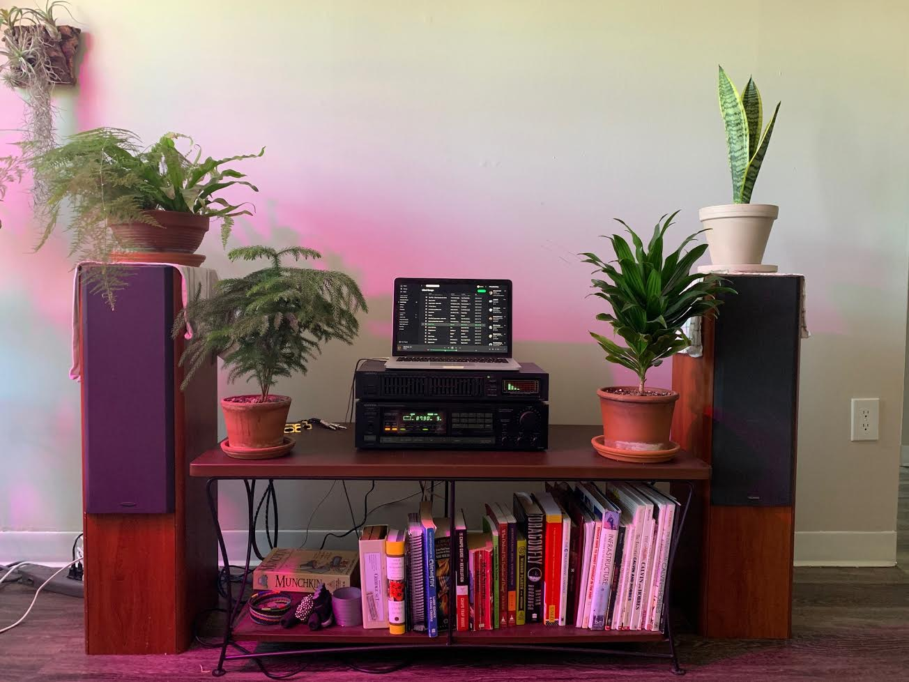

# Recapping the Onkyo
Earlier this year I put together a budget stereo system. I bought a pair of Celestion F28 floor speakers, an Onkyo Tx-810 stereo, and an Onkyo EQ-25 equalizer. It really was budget; it all came from eBay, Craigslist, or a friend. I was pleased with it, and it worked great for awhile. However, a few weeks ago, it started crackling and popping. I ignored it at first, but it grew worse and worse. I tried all sorts of non-invasive troubleshooting steps like different outlets and inputs, but eventually I narrowed it down to hardware problem inside the stereo. I cracked the lid open and found the culprit right away: The two largest capacitors inside were leaking electrolytic fluid.

I'm no hardware expert, but this unit is old enough that the electrical components are relatively large, and the solder points looked approachable even to me. The first step was trying to find new capacitors: The manufacturer, Nichicon, no longer makes the model VX(M) caps. However, I was able to find an upgrade sheet showing the upgrade path. Even better, the replacement VR(M) capacitors are $1.50 on [Digikey](https://www.digikey.com/). For that price it seemed worth a shot.

Surprisingly, this quick and dirty fix seems to be working. For $5 this was a lot of fun, and I'm happy to have music in the kitchen again!
