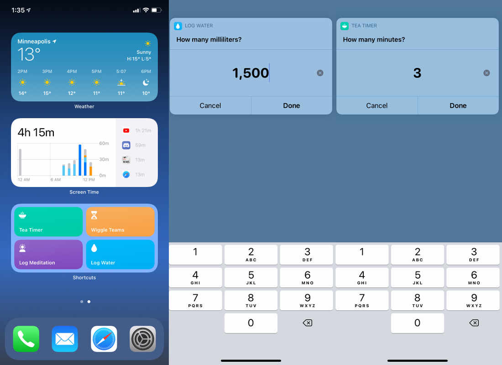
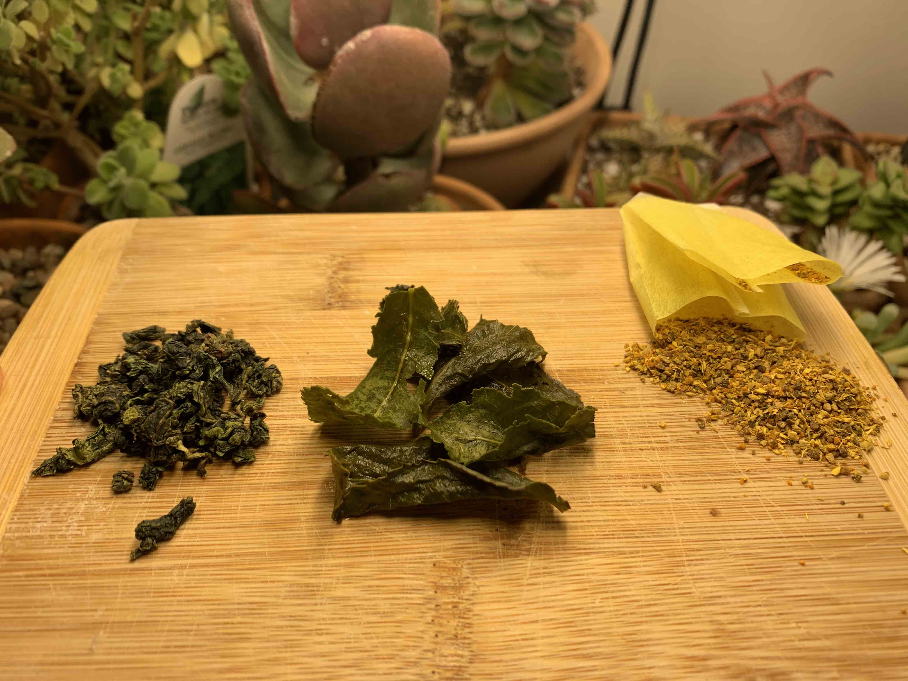
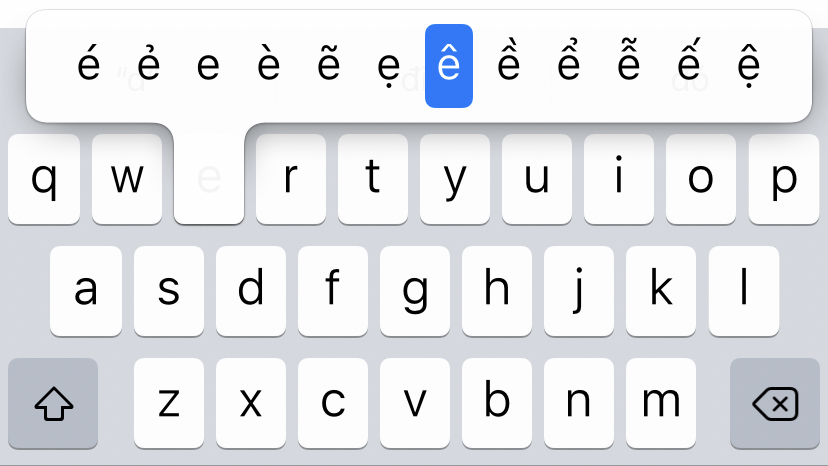

# iOS Shortcuts, loose leaf tea, and typing in Vietnamese
## shortcuts as the app-killer
Apple launched Shortcuts for iOS in 2019, but I've only just come around to using them. The Shortcuts app is really a way to write small programs or [macros](https://en.wikipedia.org/wiki/Macro_%28computer_science%29), and it has some neat functionality. However, to work with a certain app it must be provided an integration by the app's developer. In this sense it is rather limited, because there is no support for playing back screen inputs, or for navigating through apps yourself. It can only complete functions that the developer has specifically included to work with Shortcuts. Apple also only provides a limited set of operations that can be done outside of applications. A few of these strike me as rather odd. For example, you can open an app with Shortcuts, but you can't close it. Shortcuts will generate a hash value or scrape internet connection details for you, but it [can't change your wallpaper](https://discussions.apple.com/thread/250657629).

Regardless, I've found a few good ways to utilize them. Mostly these are related to working with Apple's Health app. The Health app provides some good insights if you feed it lots of data like water intake or miles walked, and it can be a good kick in the rump to get you exercising or taking better care of yourself. Writing data to Health manually is not a great experience though; it's menu-intensive and rather slow to add data points. This has formed a niche on the App Store of apps that essentially just increment a value in the Health app. This strikes me as an inefficient use of space, and thankfully we can use Shortcuts instead. Here's what it looks like when a few Shortcuts are set up in a widget:

The ability of Shortcuts to set a default value make it especially useful. For a shortcut that logs water intake, I might set it to '1500' to represent how many millimeters my water bottle can hold, or '3' for a tea timer to represent my usual brew time. Most importantly, it can also write to the Health app, allowing me to get rid of two full fledged apps that did the same thing. You can check out an example of mine [here](https://www.icloud.com/shortcuts/c8f1b658904943ceba2d42f07e87f842).

## a small rant about tea
I don't want to disparage the typical American supermarket tea. It's convenient and cheap. I almost always have a box in my kitchen. However, I've been wondering why loose leaf tea never caught on in supermarkets. It seems plausible that a majority of people have gone their entire life without tasting tea that hasn't been cut with some kind of flavoring. Take a look at [Lipton's green tea offerings](https://www.lipton.com/us/en/our-teas/green-teas.html): passionfruit, mint, lemon ginseng, ginger, cranberry, the list goes on and on. There are a few with more abstract names, like "Detox" and "Support". If you want plain tea your only option is decaf, and the box doesn't endeavor to tell you what kind of tea it even is! Cut one of the pouches open and you'll find a powdery substance not... entirely *unlike* tea leaves?

Am I just a purist? Some kind of tea snob? Well, yes. Still, I find the lack of productized loose leaf tea interesting. For starters, it's no more expensive than the individually wrapped pouches. Lipton's green teas start at around $3 for 20 pouches. A big bag of loose leaf tea, say, [Pinhead Gunpowder](https://www.thewhistlingkettle.com/collections/classic-green-teas/products/pinhead-gunpowder-organic?variant=6930836226103) usually runs around $20. The price is almost the same - 15 cents per Lipton serving and about 17 cents from the loose leaf purveyor. What seals the deal is that these full tea leaves can be steeped multiple times, doubly so for green teas. Those 128 servings of Gunpowder will make 300 cups or more, and the flavor is quite different than what comes in the little packets. I suppose this hole in the market can't be plugged until Americans develop a taste for tea. This seems to be growing, but slowly. For the uninformed, here's what a fairly standard loose leaf tea looks like compared to a typical supermarket sachet:

Here's my preferred brew method, using an indestructible metal basket that runs about $6:

The best part of this brewing method is that a single cup of loose leaf tea produces no waste except the tea leaves themselves. The paper pouches aren't so bad either, but don't get me started on the [new trend of plastic "silken" tea pouches](https://www.discovermagazine.com/health/plastic-tea-bags-release-billions-of-microplastics-into-every-cup). I have strong feelings about taking something that was formerly sustainable and wrapping it in an oil derivative just for misguided aesthetics.

## typing a tonal language
I've started the Vietnamese language tree on Duolingo, just for fun. Vietnamese uses a Latin alphabet with [digraphs and diacritics](https://vietnamesetypography.com/alphabet/) to represent the many possible spoken tones of Vietnamese (before [the French invaded](https://en.wikipedia.org/wiki/French_Indochina), they used [Chinese characters](https://en.wikipedia.org/wiki/Ch%E1%BB%AF_N%C3%B4m)).

So how does one type a tonal language? Those little marks are important, and they mean the difference between a word like mother (mẹ) and horse (mé). You can "hunt and peck" for them as shown above, but it's a slow process. It turns out iOS (and macOS) provide another input method, and I stumbled upon it by chance. When certain characters are typed consecutively, such as 'dd', it will replace those characters with a another set of marked letters, like [đ](https://vietnamesetypography.com/modified-letters/#dcrossbar). It turns out this input system has a name, [Telex](https://en.wikipedia.org/wiki/Telex_%28input_method%29), and it's something of a standard. There's even [a neat website](https://vntyping.com/) where you can try it out for yourself.