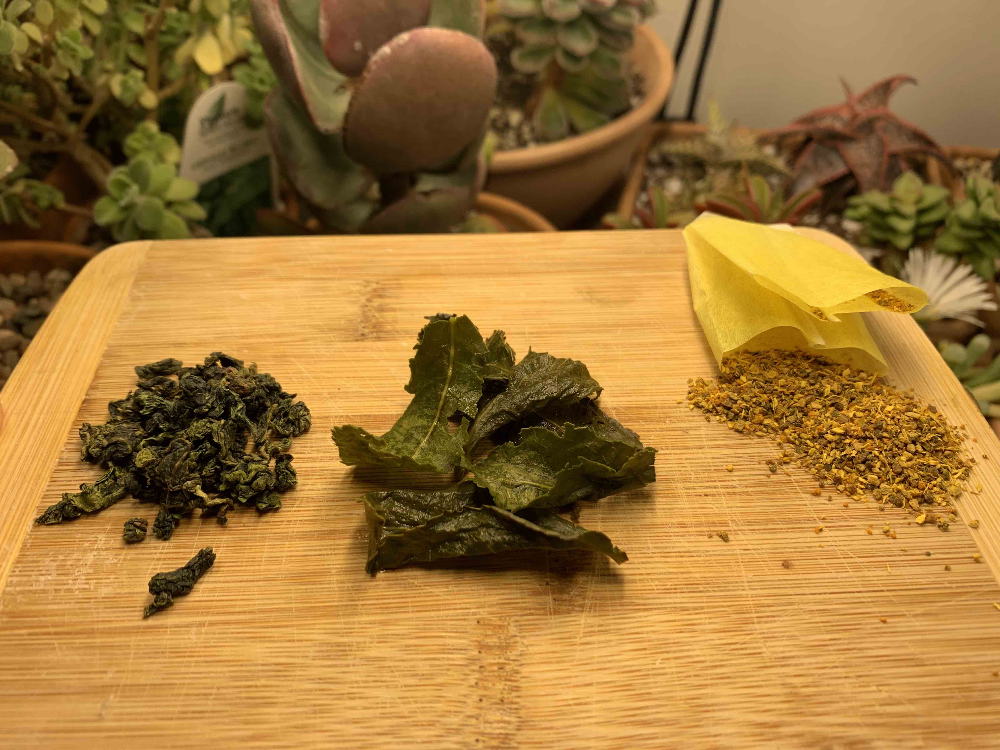
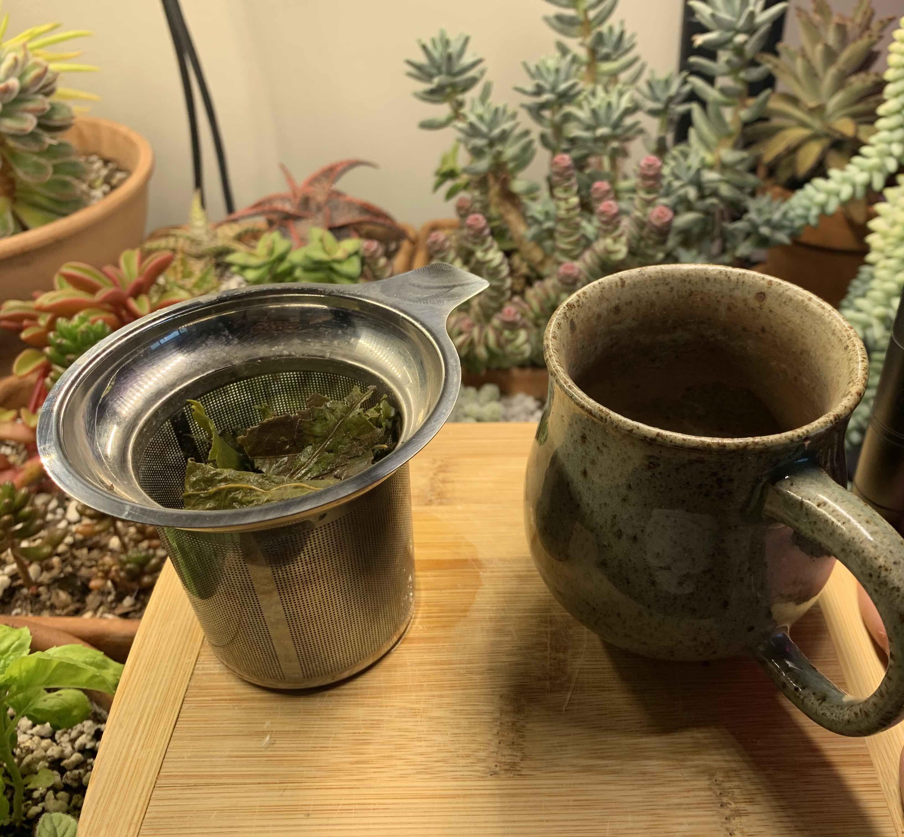

Lets get three mindblowing facts out of the way before we begin. 

1. All tea comes from the same plant, [camellia sinensis](https://en.wikipedia.org/wiki/Camellia_sinensis). Yerba mate, rooibos, chamomile, hibiscus, tea tree, and every other hot drink is *not* tea.
2. Almost all tea comes from Asia. The only significant tea producing region outside of Asia is Kenya.
3. Tea has no strongly correlated health benefits aside from being a low-calorie, water based drink.
4. Most bagged tea sucks.

With those inflammatory statements out of the way I can start listing all the caveats, the first being that tea is a subjective term. My intent with that statement is just to split the categories of tea in twain; those that contain actual tea and those that do not. There are a great many interesting non-tea drinks, especially yerba mate and guyasa (from the holly plant family) and coca which has a nice perky effect for obvious reasons!

What, however, accounts for the great variety of pure teas if they all come from the same plant? Well, there are four levers that manufacturers can pull, these being oxidation, fermentation, processing, and geography. Oxidation accounts for the darkening of green tea into black (and indeed, you can tell bad green tea by it's reddish liquor). Fermentation is responsible for some pu'erh teas, processing can cut off oxidation as in the case of the Japanese greens like sencha, tencha, matcha and gyokuro, and location yields interesting effects like sugar production by insect damage or unique cultuvars like the high altitute teas of Taiwan.

On to the second caveat: country of origin is extremely misleading with tea. Why, for example, is half of all tea in the supermarket labeled as a UK product when it can barely grow in the British isles? The obvious answer is colonialism, exportation, and cultural reasons. I advise against buying any British tea as it *ensures* extra middlemen and a less fresh product. The contrapositive is not true, of course, as you can get garbage tea from any country.

As for health benefit claim, look up any reputable study, for example [this metastudy from the NIH](https://pmc.ncbi.nlm.nih.gov/articles/PMC9823498/), and you'll find the effects are usually quite small.

> [W]hile a substantial amount of pre-clinical research on the potential benefits of tea plants and their derived bioactive components has been conducted, there was inconclusive evidence on their effects in clinical studies. In addition to that, it has not been approved as a treatment for any specific indication until now. 

Like coffee, this is one of the most tested beverages on the planet; if there was a real impact to longevity, mental acuity (beyond the temporary effects of caffeine & L-Theanine), or whatever else is claimed, we'd have found it by now. The health benefits are mostly driven by the lack of calories and acidity. Tea will not degrade your teeth or cause weight gain, and you can drink as much as you want with the only ill effect being a reversable staining of the tooth.

And now on to the big one. Bagged tea is, on average, always of a lower quality and a worse value than loose leaf tea. I don't want to disparage the typical American supermarket tea -- it's ubiquitous and convenient. I have a box in my kitchen. However the fact that loose leaf tea never caught on in American supermarkets is baffling, and as a direct result it seems plausible that a majority of Americans have gone their entire life without tasting tea that hasn't been cut with some kind of flavoring, natural or otherwise. Take a look at [Lipton's green tea offerings](https://www.lipton.com/us/en/our-teas/green-teas.html): passionfruit, mint, lemon ginseng, ginger, cranberry, the list goes on and on. There are a few with more abstract names, like "Detox" and "Support". If you want plain tea your only option is decaf, and the box doesn't endeavor to tell you what kind of tea it even is! Cut one of the pouches open and you'll find a powdery substance not... entirely *unlike* tea leaves?

Am I just a purist? Some kind of tea snob? Yes. Still, I find the lack of productized loose leaf tea interesting. For starters, it's no more expensive than the individually wrapped pouches. Lipton's green teas start at around $3 for 20 pouches and they *exceedingly ok*. A big bag of loose leaf tea, say, [Pinhead Gunpowder](https://en.wikipedia.org/wiki/Gunpowder_tea) usually runs around $20. The price is almost the same - 15 cents per Lipton serving and about 17 cents from the loose leaf purveyor. What seals the deal is that these full tea leaves can be steeped multiple times, and doubly so for green teas, because they contain actual, whole leaves. Those 128 servings of Gunpowder will make 300 cups at a minimum, and the flavor is much better than what comes in the little packets. I suppose this hole in the market can't be plugged until Americans develop a taste for tea. This seems to be growing, but slowly. 

Here's my preferred brew method, using an indestructible metal basket that runs about $6 after shipping:

The best part of this brewing method is that a single cup of loose leaf tea produces no waste except the tea leaves themselves, which are compostable. The paper pouches aren't so bad either, but don't get me started on the [new trend of microplastic factories, aka "silken" tea pouches](https://www.discovermagazine.com/health/plastic-tea-bags-release-billions-of-microplastics-into-every-cup). I have strong feelings about taking something that was formerly sustainable and wrapping it in an oil derivative just for misguided aesthetics.