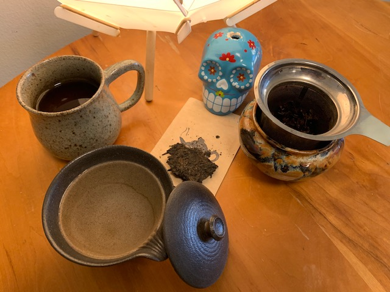

This is a [genre of tea](https://en.wikipedia.org/wiki/Pu'er_tea) I've been avoiding for some time because my brews have never turned out well. Most tea I've always been able to at least appreciate, whether that be white, green, black, or my personal favorite, oolong. These other types of tea all exist on the same spectrum of unoxidized to oxidized, but pu'erh brings a new dimension: fermentation. Some of my troubles boil (heh) down to quality. Cheap pu'erh isn't stored correctly, and it can carry a fishy smell as a result. 

It's also different in form as it comes in compressed in bricks or cakes rather than loose leaves. I've ordered and tried a few samples, but I've never gotten a good cup out until now. I've just discovered that this was partially due to a bad brewing technique. Many teas are very straightforward and list a brewing temperature and time that stays relatively consistent regardless of methodology, but pu'erh is different here. 
- My first mistake was skipping the wash cycle. This may sound strange, but the first brew with these leaves is best tossed out. It contains dust and detritus from the long storage the tea undergoes before and during fermentation. Now my first steep is now about 20 seconds long, and I discard this liquor afterwards.
- My second mistake was not using enough tea. Many teas benefit from ample room to unfold (and thus a lower leaf/water ratio), but pu'erh's strong flavors are all washed away in that first rinse. This is corrected by increasing the amount of leaves used in the brew.
- My last mistake was steeping for times comparable with my standard fare of green teas, centered around three minutes. Extractions of this length will end up bitter, and the best flavors I've extracted came from a steep lasting only five seconds!

It is often made in a [gaiwan](https://en.wikipedia.org/wiki/Gaiwan) -- the small lidded, ceramic dish shown above -- but I've adapted the technique to work with my preferred metal brew basket. The result of the improved brewing method is a beautiful spectrum of liquors ranging from dark amber to ruby red. It is light on the nose, and carries both sweet and savoury flavors. I was convinced for awhile that this tea is strictly an acquired taste, but now I believe anyone can enjoy a well-made cup.