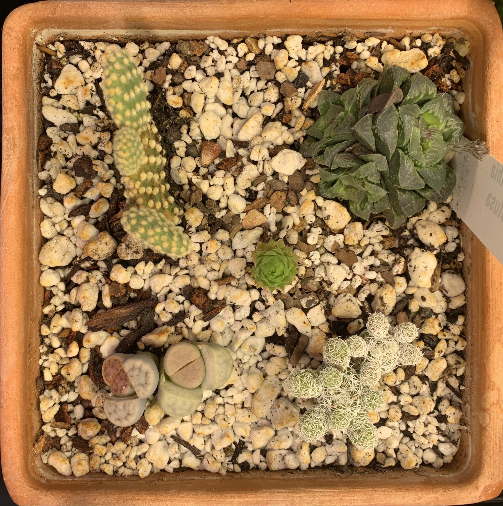
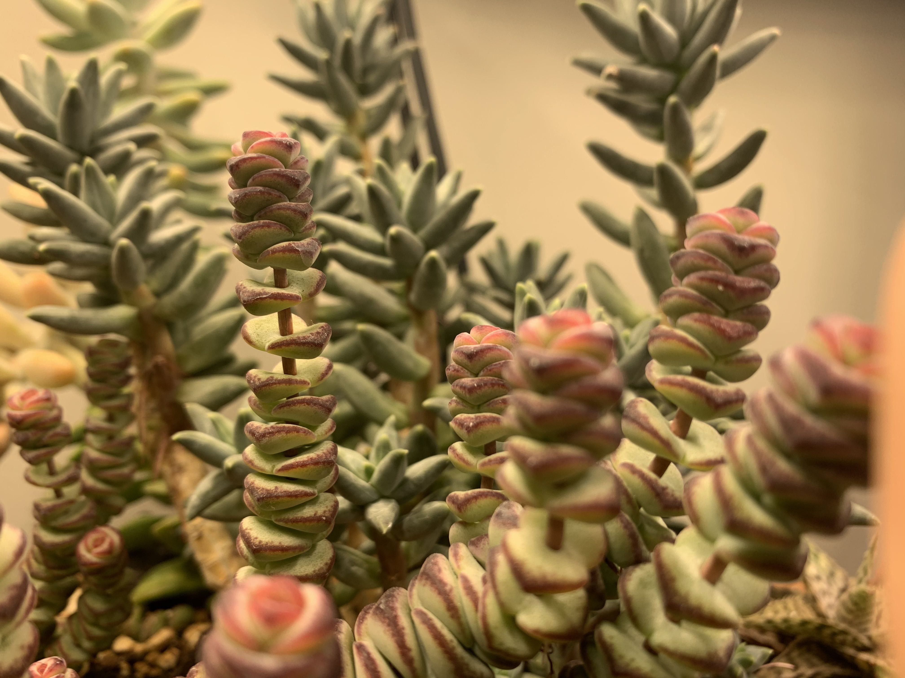
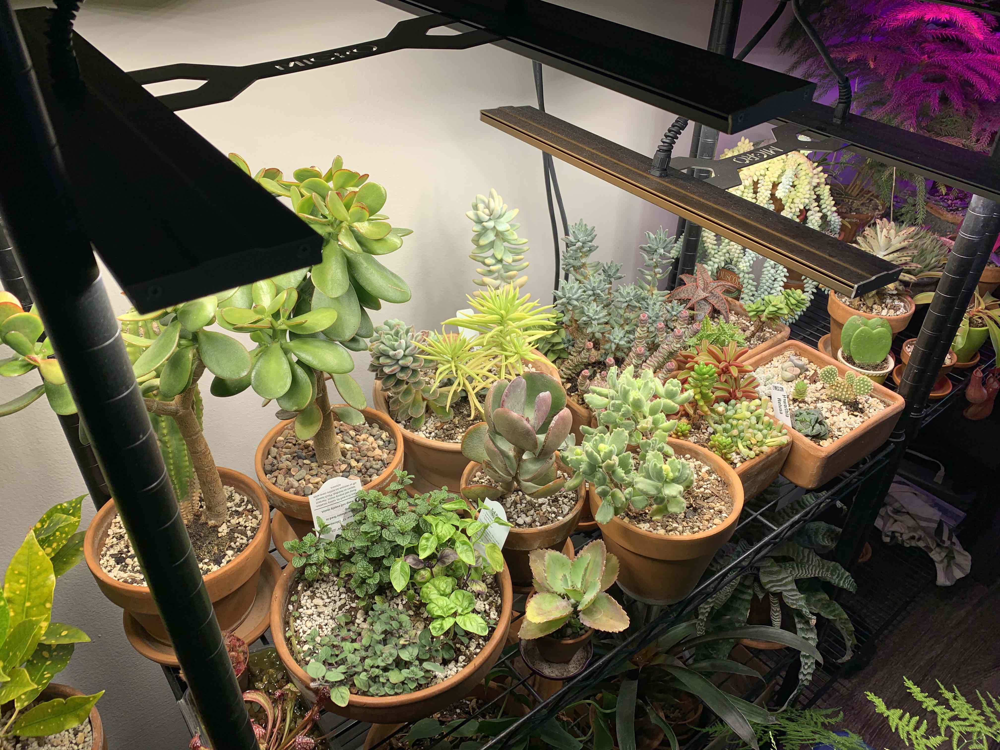

# indoor succulents & cacti

I've been growing succulents indoors for about five years now. Along the way I've learned a thing or two and paid the price in dead and mangled plants. However, I believe I've reached a point of succulent mastery and have decided to share these secrets with you, my loyal reader.

## differing types
Here in Minnesota you'll find a few standard varieties of succulents in greenhouses (and occasionally the Target checkout line). The traditional small succulent offerings usually fall into the echiavera, crassula, sedum, euphorbia (spurge), lithops, or kalanchoe families.

For true cacti you're likely to find grafted (hybrid) moon cacti, prickly pears, and barrel cacti.

From top to bottom and left to right, the pot below holds a prickly pear, a haworthia (retusa), a crassula (hen and chicks), lithops (living stone), and a cactus. The white material is perlite, discussed below.

Thankfully, these all share the same requirements.

## soil
Likely the most important part of caring for a succulent or cactus is the soil. You've no doubt heard they need well-draining soil - a mix specifically for potted cactus works well, but it's cheap and easy to make your own. Starting with compost or miracle-gro is fine, but it *must* be cut with something light to quickly drain water. The best material for this is [perlite](https://en.wikipedia.org/wiki/Perlite), a puffed volcanic glass sold in any plant supply or hardware store. Another common mix ingredient is [vermiculite](https://en.wikipedia.org/wiki/Vermiculite), a mineral that forms sheets as it weathers. It retains slightly more water than perlite. 

The key is in quantity; a handful of perlite in a pot won't do it. Water poured in the top of a pot should drain out the bottom in seconds which will probably require the perlite to soil ratio to be 1:1 or even higher. A difficulty with high-perlite mixes is that the lighter soil makes plants become prone to tipping. One solution is to weight the top of the soil with decorative pebbles or to mix them into the substrate.

## light
These plants need a lot of light. Light is usually the limiting factor of where you can grow them and how many you can keep. The best location is on a windowsill with a "view of the sky", keeping them in the sun for many hours a day. In the northern hemisphere they are best suited to south and west facing windows where the sun is brightest. This doesn't mean they can't be displayed on a shady kitchen counter or dark bathroom, but you must rotate them in and out of a brighter location if you want them to thrive. Many will die outright if they don't receive *direct* sunlight. Others will stretch and grow towards the brightest point they detect, a process called [etiolation](https://en.wikipedia.org/wiki/Etiolation). While not biologically harmful, it indicates the plant would benefit from more light, and it is often not as desirable as the tightly bunched leaf clusters you'll find for sale in a greenhouse. The crassula below shows both periods of dense, well-lit growth as well as periods of etiolation.

The solution to etiolation is to increase the amount of light the plant receives. This is not as easy as it sounds - unless you live near the equator! In Minnesota, for example, grow lights are the only way to prevent etiolation in the winter and often even in the summer. Cheap LED panels saturate Amazon starting around $20. They may emit a purple hue, claiming to bias the light spectrum towards what plants need. However, [all plants benefit from a full light spectrum](https://www.youtube.com/watch?v=P2bw4cgkh9c) (i.e. white light). Despite *appearing* bright, these cheap panels are likely orders of magnitude less bright than the sun. Visual appearance won't help you determine a good grow light because [our eyes don't process light linearly](https://en.wikipedia.org/wiki/Human_eye#Dynamic_range). The only way to really determine how much light is enough is to use a measured value like lumens or foot-candles. Wattage is also helpful, but it's only a measure of power consumption so efficiency matters there. You can assume anything sold without such values listed is insufficient.

Unfortunately, good grow lights are still expensive. LEDs have made these cheaper and more efficient, but they are not yet cheap. To keep a plant shelf free of etiolation expect to spend between $150 and $300. I use a [240 watt array](https://www.migrolight.com/product/migro-aray-240w-iiii-bar-light/) which does an excellent job.

At the high end of the lighting spectrum you may start to see sun blush or sun stress as the plant adapts to the high quantity of light. This can create a wide range of beautiful red, orange, and yellow colors especially at leaf tips. On its own this is not harmful. Too much light will eventually singe the leaf tips and turn them brown.

## pots
My advice here is pretty simple. The easiest pot to grow a succulent or cactus in is an unglazed, plain terracotta pot. Not only are they extremely cheap, but they also wick moisture away from the roots. Glaze is usually impermeable and will keep moisture close to the base of the plant, potentially causing rot. Whatever you choose, make sure it has a drainage hole at the bottom. One downside to terracotta is that unglazed saucers will allow moisture to come into contact with whatever is below it. You may want to use a glazed saucer or plastic if you don't want to damage the surface below.

Succulents prefer small pots over large ones as a smaller soil mass holds less water. When repotting, consider a pot only slightly larger than the current one. Another great option is to trim the roots slightly and repot with fresh soil into the same pot.

## watering
Another big topic. The goal here is to imitate desert conditions, so don't mist your plants, use ice cubes to water them, or place them in humid terrariums! Most of the time desert plants receive no water at all. When it does rain, it comes fast and quick, flooding the surface and then allowing the plants to entirely dry out. A good way to mimic this is to soak the pots in a large tupperware or bowl, filling the container until the water is just below the top of the pot. This ensures a thorough soak and avoids the problem of water simply running around a compacted root ball. Normal watering at the correct (infrequent) interval is sufficient if the soil is loose.

Another common mistake is using a strict watering schedule, such as watering once a week. This might be a good reference point to check the pots for moisture, but their actual rate of water consumption will vary with your building's humidity, temperature, and how much sunlight the plant receives. Most succulents only need watering when the entire top inch of soil is entirely dry.

Occasionally you will find your succulents have stopped growing despite the conditions remaining favorable. They might have just exhausted all the resources in the soil! This can be remedied by repotting with fresh soil or adding fertilizer to the water. Expect to do this 2-4 times a year for sustained growth. Be careful with fertilizer and follow instructions carefully; too much will chemically burn the roots and can kill foliage. This will make you sad and you may cry salty tears into the pots, further compounding the issue.