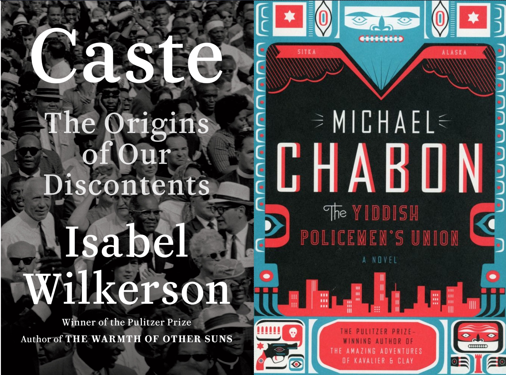
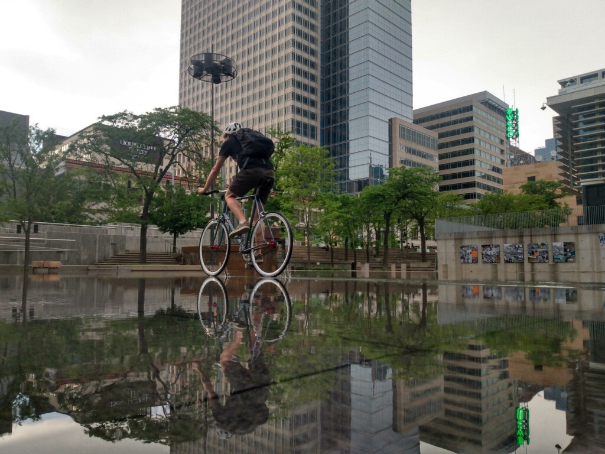
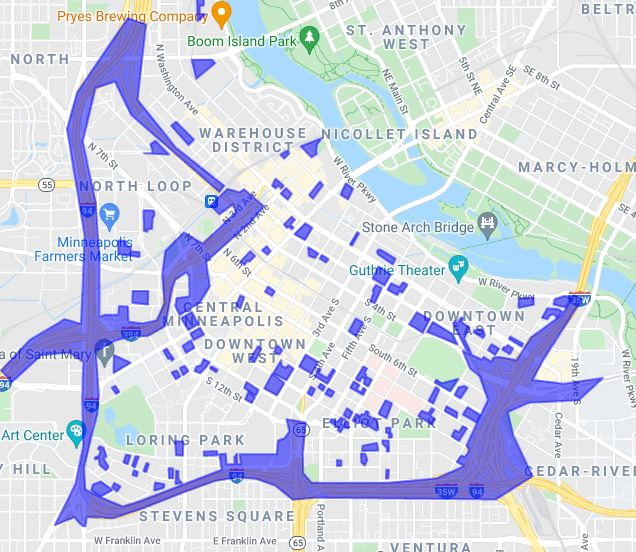

# july media roundup (and the car rant)
Okay, here we go. July post. Posting for July. I'll start with the media roundup because that's always the easiest to write.

## caste: the origins of our discontent
I read Times bestseller & Oprah-recommended book *Caste: The Origins of our Discontent*, by Isabel Wilkerson. To be more precise, I read a little over half of Caste. It had an interesting premise and set out to show that America's racial problems were better suited to the Indian style of [caste](https://en.wikipedia.org/wiki/Caste) than to the American idea of racism. Wilkerson attempts to show this by defining caste's components and pointing them out in the American social landscape. Where things went wrong were the presentation. *Caste* had two distinct problems heavier than the premise could carry. The first issue was an overly ornate style of writing plastered with particularly unhelpful analogies. Caste is like the mudsill of a house. Caste is like The Matrix. Caste is like a computer program. A wolf pack. A Broadway play. Marionettes. Each chapter opened with an anecdote or analogy, and almost every analogy was unhelpful. The concept of enforced social stratification isn't difficult and these references only served to water down the narrative. 

My second main qualm with the book was the Liberal attitudes it conveyed. In many spots I would have agreed completely with the premise if only the word "Caste" were to replace "Caste". Wilkerson does actually touch on the differences briefly:

> Class is an altogether separate measure of one's standing in a society [than caste], marked by level of education, income, and occupation, as well as the attendant characteristics, such as accent, taste, and manners, that flow from the socioeconomic status. These can be acquired through hard work and ingenuity or lost through poor decisions or calamity. If yo can act your way out of it, then it is class, not caste.

I don't particularly disagree with her on this, but I can only say that because the paragraph is carefully arranged to be irrefutable. Is it true that class mobility exists? Yes. Is it true that class can be lost in a calamity? Yes, though only in one direction and rarely at the top. This takes into account slim possibilities and presents them as equal to near certainties. America's upper class rarely faces real financial hardship, and class mobility is almost always limited to the lower and middle classes. Here, I believe, Wilkerson is missing the economic reality that the class divide is just too large for most to cross. In retrospect that [big-L Liberalism](https://en.wikipedia.org/wiki/Liberalism) shouldn't have been surprising as it came heartily endorsed by Oprah Winfrey, a woman worth over $3 billion.

## the yiddish policeman's union
Michael Chabon's novel is an easy recommendation because it's fiction, an interesting premise and just plain fun. In an alt-history autonomous Alaskan zone, loose-cannon-but-damn-fine Yiddish cop Meyer Landsman must unravel the secrets of the displaced Israeli Mafia after a role-reversed [Arab-Israeli war](https://en.wikipedia.org/wiki/Arab%E2%80%93Israeli_conflict). How's that for an elevator pitch? The novel is based on the real-life [Slattery Report](https://en.wikipedia.org/wiki/Slattery_Report). This one comes highly recommended -- bake some challah, pour a glass, and turn off your brain long enough catch some action and learn a bit of Hebrew on the way.

## the car rant
Alright, if you're still reading this drivel it's time to buckle up. Some pre-rant context — for a few different reasons I’ve been considering selling my car and trying to live without one. Most compelling is the cost of car ownership. I have no loans on it, but insurance is $100 every month even if I don’t drive it. Coupled with gas, parking, and taxes the financial toll of owning a vehicle is insane before factoring in absurd interest rates that many pay on new vehicles. The second reason is the collective weight of car infrastructure has started to become increasingly apparent, and once you've see you can't un-see it. If you want to go down that particular rabbit hole take a gander at the YouTube channel [Not Just Bikes](https://www.youtube.com/channel/UC0intLFzLaudFG-xAvUEO-A). The short version is that all the "free" infrastructure we build for our cars makes public transit worse, cities less safe, and life less pleasant for everyone involved. This hidden cost of automobile idolism is accepted without question in the US as an unavoidable necessity, and I set out to disprove it.

The trial run of a carless life was supposed to be a one month period in the driest time of the year — easy, right? I’m willing to bike to any destination in Minneapolis, so that corner of the globe is covered. I even biked for groceries. Work was more or less covered by an express bus, and I figured I'd use [HourCar](https://hourcar.org/) to visit my parents on the weekend.

This system more or less worked, but learning a new transit system came with the usual trappings and pitfalls. At first I thought I didn't need a raincoat if the weather was supposed to be clear (I did). Then I thought the bus would stop at all designated street stops, even if the street sign was obscured by leaves (it won't). I found that my transfer bus is usually between three and seven minutes late making it unusable, and relegating me to one 15 minutes earlier. Then there's the issue of frequency -- there's a single express bus for my route in the morning and a single one back in the evening. If you forget something crucial or a transfer bus drops the timetable, your day is just about over. One alternative is to take a bike to the express stop; this leaves the rider sweaty on arrival and runs the risk of having a driver refuse a bike if the rack is full. Habitually leaving your bike, even locked, on a Minneapolis street is sure to result in a missing seat eventually. A spooky road rage incident gave me the excuse to quit early another day. All of this conspired to make travel to work a precarious affair. On more than one occasion I had to ditch my transit plan for the car.

My second issue was with HourCar. It isn't a bad system, but the pricing is, well, per hour -- making it a particularly unattractive option for spending any serious amount of time at home and on the clock. A typical weekend visit for me would rack up $50 in fees. There are few alternatives; Google suggests a two hour transit loop in each direction or a $40 Lyft fare. How is it a location 12 miles outside of the largest urban center in the upper Midwest is entirely inaccessible by public transit?

Even more damning is the money. My commute to work is about 12 miles. At time of writing, gas is $2.98 per gallon and my car gets 40 miles per gallon bringing the cost of daily cost of driving $1.79 or $467.19 per year, assuming 261 working days. That's a lot, so lets take a look at transit. Surely a group of people going in the same direction is cheaper! So, the express bus is $3.25 each way for a total of $6.50/day or $1,696.5/yr. *Over a single year that’s an extra $1,229.31 penalty for participating in mass transit*. What the hell are we thinking? Of course nobody is using this! Only those too poor to put up the down payment on a car and weird internet leftists (hello) would ever bother with this system. It doesn't end there though. It’s also slower! My morning option is a 21 minute reverse-commte or *over an hour of transit*. Somehow, public transit in this case is not only slower, but also more expensive. What is going on?

In the era of climate change we need to be transitioning to mass transit. Those weirdly obsessed with Tesla's shiny cars and Elon Musk's megaloop hypertube vaporware will glady explain that the solution is to just have everyone buy a $60,000 Tesla driven by robots. However, in the real world where many of us must live, even affordable electric cars fail to solve the problems induced by urban sprawl, tire noise and peak traffic hours. When our entire system is designed around cars that sit idle for the majority of their lives only clog the massive, expensive roads over-designed for the two hours of rush hour traffic we will never find an efficient solution to the people moving problem. Worse still, we'll destroy our living spaces in the process. Here's a quick map I made of significant car infrastructure in Minneapolis' downtown:

If you look closely, you'll notice the place where a hundred thousand people are trying to live is cut like swiss cheese by parking lots that sit mostly empty and gather the daytime heat, constricted by highways flanked by the lower classes who are doomed to never get a solid night of rest thanks to the perpetual cacophony of street racers and ghosts of street parkers' catalytic converters. This shit *sucks*. Huge swaths of the city have been hollowed out, and instead of producing usable income for the city, they suck taxpayer dollars like a whale shark binging on krill; spitting back the salt, grime and noise of an urban freeway into the urban dweller's face.

Its hard to propose a solution to this problem in the context of modern America. If you want one, I'd suggest bulldozing the suburbs. If you want a serious answer, I'd suggest bulldozing the suburbs slowly, over decades, with targeted land use and tax policy rewarding density and punishing the suburban model. I'd suggest making public transit free for all and raising parking costs to do it. I'd suggest **controlling rents, with rent control** so that the people of Minneapolis might be able to afford to live in dense, urban areas. And most importantly, I'd suggest you start this process twenty years ago because as I sit here sweltering in our tenth 95+ degree day of the summer I've noticed that we're cooking ourselves to death in the struggle to keep the failed automobile model afloat. Good riddance.