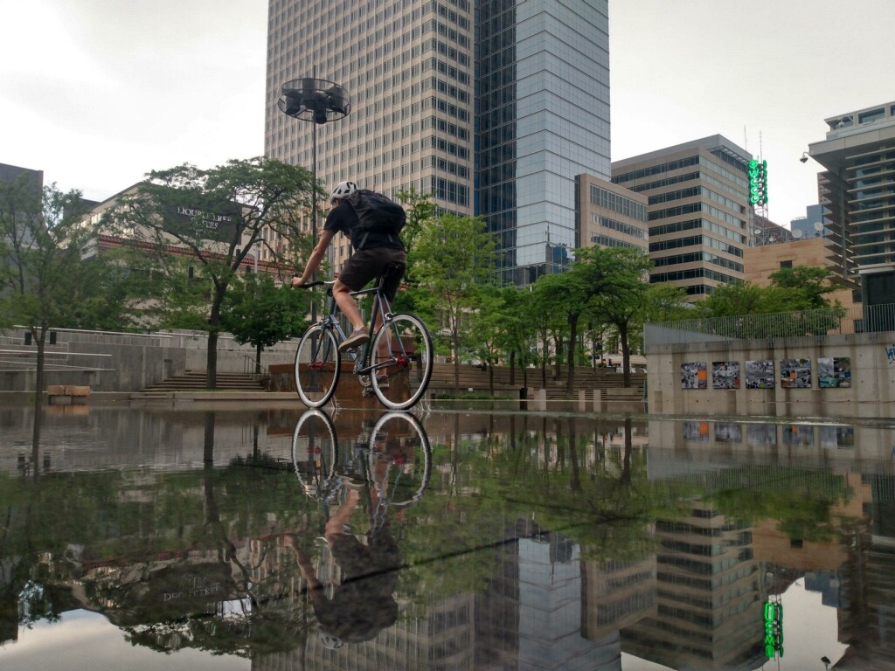
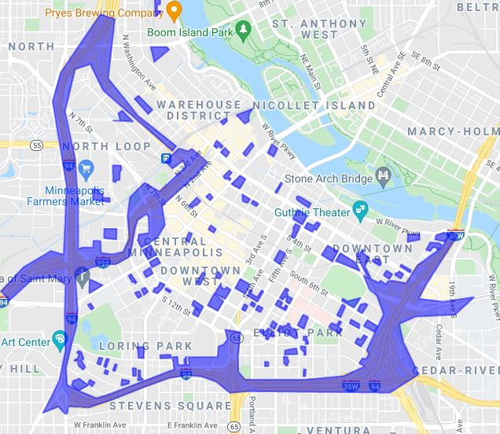

Alright, buckle up. This is the explainer on why I hate cars, car culture, and most importantly: car infrastructure.

I’ve been considering selling my car and trying to live without one. Most compelling is the cost of car ownership. I have no loans on it, but insurance is $100 every month even if I don’t drive it. Coupled with gas, parking, and taxes the financial toll of owning a vehicle is insane before factoring in absurd interest rates that many pay on new vehicles. The second reason is the collective weight of car infrastructure has started to become increasingly apparent, and once you've seen you can't un-see it. If you want to go down that particular rabbit hole take a gander at the YouTube channel [Not Just Bikes](https://www.youtube.com/channel/UC0intLFzLaudFG-xAvUEO-A). The short version is that all the "free" infrastructure we build for our cars makes public transit worse, cities less safe, and life less pleasant for everyone involved. This hidden cost of automobile idolism is accepted without question in the US as an unavoidable necessity, and I set out to disprove it.

The trial run of a carless life was supposed to be a one month period in the driest time of the year — easy, right? I’m willing to bike to any destination in Minneapolis, so that corner of the globe is covered. I even biked for groceries. Work was more or less covered by an express bus, and I figured I'd use [HourCar](https://hourcar.org/) to visit my parents on the weekend.

This system more or less worked, but learning a new transit system came with the usual trappings and pitfalls. At first I thought I didn't need a raincoat if the weather was supposed to be clear (I did). Then I thought the bus would stop at all designated street stops, even if the street sign was obscured by leaves (it won't). I found that my transfer bus is usually between three and seven minutes late making it unusable, and relegating me to one 15 minutes earlier. Then there's the issue of frequency -- there's a single express bus for my route in the morning and a single one back in the evening. If you forget something crucial or a transfer bus drops the timetable, your day is just about over. One alternative is to take a bike to the express stop; this leaves the rider sweaty on arrival and runs the risk of having a driver refuse a bike if the rack is full. Habitually leaving your bike, even locked, on a Minneapolis street is sure to result in a missing seat eventually. A spooky road rage incident gave me the excuse to quit early another day. All of this conspired to make travel to work a precarious affair. On more than one occasion I had to ditch my transit plan for the car.

My second issue was with HourCar. It isn't a bad system, but the pricing is, well, per hour -- making it a particularly unattractive option for spending any serious amount of time at home and on the clock. A typical weekend visit for me would rack up $50 in fees. There are few alternatives; Google suggests a two hour transit loop in each direction or a $40 Lyft fare. How is it a location 12 miles outside of the largest urban center in the upper Midwest is entirely inaccessible by public transit?

Even more damning is how expensive we've made our public transit. My commute to work is about 12 miles as well. At time of writing, gas is $2.98 per gallon and my car averages 40 miles per gallon bringing the cost of daily cost of driving $1.79 or $467.19 per year, assuming 261 working days. That's a lot, so lets take a look at transit. Surely a group of people going in the same direction is cheaper! So, the express bus is $3.25 each way for a total of $6.50/day or $1,696.5/yr. *Over a single year that’s an extra $1,229.31 penalty for participating in mass transit*. Only those too poor to put up the down payment on a car and weird internet leftists (hello) would ever bother with this system.

In the era of climate change we *need* to be transitioning to mass transit. Elon Musk and his fleet of fanboys will glady explain that the solution to climate change is to simply have everyone buy a $60,000 Tesla driven by robots. Or perhaps everyone can hop in a pod and take the megaloop hypertube vaporware to work. However, in the real world where many of us must live, even affordable electric cars would fail to solve the problems induced by urban sprawl like tire noise and rush hour. When our entire transit system is designed around cars that sit idle for the vast majority of their lives only to clog the massive, expensive roads over-designed for the two hours of rush hour traffic, we will never find an efficient solution to the people moving problem. Worse still, we'll destroy our living spaces in the process. Here's a quick map I made of significant car infrastructure in Minneapolis' downtown:

This tiny square of the map where thousands people are trying to live is cut up like swiss cheese by massive parking lots that sit mostly empty doing nothing but gathering the daytime heat. Outside of them, enclaves of housing are constricted by highways that ruin the lives of people living in adjacent apartments -- overwhelmingly the lower classes who will never get a good night of rest thanks to the perpetual cacophony of street racers and stolen catalytic converters. Huge swaths of the city have been hollowed out a sacrifice to the automobile, and instead of producing taxable revenue for the city these areas form a bottomless pit of taxpayer dollars; spitting back only the salt, grime, and noise of a freeway into our faces.

Its hard to propose a solution to this problem in the context of modern America. If you want one, I'd suggest bulldozing the suburbs. If you want a serious answer, I'd suggest bulldozing the suburbs slowly, over decades, with targeted land use and tax policy rewarding density and punishing the suburban land model. I'd suggest making public transit free and raising parking costs to do it. I'd suggest **controlling rents, with rent control** so that the people of Minneapolis might be able to afford to live in dense, urban areas. And most importantly, I'd suggest we start the process twenty years ago because as I sit here sweltering in our tenth 95+ degree day of the summer, I've noticed that we're cooking ourselves to death in the struggle to keep the failed automobile model afloat.