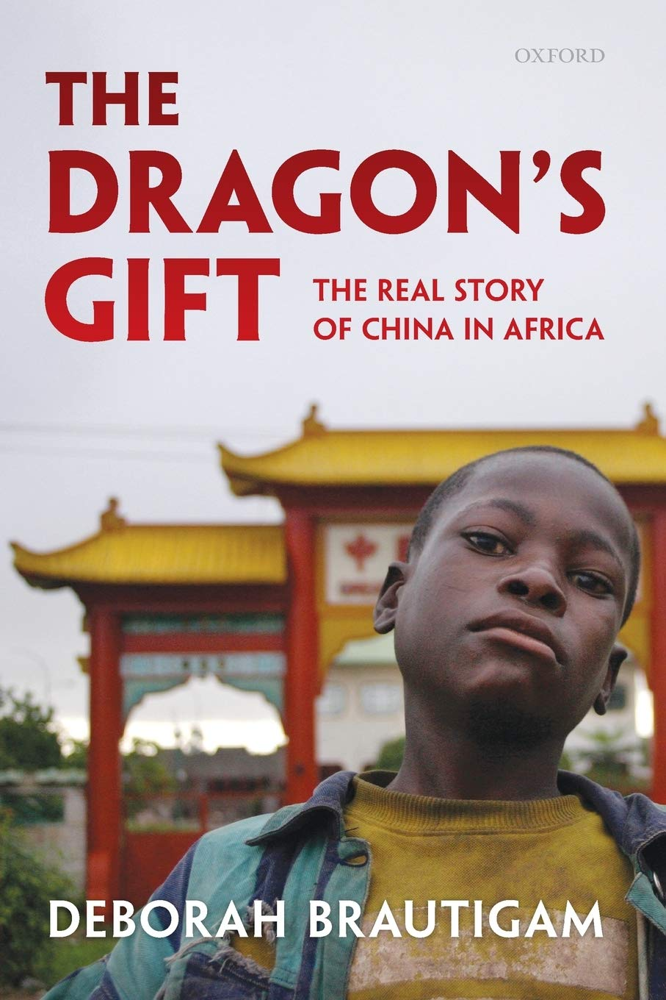

China has become the new spectre haunting on the international stage, and this looming presence has piqued my interest. This interest comes from a few angles: China is a country of over a billion souls, one of only six self-described communist sovereignties, and one of the few states to climb *out* of poverty and *up* the economic strata after the end of World War Two.

This vision of an ascendant power is now threatening the United State's economic world-leader status, and the cloak of (relative) silence around China's activities make it hard to discern what is actually going on inside the party. Is China currently carrying out a [genocide against the Uyghur minority](https://www.nytimes.com/2019/11/24/opinion/china-xinjiang-files.html) in western Asia? Possibly, though [a primary source often attributed to the claims](https://en.wikipedia.org/wiki/Adrian_Zenz) feels [guided by God](https://en.wikipedia.org/wiki/Adrian_Zenz#Theology) to carry out an anti-communist crusade, so impartiality isn't exactly guaranteed. Propaganda is dispensed freely by both the west and Chinese officials. Amusingly, this is increasingly happening [on Twitter](https://twitter.com/chenweihua/status/1382369697568546816). Is China [stealing intellectual property](https://www.justice.gov/usao-sdoh/pr/hospital-researcher-sentenced-prison-conspiring-steal-trade-secrets-sell-them-china)? Probably, but I'm inclined to believe I would do the same in their position. It's hardly fair to ask China to assemble our phones and laptops for decades while using international IP law to prohibit any kind of technological transfer. The last common talking point is the topic of today's read; is China exploiting Africa? The answer, it turns out, isn't so straightforward.

The author, [Deborah Bräutigam](https://en.wikipedia.org/wiki/Deborah_Bräutigam), comes armed with some impressive credentials. She's one of the most cited women in academia, and she's traveled much of Africa and seen Chinese industry at work with her own eyes. Bräutigam has also talked to industry leaders from both China and abroad alongside the African locals working in Chinese funded and run industry. *The Dragon's Gift* is full of casual mentions of her travels to see Chinese officials, African leaders, and laborers in person:
> In December 2008, on my way to a meeting at the Ministry of Agriculture, I passed a man addressing a group of farmers milling outside [...] a landowner from Rochain village explained to me, “We have come to tell the government what we want: schools and scholarships for the children, medical facilities, water supply, and roads.
Here, she's in Sierra Leone to discuss the [Magbass Sugar Complex](https://en.wikipedia.org/wiki/Magbass).

Since their Cultural Revolution, China has engaged with Africa in a number of ways. In the very first projects, like the Tan-Zam railway, development was modeled as turn-key projects -- simply building infrastructure and transferring ownership. This was found to be ineffective as the locals did not have the requisite skills to manage many the projects on their own. In response, China began sending Africans to China to learn the skills necessary for development. Later, China began managing constructed infrastructure such as in Sudan's [Friendship Textile Mill](https://en.wikipedia.org/wiki/Manufacturing_in_Sudan#Growth:_1998-Present). Additionally, the Chinese found many projects required continued investment and provided it. Projects that had degraded or suffered damage are routinely rehabilitated.

The investments themselves come from a relatively complex system of bids from Chinese companies, who are instructed to seek projects in particular areas at the government's request. Two separate entities actually dole out money: China's [Export Import bank](https://en.wikipedia.org/wiki/Exim_Bank_of_China) (Eximbank) and the [Chinese Development bank](https://en.wikipedia.org/wiki/China_Development_Bank).

The picture painted by Bräutigam is a far cry from the devious, scheming regime depicted by the nightly news. Instead, the story of China in Africa is one of imperfect experimentation. The book explores a huge number of topics, but here are three common narratives, debunked:
1. **China only engages in resource extraction.** This is untrue. Chinese investors are far more interested in money than resources alone. The continent of Africa and the nation of China are not close and shipping is expensive. The Chinese often prefer to manufacture and sell products within the host nation, sending only money back. Additionally, solid numbers exist to show this. *"In 2007 alone, Chinese construction companies earned revenues of $12.6 billion and signed contractions for more than $29 billion in Africa."*
2. **China allows dictators to cling to power.** What's true is that in general, the only condition China imposed on recipient nations until the 90s is that they followed the One China policy. Compared to the west and the [Bretton-Woods](https://en.wikipedia.org/wiki/Bretton_Woods_system) institutions this was a far less stringent set of requirements to levy. Many recipients of investment (and I do mean *investment* -- very little of China's foreign engagement is considered aid internally) are still imperfect, ruled by dictators or noted for human rights abuses. The difference in philosophy between China and the West here is that development can occur even under these less than ideal conditions. Indeed, this was the case in the UK during it's period as the factory of the world. *"We don't attach political conditions. We have to realize the political and economic environments are not ideal. But we don't have to wait for everything to be satisfactory or human rights to be perfect."* - Liu Guijin, special envoy for Africa.
3. **China is issuing predatory loans in Africa.** Again, this is untrue. China often gives loans at rates equivalent to or below IMF rates, often to countries who are not eligible for other forms of development. The approach to overdue loans was one first of rescheduling and later forgiveness: *"At first, when aid loans started to come due in the early 1980s, China rescheduled them... Repayments for the [Tan-Zam](https://en.wikipedia.org/wiki/TAZARA_Railway) railway were put off for ten years"*. Later, in 2000 and beyond, China would begin cancelling many cases of unpaid debt.

Another common issue is environmentalism, something I personally feel strongly about. Is China's development impacting the delicate savannah and jungle ecosystems of Africa? Undoubtedly. However, I am reminded of a clip from Anthony Bourdain's part's unknown where he discusses the future of Madagascar with filmmaker Darren Aronofsky:

> A lot of people feel that the future should be ecotourism, [and] people should essentially be working in hotels and restaurants for tourists. That’s kind of a return to colonialism, isn’t it?

The west was allowed to develop its land and extract resources despite the damage to the ecosystem and dangerous working conditions. Shouldn't Africa be given the same right? Perhaps it's possible to have our cake and eat it too, but so long as many of the world's poorest languish in conditions not seen on *our* continent for hundreds of years it's tough to criticize any ongoing development.

Often, stories in the west miss fundamental pieces of the story of China in Africa. Conversions are made from Yuan instead of Renminbi. Sequential bids for construction are mistakenly summed. Journalists are confused by the style of [grouping numbers in 10,000 unit chunks](https://jisho.org/search?utf8=%E2%9C%93&keyword=man), a common practice in China and Japan. 

Bräutigam strikes a balance between refuting untrue claims of China and Africa while also acknowledging failures. Many of the first projects, like Tan-Zam or the Friendship Textile mill, struggled to turn a profit -- and thus stay sustainable. Other projects are readily admitted to by the Chinese as being vanity projects, such as sports stadiums. The claim of supporting dictators isn't entirely untrue, like Mugabe in Zimbabwe, though it's often a more complex situation than implied in media and China has become more conscious of this in recent years. The book itself is also imperfect -- I found the system of organization around themes to be tough to follow at times, and I would be curious to see a similar work laid out chronologically either from the perspective of China or Bräutigam herself.

So much ground is covered in this book that I can only implore anyone interested in (or skeptical of) Chinese investment in Africa to read it. My takeaway? China has been slowly modifying their approach over the last 50 years, continually tweaking the strategy to find what works and what doesn't. Where the west sends aid, China invests in infrastructure and people. Two hundred years of western aid and NGO attention has not lifted Africa out of poverty. Perhaps it's time to try something new.