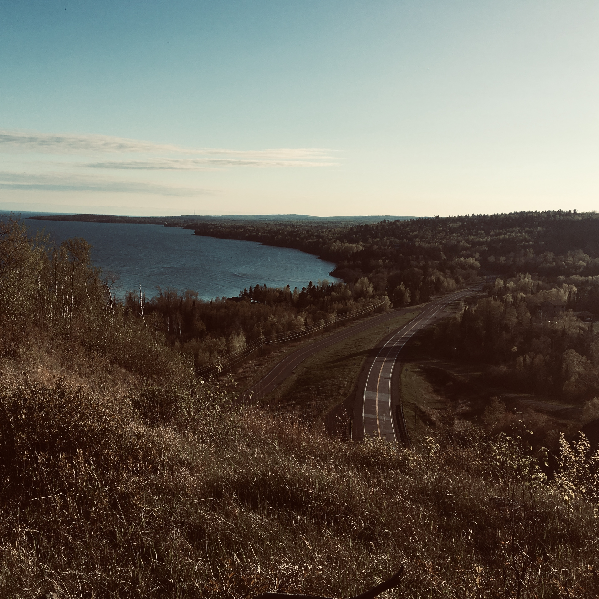
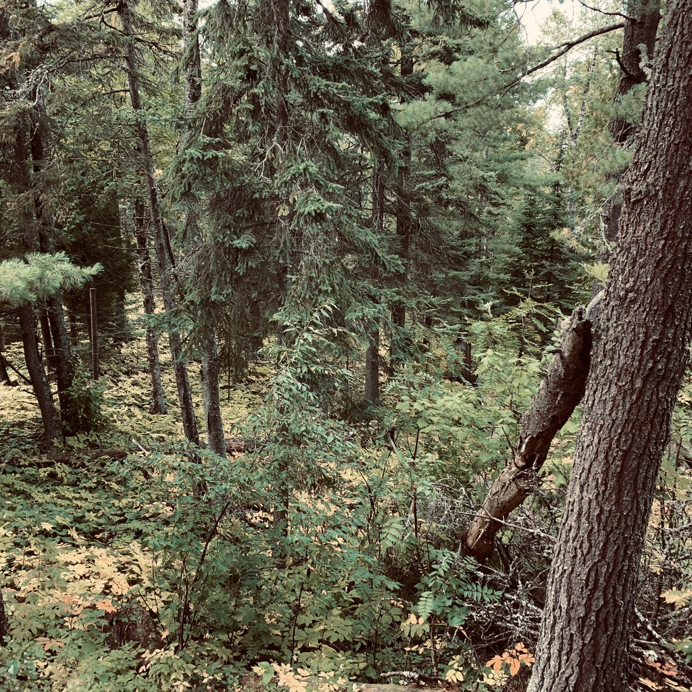
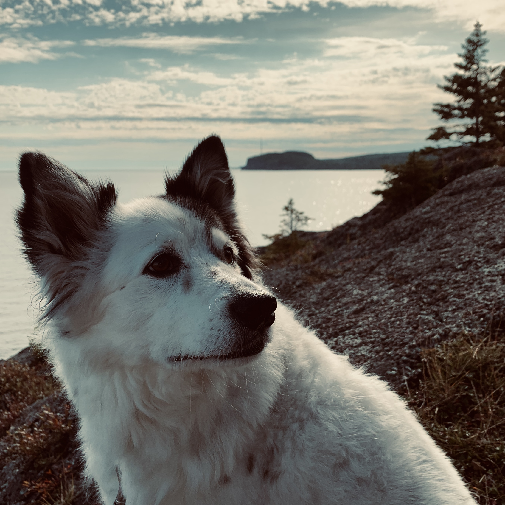

# the trip that didn't happen
I take the last sip of cold coffee out of the thermos as I pull into park. Rigby, sensing the car is slowing, makes the herculean effort to stand up from the folded-flat seats of the hatchback and nearly trips over the center console to reach the front seat. No matter how difficult, one of his joys in this life is emerging from a deep slumber to find himself transported, almost as if by magic, to some new destination. He won't be disappointed. The clock reads a minute to eight and I have over an hour to spend before my relatives are here.

The wiley grounds in the bottom of the thermos that slipped past the filter over three hours ago stare back and I consider them carefully. What absurd odds that the arabica shrub should spring forth from the tree of life, beaten into a tactical self-defense of insecticidal caffeine production only for us to come along thousands of years later, developing a taste for these beans and their particular biochemical alkaloid interactions in our brains and to cultivate them, carefully, shipping them around the globe in sealed pouches and grounding them to powder and immersing them in boiling water and carrying them in a too-small thermos in the seat of a car powered by crude oil from a thousand miles in the other direction and a million years ago all the way to the rocky shoreline of Lake Superior and it's frigid waters. How strange that we do that.

Rigby, looks at me and breathes hot, smelly dog breath in my direction. The car is stopped, this is the part where we get out and I get to inhale the air and the grass and the pollen and see the people and feel the Earth beneath my paws. Why aren't we doing that? He's almost 15 now. Cancer is eating his bones but it doesn't matter. Today he is happy to be here, and tomorrow none of us will exist because the chemistry holding our fragile selves will stop and we will sink into the Earth, perhaps adorned with a commemorative rock bearing our name and Age of Living, until that too is ground to dust and the very spot is folded like taffy back into the depths of the mantle sending tremors through what was once San Francisco but now is something unimaginable. 

Late September heat seeps into the car and drives me from my stupor. Rigby gets his wish. He is sleek and streamlined as he pulls against the leash to escape the hot tar of the parking lot. Back on cool Earth, the leash is once again a relic of his youth, a formality that we abide by so the park might let us stay. We skip the visitor center which is offering to add context to this geographical site as if we were consequential to it or anything at all. Inside families flit from plaque to plaque, pausing over the park model and its tiny simulacrum of a moment in reality.

We decend into the cool forest and its carpet of humus and moss almost silently against the sound of a waterfall that was once much larger but is now just a trickle. All around us is the life and death of a forest and people pass on path as though we are all immortal and separate from it and the protein ballet inside us is not snipping away at our telemeres like a candle burns a wick. We will meet again on this path in a year. In ten years. In a hundred years. We will do this forever.

We reach the waterfall and then the lake. Everyone says the lake is fickle and has moods but the personification rings hollow to me. It is indifferent and today it is cold. The bright sun is cutting loudly through an impossibly bright sky and this is the part where Brian Eno would fade in and the screen would fade out but it doesn't and I wish I could meet my friends by the concession stand after it all and talk about how it was and what we liked and what was bad but the reel seems endless so I sit and watch until my rock digs into my skin.

On the way back up the path an old man approaches. I nod and say hello but he is not looking at me. Rigby has stopped trotting to stare at the interloper, ears forward, straining for something. "It's a nice day", the old man says, but not to me. It sure is.