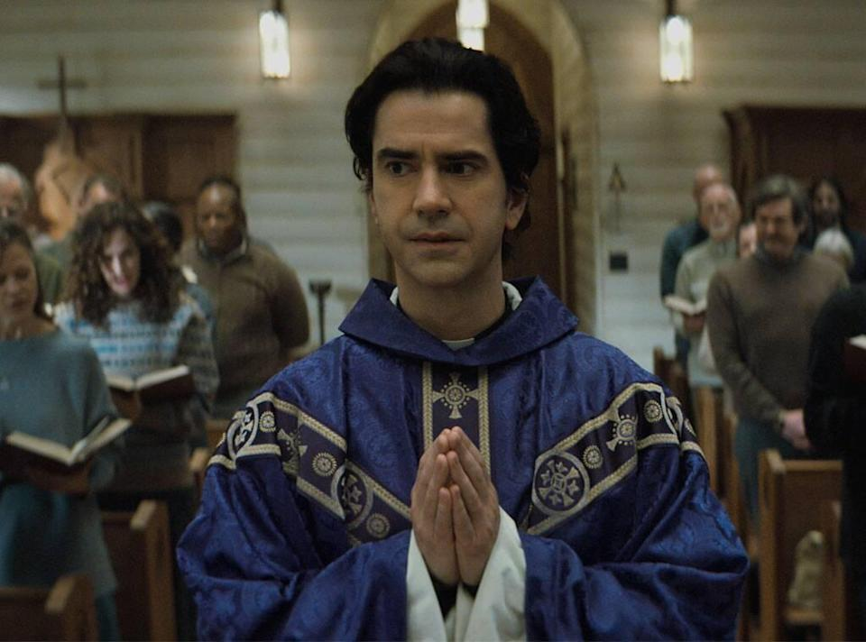
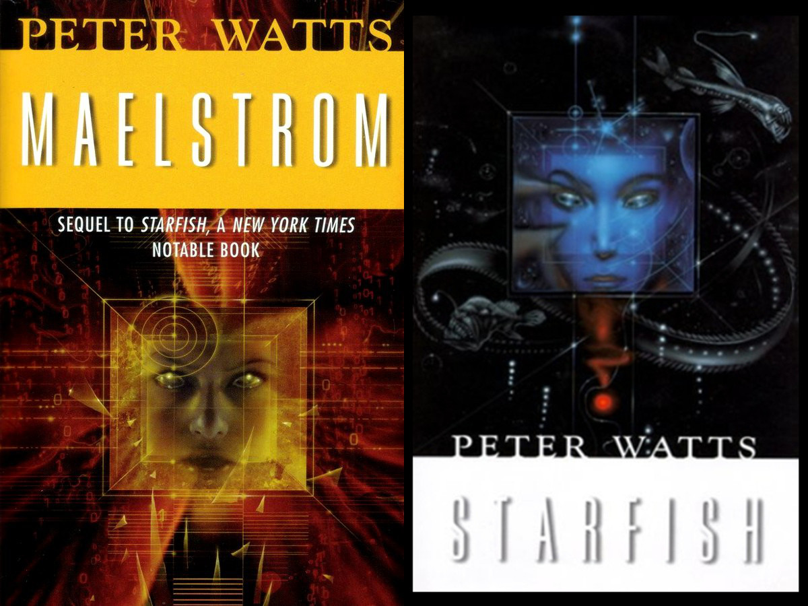

# september media roundup
### midnight mass (netflix)
Watch the teaser for [Mike Flannigan's](https://www.imdb.com/name/nm1093039) Midnight Mass and you'd guess it's the heartwarming story of a priest connecting with a physically disabled girl. Watch the actual show and what you'll actually find is thriller with an ecclesiastical backdrop. It certainly kept me guessing; was this a story about faith? A simple horror flick? A parable about death and grieving? Midnight Mass falls somewhere between all three themes without fully embracing any of them, though it veers towards horror and the contemplation of death in the last two episodes.

There are a few strong roles in the series. [Hamish Linklater](https://www.imdb.com/name/nm0512934/) plays a convincing young priest brimming with the holy spirit, and [Samantha Sloyan](https://www.imdb.com/name/nm1418096/) plays a chilling acolyte steeped too long in her own grandeur. Other performances lacked. [Alex Essoe](mildred.jpg) was cast to play the geriatric mother of [Annabeth Gish](https://www.imdb.com/name/nm0001272) at only 29, and despite the efforts of makeup artists this age gap shows. Wearing glasses and a head scarf does not a convincing disguise make.

Despite these casting weaknesses and a few *really* self-indulgent monologues between Riley Flynn and Erin Greene (seriously, I clocked one of them in at over five minutes), the series is a well executed, original screenplay worthy your attention.

### rifters
Before starting Midnight Mass I was in a media rut. I had been reading heavy non-fiction ending with *Primary Healthcare in Cuba; The Other Revolution*, which, by the way, is actually worthwhile. I was in the mood for something easy and fun, so I settled on a the first two novels in the *Rifters* series by Peter Watts.

The initial setting is the bottom of the pacific ocean and our characters are bio-engineered to be incompressible, allowing them to act as [saturation divers](https://en.wikipedia.org/wiki/Saturation_diving) without gear or decompression. Their chests are replaced with machines and their eyes obscured by photon sensors, and drifting at the bottom of a volcanic ridge they maintain the generators required to power the 30th century North American Pacific states. 

Adding to the physical pressure, extensive psychological testing reveals to their handlers that those best suited to this isolated work are those "pre-distressed" souls who have experienced past trauma. The rifters grapple with both physical danger and fight [l'appel du vide](https://en.wikipedia.org/wiki/Intrusive_thought) as they sink deeper into isolation and lose their sense of self.

This haunted setting  makes for an incredible first book, but it isn't meant to last. The second novel sees our characters leave the [Juan de Fuca](https://en.wikipedia.org/wiki/Juan_de_Fuca_Plate) rift and head for the surface which degrades the series from something unique to something closer to mundane. Regardless, these first two novels make for an excellent read.