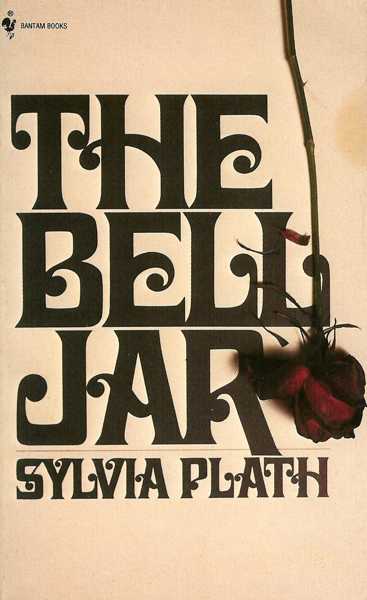

# the bell jar
The Venn diagram of Reddit users and psychedelic drug users must be a near perfect circle of 20-something yuppy males. I'm attracted to [that corner of the internet](https://www.reddit.com/r/RationalPsychonaut/) in the same one one reads the Wikipedia pages of serial killers or stays glued to the TV while lurid details of highway accident spill out of the screen. It's enticing, and only rarely do I bother to engage because the majority of the posts are the same little paragraph. Clones of it trickle in like drops in the ocean, twenty four hours a day, seven days a week: *I just had a psychedelic experience that shook me up and I no longer understand my place in this world.*

The usual advice from the wise internet drug gurus who may or may not just be addicts falls into a few categories. The first is one of a few tired aphorisms -- *Before enlightenment: chop wood, fetch water. After enlightenment: chop wood, fetch water.* There's the prototypical Carl Sagan or Ram Das YouTube link which goes hand in hand with the user who posits that the panacea for existential dread is to just do more drugs, more often. Somewhere near the bottom, possibly downvoted so far as to be hidden by default, there's a meek suggestion that the solution to a traumatic pharmacological experience is actually *not* to replicate it. Occasionally someone really wise will suggest tea.

On a particular thread, however, I came across a quote that intrigued me:
> I saw my life branching out before me like the green fig tree in the story.   From the tip of every branch, like a fat purple fig, a wonderful future beckoned and winked. One fig was a husband and a happy home and children, and another fig was a famous poet and another fig was a brilliant professor, and another fig was Ee Gee, the amazing editor, and another fig was Europe and Africa and South America, and another fig was Constantine and Socrates and Attila and a pack of other lovers with queer names and offbeat professions, and another fig was an Olympic lady crew champion, and beyond and above these figs were many more figs I couldn't quite make out.   I saw myself sitting in the crotch of this fig tree, starving to death, just because I couldn't make up my mind which of the figs I would choose. I wanted each and every one of them, but choosing one meant losing all the rest, and, as I sat there, unable to decide, the figs began to wrinkle and go black, and, one by one, they plopped to the ground at my feet.

Hmm, that's something new. A succinct synopsis of analysis paralysis and the post-psychedelic ennui of an animal that suddenly no longer has a trail to follow. Or, you know, *so I've heard*.

I went into *The Bell Jar* with no further introduction to the novel or the author beside this quote. To the acquainted reader, you can image my surprise as the narrative turned from posh New York tediums to the suburban suicidal ideation. Some context for the rest of us: [Sylvia Plath](https://en.wikipedia.org/wiki/Sylvia_Plath) laid her head in an oven and turned the gas on one month after publication.

Despite the grim turn of events, this was a worthwhile read. Plath's descriptions of the daily grind are likely familiar to anyone:
> I saw the days of the year stretching ahead like a series of bright, white boxes, and separating one box from another was sleep, like a black shade. Only for me, the long perspective of shades that set off one box from the next had suddenly snapped up, and I could see day after day after day glaring ahead of me like a white, broad, infinitely desolate avenue.
Insomnia aside, I felt the same dread of a continuum ahead of me as soon as I completed my undergrad -- all the little milestones of student life had evaporated. There was nothing left to delineate one week from the next. I entertain myself by plotting sabbaticals and gap years that will likely never come to fruition, rotting at my feet like Sylvia's plums did. Yet, for now, it is enough. Pick up a copy of *The Bell Jar* if you want to spend a week commiserating with an author who can put the feeling into actual words.