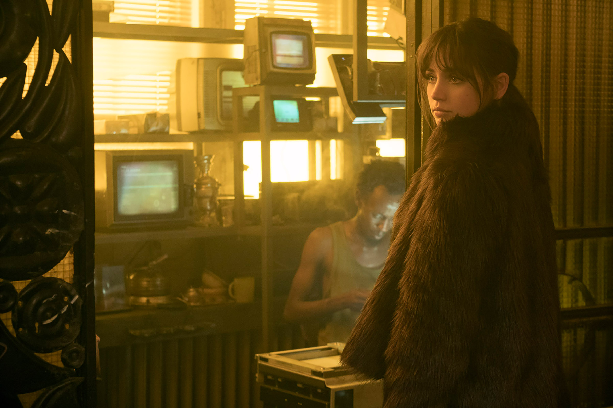
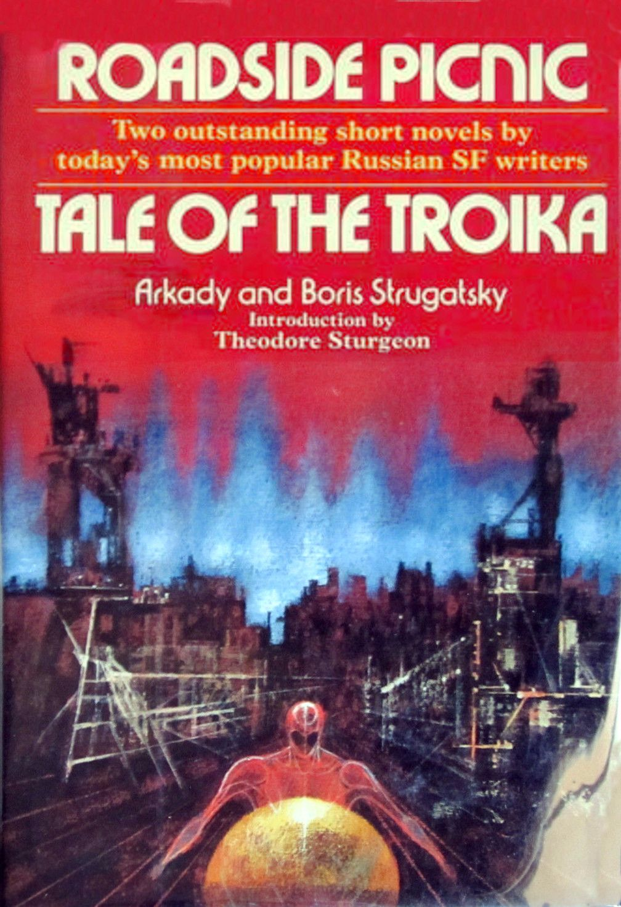

The intersection of technology and fiction is fraught with annoying inaccuracies, but carefully applied temporal aesthetics have created some of my favorite universes in science fiction. What's especially interesting to me are  anachronistic retro-futurisms. Two examples of this are shown in Denis Villanueve's last films, *Blade Runner 2049* and *Dune*. The former was originally directed by Ridley Scott in 1989 before Villanueve's 2017 reboot. To this day the reboot remains my favorite film. Afterwards, Villanueve moved to the challenge of Frank Herbert’s *Dune* — the same troublesome franchise that David Lynch directed in 1989 and would later describe as a "great sadness" in his life.

The question, then, is why these far-future epics insist on the use of tech from the past. We see it in Blade Runner’s tech melange: microfilm scanners from the 50s are smoothly operated with intelligent voice controls and clunky [cathode-ray screens](https://en.wikipedia.org/wiki/Cathode-ray_tube) are connected to incredible autonomous robots. In Dune, a luddite revolt dubbed the ‘Butlerian Jihad’ rejects artificial intelligence and weakly justifies the need for a human in the loop. Are these anachronisms included solely for aesthetics? Or do they reveal something about the ecological nature of technology? By imagining a world via subtraction of something — the cheap processor, the portable screen, computerized automation — we are able to view the effects of technology in isolation. How might have the rest of technology progressed to support these niches? What is lost when a breakthrough occurs?

Derrida might call these phenomena [hauntology](https://en.wikipedia.org/wiki/Hauntology), but I was first introduced to this term by Mark Fisher who noted that while it's easy to imagine these alternative futures, we've stopped imagining futures with the subtraction of capitalism -- that we've reached the postmodern [end state](https://en.wikipedia.org/wiki/End_of_history) of society. Every apocalypse story now ends in the triumphant recreation of capitalism. As Slavoj Žižek put it, it is easier to imagine an end to the world than an end to capitalism. So why does the specter of communism still haunt from beyond the grave?

# Media Roundup
I've finished a few other bits and pieces worth mentioning this month. The first was *Roadside Picnic* by Arkady & Boris Strugatsky, first published in 1971. The scene is a surreal zone created by an alien impact on Earth and it's bizarre effects on the life around it. Men called Stalkers loot the zone for valuable artifacts and die in great numbers doing so. It has an obvious modern parallel in *Annihilation*, a gripping sci-fi novel adapted in to an equally great film that flopped despite a great soundtrack, cast, and execution. I'm not the first to notice the similarity -- Jeff VanderMeer has [fended off accusations](https://twitter.com/jeffvandermeer/status/754674019174060032) of lifting ideas from Roadside Picnic in the past. Both novels (and their film adaptions) are well worth your time.

I also finished Dan Harris' *10% Happier*, a short read on his experiences with meditation as a high-strung TV presenter with PTSD from time in Afghanistan and subsequent drug use. There was nothing new in this read, but the prose itself was enjoyable and a good reminder to stay present. I also finished Lenin's *The State and Revolution* which is notable only for showcasing how catty Lenin was. A few nuggets of interesting theory are buried here, but you must wade through his categorical rejections of "reactionary" socialists in Germany, Russia, and abroad. Lastly, I finished *On The Road* by Jack Kerouac. For the uninitiated, *On The Road* is considered a zeitgeist of the [beats generation](https://en.wikipedia.org/wiki/Beat_Generation) novels and takes the shape of a series of sweaty, intense road trips in which the protagonists consume alcohol, drugs, and jazz in great quantities. It captures a careless, grungy, and bohemian lifestyle extremely well and while the middle drags, some lucid prose at the end partially justifies the great journey to get there.

I also finished a few series -- *Invasion* which was produced by Apple at the enormous cost of $200 million. It's intended to be a psychological thriller and mystery, but the only real question is where Apple spent a fifth of a billion because it certainly wasn't on actors, writers, or effects. You're better off scrolling through [TV Tropes](https://tvtropes.org/) than watching this one. I also finished a fun telenovela called *Alguien Tiene Que Morir* by the same Netflix team as *Casa de Flores*. At only three episodes this was a tight story. In theatres I saw Ridley Scott's *House of Gucci* which rode the line between comedy and drama without being great at either. A few perplexing choices for music and dialogue left me nonplussed. Naturally I carved out the time to see Dune twice; it's a fun story, but Villeneuve's best work remains  the neon-soaked *Blade Runner 2049*. Perhaps the second half of the diptych will pick up the slack.