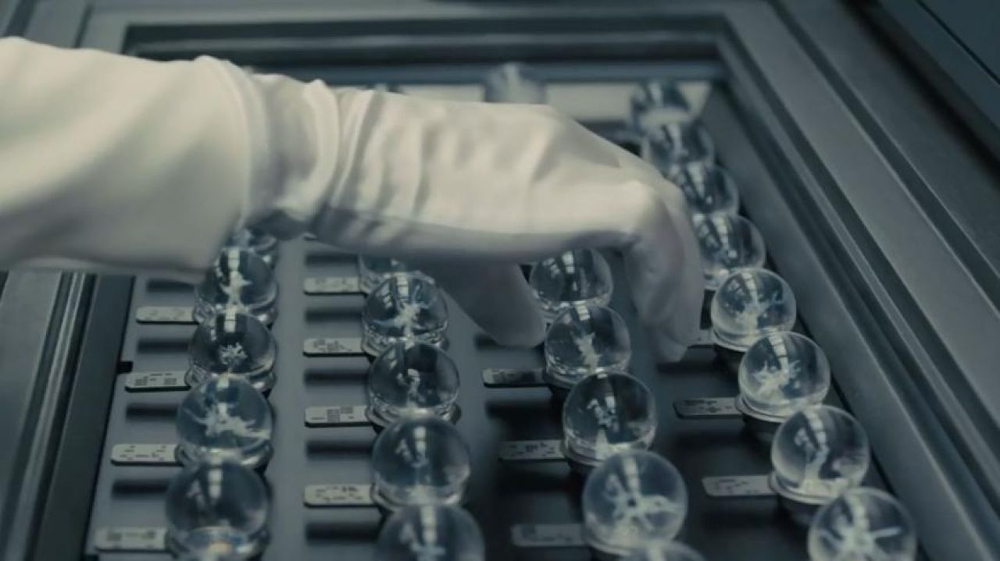

The intersection of technology and fiction is fraught with annoying inaccuracies, but *carefully applied* inaccuracies can also serve as an intentional choice. In fact, these temporal aesthetics have created some of my favorite universes in science fiction. Especially interesting to me are  anachronistic retro-futurisms, when a film set in the future explores how a small change to technology can shape society. Two films that exemplify this come to mind, both recently directed by Denis Villanueve: *Blade Runner 2049* and *Dune*. The former was originally directed by Ridley Scott in 1989 before Villanueve's 2017 reboot -- to this day the Villanueve reboot is still my favorite film. Afterwards, he moved to the challenge of Frank Herbert’s *Dune* — the same troublesome franchise that David Lynch struggled to direct in 1989 and would later describe as a "great sadness" in his life.

The question, then, is why these far-future epics insist on the use of tech from the past. We see it in Blade Runner’s tech melange: microfilm scanners from the 50s are smoothly operated with intelligent voice controls and clunky [cathode-ray screens](https://en.wikipedia.org/wiki/Cathode-ray_tube) are connected to incredible autonomous robots. In Dune, a luddite revolt dubbed the ‘Butlerian Jihad’ rejects artificial intelligence and weakly justifies the need for a human in the loop. Are these anachronisms included solely for aesthetics? Or do they reveal something about the ecological nature of technology? By imagining a world via subtraction of something — the cheap processor, the portable screen, computerized automation — we are able to view the effects of technology in isolation. How might have the rest of technology progressed to support these niches? What is lost when a breakthrough occurs?

Derrida might call these phenomena [hauntology](https://en.wikipedia.org/wiki/Hauntology), but I was first introduced to this term by Mark Fisher who noted that while it's easy to imagine these alternative futures, we've stopped imagining futures with the subtraction of capitalism -- that we've reached the postmodern [end state](https://en.wikipedia.org/wiki/End_of_history) of society. Every apocalypse story now ends in the triumphant recreation of capitalism. As Slavoj Žižek put it, it is easier to imagine an end to the world than an end to capitalism. So why does the specter of communism still haunt from beyond the grave?

## media roundup
I've finished a few other bits and pieces worth mentioning this month. The first was *Roadside Picnic* by Arkady & Boris Strugatsky, first published in 1971. The scene is set in a surreal zone created by an alien impact on Earth haunted by bizarre phenomena that rips people apart and, occasionally, puts them back together. Men called Stalkers loot the zone for valuable artifacts and die in great numbers doing so. Roadside Picnic has an obvious modern parallel in *Annihilation*, a gripping sci-fi novel adapted in to an equally great film that flopped at the box office despite a great soundtrack, cast, and execution. I'm not the first to notice the similarity -- the author, Jeff VanderMeer, has [fended off accusations](https://twitter.com/jeffvandermeer/status/754674019174060032) of lifting ideas from Roadside Picnic in the past. Both novels (and their film adaptions) are well worth your time.

Dan Harris' *10% Happier*, was a short read on his experiences with meditation as a high-strung TV presenter with PTSD from time in Afghanistan and subsequent drug use. There was no information on meditation new to me in *10% Happier*, but the prose itself was enjoyable and the maxims he chooses are worth repeating. I also finished Lenin's *The State and Revolution* which is notable only for showcasing Lenin's catty nature. A few nuggets of interesting theory are buried here, but you must wade through his categorical rejections of "reactionary" socialists in Germany, fascists in Latvia, and problematic Italians. Lastly, I finished *On The Road* by Jack Kerouac. For the uninitiated, *On The Road* is considered a zeitgeist of the [beats generation](https://en.wikipedia.org/wiki/Beat_Generation) takes form through of a series of sweaty, intense road trips where the protagonists consume alcohol, drugs, and jazz in great quantities. It captures a particular type of carefree, grungy, and bohemian lifestyle extremely well. While the middle drags, some lucid prose at the end partially justifies the great journey to get there.

*Invasion*, a miniseries produced produced by Apple at the enormous cost of $200 million, was intended to be a psychological thriller and international mystery. The only real question is where Apple spent a all their money. It certainly wasn't on actors, writers, or convincing effects. You might as well save yourself a few hours and scroll through [TV Tropes](https://tvtropes.org/) instead.

I also finished an explosive telenovela called *Alguien Tiene Que Morir* by the same Netflix team as *Casa de las Flores*. At only three episodes, it was a fast, tight story with LGBTQ representation and excellent acting.

In theatres I saw Ridley Scott's *House of Gucci* which rode the line between comedy and drama without being great at either. A few perplexing choices for music and dialogue left me nonplussed. Naturally I carved out the time to see Dune twice; it's a fun story, but Villeneuve's best work is still found in the neon-soaked streets of *Blade Runner 2049*. Perhaps the second half of the Dune diptych will pick up the slack.