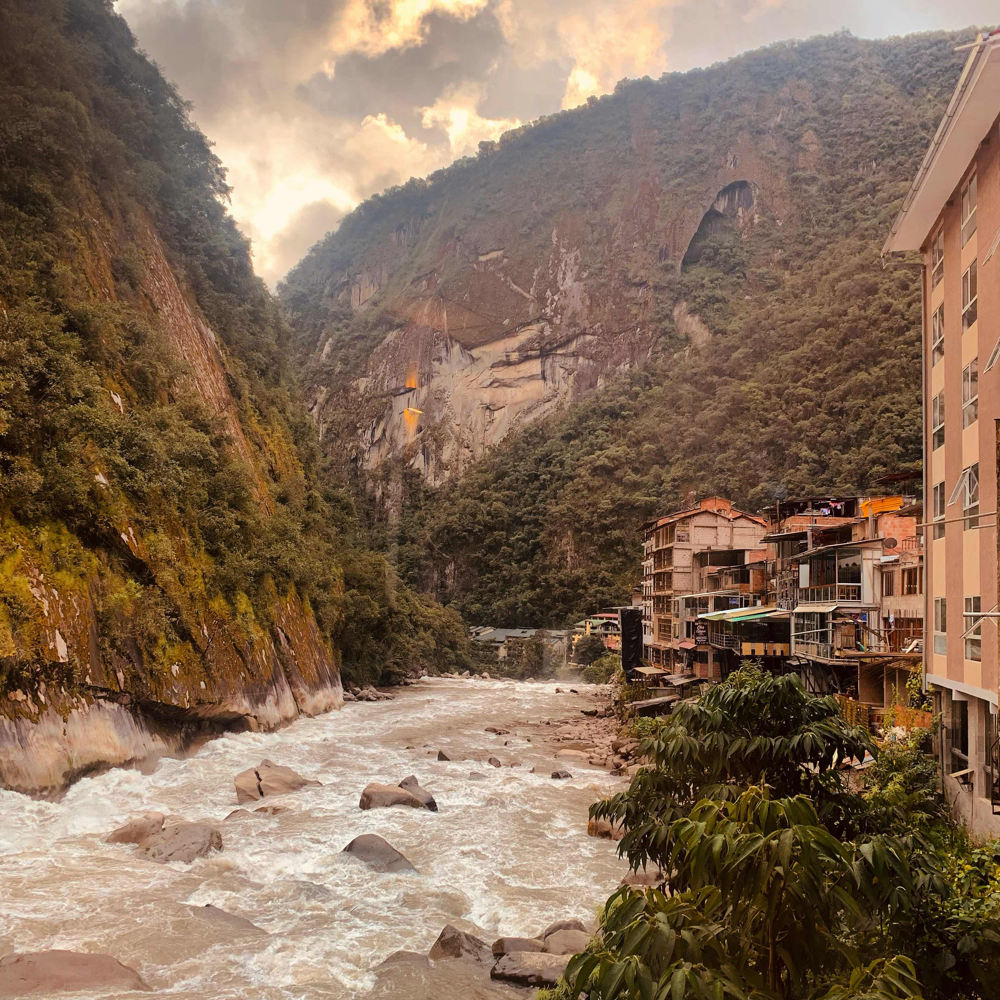

Last time I traveled I reached a maximum distance from home at Lũng Cú, Việt Nam. This might have been the maximum distance over land as well, but I prefer to think in [isochrones](https://en.wikipedia.org/wiki/Isochrone_map). That is to say, how far are you from home *in time*? It's an interesting question because the answer is so variable; even being slightly short on currency changes the equation if you can't afford transit.

I recently returned from two weeks in the beautiful country of Perú and after pondering the isochrone question I think it must have been here, in Aguas Calientes:

I've struggled to write anything about this trip for awhile. Already, it blends together with past trips because the style of travel I've done has all been similar. It features other 20-somethings, hostels, the smallest backpack I can manage, and the pull between wanting to socialize and being mildly disgusted with other tourists and the industry as a whole. The most perplexing part is the number of people who travel around the world simply to drink in a nightclub that could be anywhere on Earth. So, was any part of this experience worthwhile? Is everything simply about extracting money from tourists and checking boxes?

I had one interaction on the outskirts of Cuzco worth discussing. It might have been my only interaction with a Peruvian that didn't revolve around money. She was old, maybe in her 80s, resting in the shade by the side of the road. I had spent too many Soles to get out to the countryside to see some ruins. I was already tired of Cuzco and sat down not far away to daydream and hide from the intense equatorial rays. We ended up talking for a time in Spanish, and the slow drawl of the countryside was much easier on my gringo brain so I was actually able to keep up. Not so with Limeños. Her life, she explained, had been difficult. Already two of her kids were dead. She now made ends meet by selling junk to tourists like me, but did not attempt do so while we chatted. To me this added some form of purity to the interaction. Neither of us had anywhere to be nor any agenda to sell. She asked me how much money I made in a year and I answered honestly. It's an unfathomable sum in Perú. I wanted to dig more, to ask her opinions on the throngs of tourists and the modern day indigenous experience but our exchange ended abruptly; just as she had finished explaing the local transit system to me, the Cuzco bound minibus careened over the hillside. I was lucky; it came to an almost complete stop to let me on.

Of course, the natural beauty of Perú speaks for itself. The nation obviously capitalizes on this as a point of advertising, but it's not in bad faith. I don't have much commentary to add to these pictures -- the hike I took to Machu Pikchu cost $600, 5 days, 10 pounds of body weight, and a pair of sneakers. It was worth every bit.

Tupananchiskama.