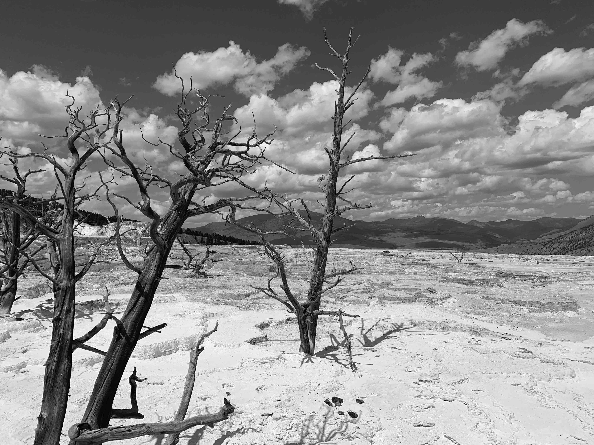
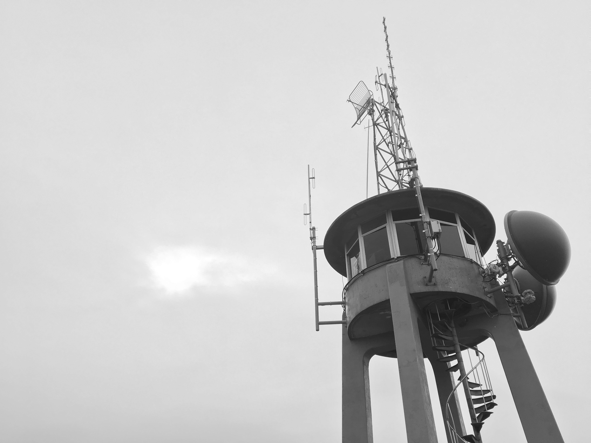
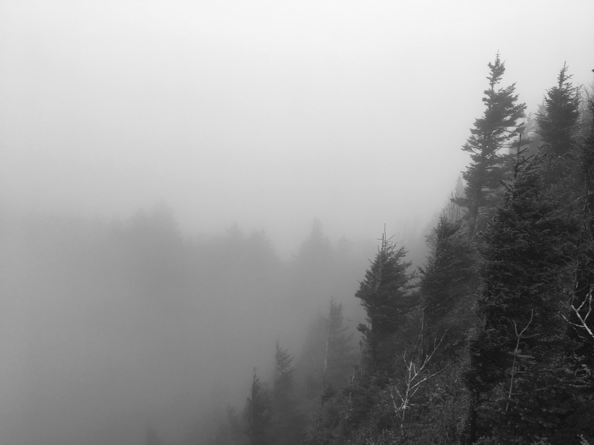

He watched a single dust mote float downwards, occasionally buffeted by an unseen draft but ultimately and unarguably sinking through the shafts of light that divided his dominion. Again he considered going home, but there was not time and the rift between them was unrepairable. Besides, things were quiet here and he appreciated the solitude. The only interruption was drifters passing through to grab supplies. All things considered they were surprisingly polite. There was comfort in social rituals. He politely informed them that the pumps that they were dry. Most said nothing or muttered only a quiet thank you. He sat behind the counter, but wasn't even his shop. It was simply a refuge, or perhaps a purgatory.

The muted tube TV in the corner featured a floating head discussing the waves of crime rippling through cities. The subtitles below were riddled with errors. Was someone still typing them out? He couldn't see why it mattered. Each medium, whether it be radio, TV, or internet featured a new exercise in futility. Respectable outlets were ostensibly bound by professionalism to play on until the end, speculating on the reasoning, strategies, or simply reporting on schemes of nations to shelter their heads of state. The less salubrious outlets were lambasting the head of NASA for an oversight beyond human comprehension or outright denying what was coming. Since global consensus was reached most channels were reduced to transmitting a countdown. 

None of it mattered. Momentum does not ask for permission.

The mote of dust finally settled, signifying the end of ad-hoc meditation session. It was not Theravada or Zen but something new -- he grinned slightly trying to create a portmanteau for his novel school of meditation. Through the grimy, dust-stained windows he glimpsed a flicker of movement, something past the desiccated vines still clinging to the station walls. Almost returned to his meditative state, he watched a small hatchback park neatly in front of a pump and a woman, perhaps college age, untangle herself from strewn clutter in the car and lock the door behind her. The sharp chime of the bell of the door broke the revery.

She walked directly to the counter, making eye contact, and slapped a twenty dollar bill on the table. The ease and weightlessness with which she walked betrayed an innocence he hadn't seen in weeks. He cocked his head slightly at this.

"Pump six please."  
"The tank is dry." He answered too quickly and the words sounded like a reprimand.  

An awkward silence settled as if carried on motes still swirling around them.

"Where are you coming from?"

She laughed and launched into an exuberant description of backpacking in the rockies for the last two weeks. The bemused look spreading across his face slowed her down.

"Is something wrong? You and everyone else I've talked to since leaving the back country has been acting strange." He looked away, suddenly ashamed. With his left hand he shut off the TV in the corner.

"It's just that the store is permanently closing. Food's on the house. I'd rather it get eaten than spoil. Can I get you anything else?"   

She did not seem to believe him, but five minutes later she was seated at one of two ragged vinyl-covered stools facing out through the yellowed window. Between bites of stale hotdog and chips she explained the correct technique for crossing snowy terrain in the mountains.

"You know," he said, "there aren't many like you anymore."   

"Because I went camping alone? You sound like my mom. Speaking of, I should really figure out how I'm going to get to the next gas station. The Subaru is almost empty and I'm supposed to meet her in Denver tomorrow." She took another bite, brows furrowed.   

He paused. Denver was a 16 hour drive. There wasn't time. It would be pointless. He strode back behind the counter and started shuffling through the mess of receipts and granola wrappers.

"There might be gas in one of the gas cans out back."  
"Oh?" She relaxed a little.  

Between the cigarette case and magazine stand, the previous owner had kept a lockbox. He found the key on his first day at the station and opened it out of idle curiosity. Inside was a sleek, heavy revolver. Back when he still felt acute fear he had found comfort in its weight. It was loaded. 

"Why travel alone?" He glanced up through the plexiglass at the ghostly scuffed figure still seated by the door.   

"There's a freedom in it." He couldn't tell if she had turned around yet. He could only hear movement. "At first, it is hard to be alone with your thoughts."  

He clicked the barrel idly. "What do you think matters in this life?"  

"Excuse me?" The mass behind the glass shifted again.  

"I'm reading a book on philosophy. Have you ever considered the question?" The barrel completed another rotation and clicked neatly into place.  

"Before I dropped out I took an intro class." She paused, motionless. "I liked the utilitarians the most. You know, minimize suffering, maximize happiness. It's straightforward."  

"Which is it?" The barrel made another revolution. "Maximizing happiness, or minimizing suffering?"  

She answered and he nodded slowly. "Thank you." He stood slowly, walked around the glass, and then closed the distance between them.