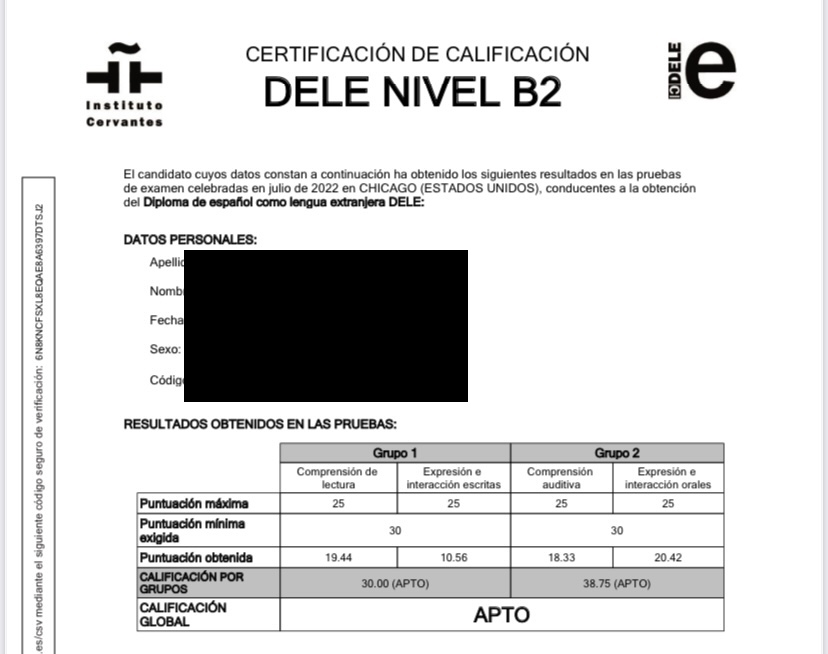
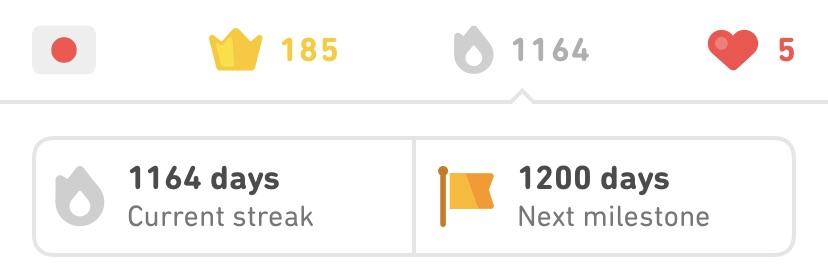
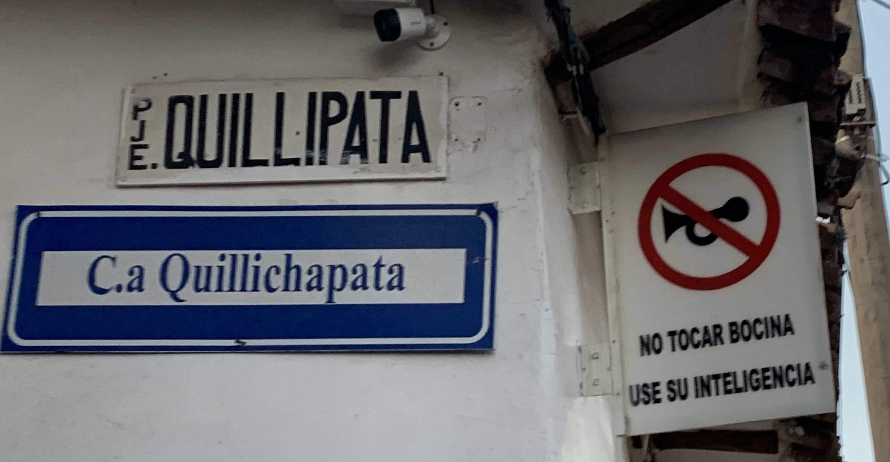

Yesterday I recieved my diploma from the [Instituto Cervantes](https://en.wikipedia.org/wiki/Instituto_Cervantes) in Madrid. It certifies that I am (barely) proficient enough to be considered level B2 on the [Common European Framework of Reference for Languages](https://en.wikipedia.org/wiki/Common_European_Framework_of_Reference_for_Languages), which places me at level four of a possible six, with six being the highest. To get this diploma I had to travel physically to another state and spend three hours reading, writing, listening, and speaking. It does not say I am fluent nor does it qualify me for a Spanish speaking job. It is a minor success, but one that very few language learners ever achieve. I thought I would take some time today to reflect on what it took to get here, what worked, and what didn't.

I started in ernest near the end of college, spurred on by what I once heard called the end of *auto-progression*. Throughout childhood and academia one can passively progress through stages which grant some measure of acomplishment. First it is grades, then semesters and a degree. Once you decide to check out of academia that ends and all achievements earned afterward must be done of your own initiative. That desire for achievement drove me to return to Spanish, the language I had once despised in high school. It does not bring me joy to say the antics of my friends and I in that stage of our lives caused a lot of strife in the Spanish department.

The easiest starting path was Duolingo, the language learning app with a feathered mascot. I would go on to pour a *lot* of time into this app and later finish the Spanish course. When I quit my streak was over 1000 days long. With these achievements under my belt it was a miracle my head fit through the door of the small coffee shop where my first in-person Spanish meetup would take place. Thankfully, this first chat quickly disabused me of the idea that you can learn a language with an app and I quit Duolingo shortly after.

From there I branched out to other in-person groups that I found via Meetup, a social networking site focused on events. On the wall of that first coffee shop someone had pinned a note about a Spanish literature circle which I still go to today. There were other fruitless strategems like online tutors, textbooks, and local classes. I set all of my websites and devices to Spanish with some funny results -- many of these leak the user's language outward. I even traveled to [Perú](https://www.strlog.net/2022-04-29).

The difficulty with language learning comes from two sources. First, it is a very long term project, and second it is not a goal by itself. Reaching fluency is not a goal because it is not measurable. In other words, how do you know when you are done? It is for that reason I chose the goal of a specific diploma as my long term goal in Spanish. However, I think more broadly it is helpful to think of language learning not as a goal but as a *routine*. It's about the little bit you do every day.

That said, in my experience everything helps but there's no silver bullet -- and some things help more than others. At the end of the day you only need to do two things: talk to people in your target language and consume a wide variety of media in your target language. Media means podcasts, books, shows, news, and even social networks. I trained Twitter to only show me posts in Spanish, for example. Find a reliable dictionary but resist the urge to look up every new word. I recommend media that is overwhelmingly in the target language -- a podcaster that speaks mostly in English is probably not worth your time. Remember that studying an hour per day means you're still spending 94% of your waking hours on English! You don't want to waste any of that time on peripheral content unless it's absolutely necessary.

This advice is mostly applicable to languages that are relatively "close" to English. The strategy is essentually immersion and it might not work as well for native/target language pairs that are further apart. An English speaker learning Spanish can get a *lot* of meaning from context clues and cognates. An English speaker learning Japanese might need a different approach. I can't speak to it as I have not progressed nearly as far with Japanese. There are further difficulties with other languages; thousands of Spanish speakers live in my city but there are quite possibly less than a hundred native Japanese speakers.

So, what does my routine look like these days? I listen to a Spanish podcast in the morning, browse Spanish Twitter and news during the day, and I read a Spanish book before bed. Twice a week I attend an in-person meetup. That's it. I firmly believe that these two steps are all that's necessary, but also non-negotiable. Your mileage may vary.