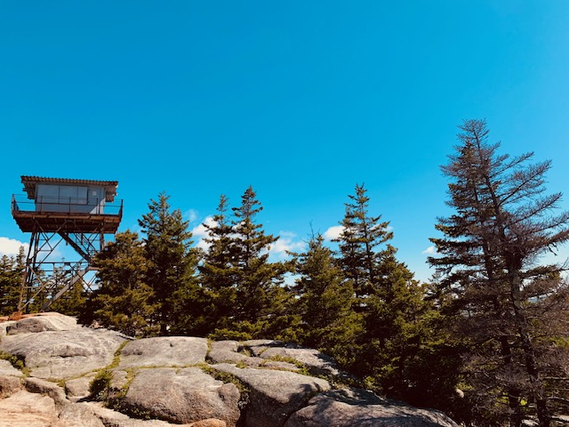
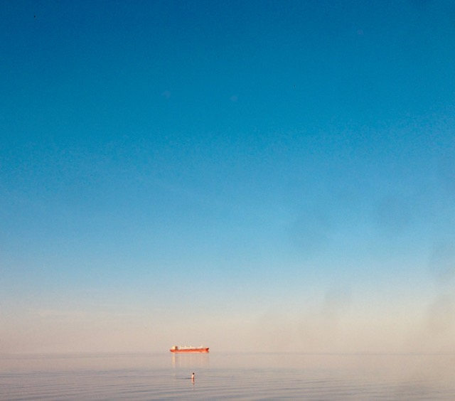
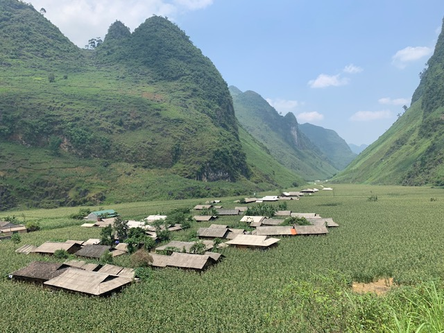
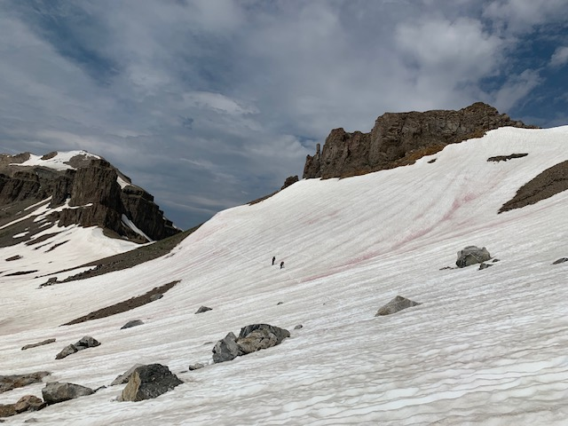

My running route is a well trodden path so I cannot say what exactly drove me to leave it that grey morning so long ago. I can only endeavor to describe the ordeal so that it might save another runner the anguish it has caused me. Let me begin with the closing of my apartment door at the age of 26; I can say at this point the mania had not yet overcome me as I carried tucked a key in my bright red jumper and so must have planned to return. The first mile seemed benign, though I slipped and skittered my way towards the river. What happened next betrays an otherworldly illness which I will not attempt to explain.

When I reached the river I did not stop nor turn around. Instead, I merely slowed and stared into that undulating, swollen body of water. The argent surface returned no reflection. My conscious mind told me that to enter and slip below the current would mean death in seconds, not minutes. Yet I waded in anyway, feeling an electric numbness anesthetize my skin. Nobody saw this futile act but if they had the  sight would have appeared suicidal. I simply walked. I walked until the water rose above my knees, punched my chest, and poured into my nose and mouth. I walked until my eyes stung with the salty runoff and my hair waved gently backwards buffeted by the eddies around the shore. I was not done running.

Slowly, arduously, I planted my feet and pushed against the silty bottom to make my way upstream. I heaved past a downtown that hadn't recovered from the last calamity. I passed this impoverished city that wants so badly to be more than it is. I passed visions of pastoral capitalism and cubicles and frigid parking garages. Weaving through the monolithic locks and brutalist dams I blazed a sandy, underwater trail northward because no alternative occurred to me. When the river began to dwindle I found myself at the quiet shores of the headwaters, at what appeared to be a campground still resting in winter repose and waiting for the idyllic, verdant spring. I would never see it.

The miracle of my survival thus far did not register. Thinking back I must have endured on a single breath for a distance of two hundred miles. Despite this, I continued down hastily paved trails where asphalt blended into the grass. I ran along side the ceaseless highways to a port city on an even colder body of water. Still, I did not stop. I only paused to consider why I was running. Something compelled me. A fleeting vision ahead -- just a speck on the horizon. What was it? As I watched it disappeared through an icy membrane. We'd reached the ocean shore.

I cut myself on the jagged ice as I pushed into and through the crystalline water, sinking deeper into the briny abyss. The river paled in comparison to this fathomless depth, but this time the bottom offered a hard surface. Worn shoes found purchase on ancient basalt and I made good progress. It has here, in this historic arena that I glimpsed my target again. The sun pierced the water between shifting ice floes and I saw him running east. I'd chase him this way for months. 

My body, sodden and wrinkled, was heavy. Engorged skin split softly open, and I found myself in a vast and lightless desert. The pressure here stiffened my joints until I could barely move, but panic drove me to the opposite inclination; I lost myself. Blind, stumbling, my mind crumbled in the complete absence of stimuli. When I eventually tripped and fell face first into the benthic ooze my first reaction was complete terror; when I found the offending object, a piece of my mind returned once more. Palpitating blindly in the inky blackness I found a smooth, round object extending forward. Hand over hand, I hauled myself along this newfound lifeline until, almost imperceptibly, the ocean floor tilted against the minute sensation of gravity and light once again filtered down to my weary eyes.

I released the cable once my vision returned and swam upward. I emerged after a year submerged to a new country. What was left of my clothes nearly disintegrated so that on the sunbaked coast I was almost naked. I could no longer run, but I walked a painful, uneven gate until I recovered. He was not much further ahead. I could now make out form, limbs, a body. This stage blends together in my mind; I am not sure I can separate the details nor arrange them chronologically. I remember great cities of stone and glass; castles, boats, and mountainous passes that broke my spirit and sand that seared my skin. There is a distinct period of intense, jungle heat and that steamy vapor clung even as I plunged back into the horrid ocean. I was only a mile behind him now.

A deep depression pervaded me then. Conditions were no different than before, but even in my exhaustion I was aware that it would be my longest trip yet. I receded into a corner of my mind and watched. Relief and deception in the form of seamounts; prismatic corals sheltered exotic creatures; the sensation of disbelief as the continental shelf loomed once again. I climbed, accelerating. I am picking up speed through the southwest, arms extending, chest pumping, I am finally sprinting.

It isn't clear where the finish line is but I'm closer than I've ever been to him. Mere feet separated us, and I catch a glimpse of my thinning hair and look down for the first time to find my skin sagging and torso skeletal. Suddenly, the route snaps into place and becomes familiar. I reach out for his wrist, wrapped in nothing but a faded red ribbon. My fingers wrap around those thin, taunting bones and I clench them tight. We slam to a stop and fall, but when I get back up I find that there was only ever me.