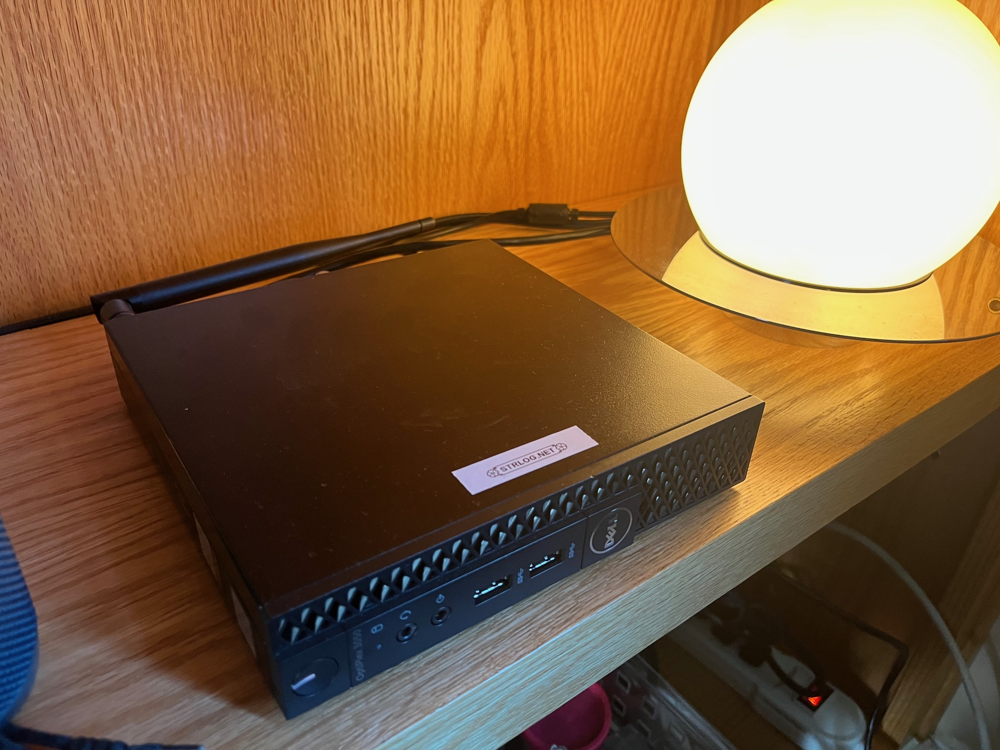

I am happy to say my blog is back online, with a whole host of changes since the [initial setup](https://www.strlog.net/2020-10-01) went live back in 2020. I shut it down somewhere in 2023 due to a mix of boredom and my dismay at Salesforce purchasing (and raising the prices on) my prior SaaS provider, Heroku. This November I decided to get things running again and to do as much of the setup as possible both locally and manually.

Hosting a static website seems a basic task in 2024, but I found the process to be very instructive. I'll provide a a brief rundown of how my data ends up on your computer -- hopefully simple enough for the layperson but not too tedious for the technologist:

1. You type www.strlog.net into a web browser.
2. This request is translated into an IP address through the [Domain Name Service](https://www.cloudflare.com/learning/dns/what-is-dns/). The DNS process has many steps, but my intervention begins with a DNS provider. I've chosen Cloudflare for this task.
3. For convienience I also chose Cloudflare as my [registrar](https://en.wikipedia.org/wiki/Domain_name_registrar); I purchased this website name, or Universal Resource Locator (URL) from them for a fee and yearly renewal.
4. Records I've given Cloudflare resolve (transform) the given URL into my external Internet Protocol address (IP address). The web request is passed on to this IP address.
5. At this step the web browser has made contact with the Optiplex server above, and the request is recieved by [nginx](https://nginx.org/en/), a program that passes the request from a machine port to my own code.
6. My code is written in [NodeJS](https://en.wikipedia.org/wiki/Node.js), a framework which permits Javascript to run in capacity as a server. Traditionally this language was only used on the "front-end", e.g. on the browser. This code generates the HTML that forms the website structure and style. It is passed back down the chain to nginx and then to your web browser.

Some other configurations were necessary as well: 
- My external IP address is updated with Cloudflare by a periodic running background process (a [daemon](https://en.wikipedia.org/wiki/Daemon_%28computing%29)) on the machine above. This is known as "dynamic DNS". This is necessary because most IP addresses are not fixed like a home address but rather recycled frequently. I chose [ddclient](https://github.com/ddclient/ddclient) for dynamic DNS. 
- Normally a router would simply reject any incoming requests for security purposes. For this reason I've configured my router to accept these requests. Modern consumer routers host a small, local webserver for configuration tasks, so no additional software was necessary.
- Similarly, I also had to explicitly allow these requests on the host machine's [firewall](https://en.wikipedia.org/wiki/Firewall_%28computing%29). In this case Linux Mint ships with a firewall called [Uncomplicated Firewall](https://help.ubuntu.com/community/UFW).
- Requests are passed not just to an IP but to an IP and port number. You can think of this as a warehouse which has both a street address and multiple available docks for trucks to ship  to. Simply providing the street address would be insufficient. This is further complicated by the fact the certain low-level ports are "privileged" and running [userland](https://en.wikipedia.org/wiki/User_space_and_kernel_space) programs on them is restricted. For this reason nginx also acts to bridge these low level ports and map them to higher level, unrestricted ports on the machine where the program is actually run.
- The server shown at the beginning is small, less than a foot wide and 4" tall. I did not want to grow this footprint by connecting all the necessary peripherals like mouse, keyboard, and screen, so I use a remote desktop program to interface with it over my existing desktop setup. I chose [NX](https://en.wikipedia.org/wiki/NX_technology) for this task.

Setting up a static blog is an uncomplicated task at face value, but the process was repleat with caveats. I found that doing this work manually was worthwhile and lead to a deeper understanding of the technology involved.

There's a bunch left to do -- the site is presentable on mobile (i.e. screens under 800px) but it is not fully navigable. It is not, for example, possible to browse topics. Fixing this will require a deeper rework of routing and the API so I've been putting it off for some time. Also, these posts are written in Markdown, a lightweight language for styling text. I'm serving them with my own Markdown 'parser', but it is just a series of regex replace calls rather than a context-aware parser. For this reason you'll notice the quirks and limitations until I get around to writing a fully-fledged markdown parser. One very visible one is mishandling of parentheses in URLs, which means I have to manually edit them with [percent encodings](https://developer.mozilla.org/en-US/docs/Glossary/Percent-encoding) to avoid extra parentheses from showing up.

They say a project is never finished, but hopefully this one isn't abandoned.