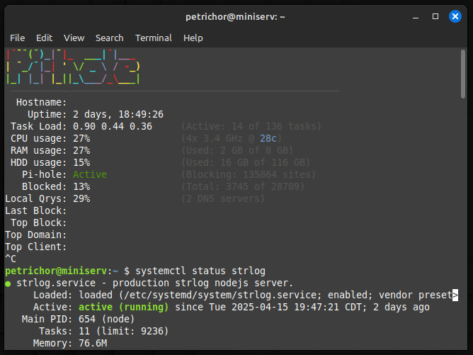
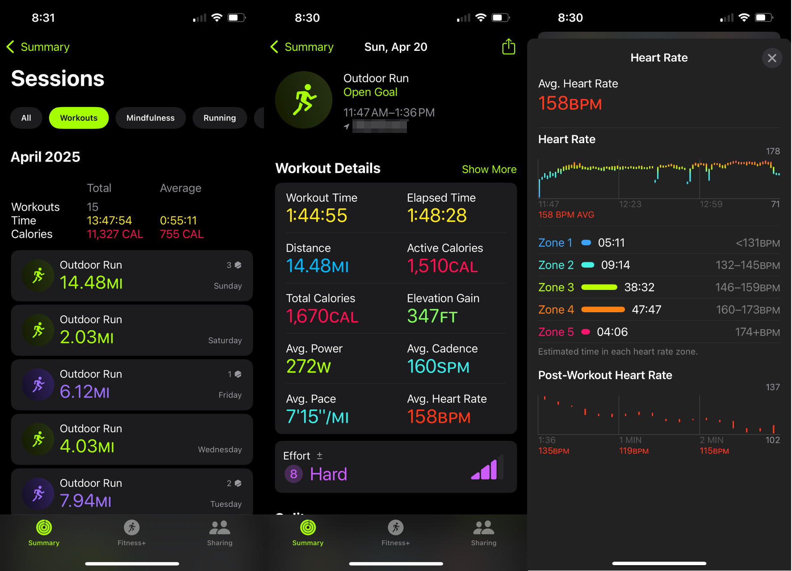

Another roundup... all the news that's fit to print.

## strlog updates
I am happy to report that strlog should now be fully navigable on mobile! There are likely still quirks, but every page should be reachable. I've also done some work with the physical strlog server after an outage. During some unrelated housework it seems I cut power to the breaker circuit that the machine was running on. The outage itself could have been brief as power was cut for only an hour, but I did not notice this blip so the machine remained offline for over a week. Nothing substantial for a blog with single digit readership, but it was inconvenient timing as it is listed on my resume as a hobbyist project, and I happened to be applying to jobs at the time. Wouldn't it be great if the machine was smart enough to restart the tenant processes after an outage?

There are various scripting options for this, but it turns out the host operating system, [Linux Mint](https://linuxmint.com/), ships with a great choice for this called [systemd](https://en.wikipedia.org/wiki/Systemd). It can monitor processes for you, restart them automatically when they fail, and even has target points at which it can start processes. Instead of launching strlog on boot, when ports and network connectivity might not be established, it can be instructed to wait for these resources to become available.

I've also hardened the server a bit further as the world wide web can be an unfriendly place. One piece was configuring [fail2ban](https://github.com/fail2ban/fail2ban). Fail2ban is a simple tool that just watches your log files for untoward behavior. In my case, I am banning IP addresses that request malicious pages. For example, this blog is run entirely off NodeJS and written in Javascript, so it is safe to assume anyone requesting a webpage page written in another language, like '.php', is fishing for an exploit. There were a few other constant patterns, like bad actors sniffing for Wordpress admin pages, trying to backtrack up the file hierarchy, or requesting a large number of pages in an unhumanly short amount of time.

Lastly, there's now [Pihole](https://pi-hole.net/) instance on the machine too. For those unfamiliar, it works on the [DNS level](https://en.wikipedia.org/wiki/Domain_Name_System) -- the bit of the router that converts websites into IPs -- to block ads at the source. It's different from the other ad-blockers because it works on any device connected to the router, not just on a single device. Now even guests can browse the web on my network with fewer ads! Per the Pihole dashboard, that amounts to 13% of all web traffic to date! On top of this I'm running [uBlock Origin](https://ublockorigin.com/) and [SponsorBlock](https://addons.mozilla.org/en-US/firefox/addon/sponsorblock/). With this triple-threat of adblocking I rarely see an ad anywhere on the web these days. Google has even gone as far as to disable uBlock Origin on their Chrome browser. The fact that the world's foremost web advertiser has tried to quash uBlock Origin is, to me, a badge of honor. What a great piece of software.

Meanwhile, on my desktop computer I've switched from Canonical's [Ubuntu](https://ubuntu.com/) operating system to [Debian](https://www.debian.org/) for a few reasons. Debian is one of those projects that has steadily improved 5% every year for 20 years, and is now a stellar operating system that is as easy to install as Windows, more customizable than macOS, and consumes fewer resources than either. Some websites report that Ubuntu is "easier to use" or "more beginner-friendly"... I challenge them to list specifically what makes that so. Debian also respects the user in various was that macOS and Windows do not, privacy not least among them. It also let me try out KDE Plasma, a different graphical desktop environment, which has been a great switch. Technically I could have done this without leaving Ubuntu, but it was a good reason to make the jump. Also, [dozens of reddit posts](https://old.reddit.com/r/cscareers/comments/199akp4/software_engineer_interview_at_canonical/) detail some horrible treatment by Canonical of prospective candidates. Having just gone through this process myself, it hit a bit close to home. More on that below...

## job hunt
At the end of last year I was feeling rather burnt out in my current software job. I could say quite a bit about that, but I will limit it to the following points:

1. Our architecture and processes make getting anything done extremely difficult
2. I was getting nothing but 2-3% salary bumps year over year
3. There was no obvious off-ramp from my current hyper-specialized, long-running project

I had a vision of working somewhere within my city within commuting distance of my house, and so with nothing but proximity and salary goals in mind I began hunting. Somewhere around September of 2024 I began tracking my application in a spreadsheet which grew into multiple pages... suffice it to say the end of 2024 and beginning of 2025 were not great times to be looking. Furthermore, nearly all jobs in my state are in the suburbs. It's a sad state of affairs, as my downtown ceded the entire core zone to office buildings that corporations have now abandoned. 

Anyway, about 120 applications and 10 interviews later, I recieved an offer from a company extremely similar to my current company that we'll call $directCompetitor. The salary offer was a 10% increase over my current, with a hard 4 day in-office requirement. Coming from $currentCorp, which still permitted off-the-books remote work, it was *good* but not *great*. I was tired of looking however, so I committed. Before I accepted the offer I brought it to my manager at $currentCorp, fully expecting to be let go at the meeting. To my surprise they offered a 17% raise to stay, effective immediately, something $directCompetitor wasn't willing to match. So, what's the end of the story? I'm still in the same old desk, doing the same old work, for 17% more money. Things could be worse! 

## running
I'm back on a training plan, targeting a half-marathon in two weeks and my second marathon in June. As usual, I've set borderline impossible goals for myself which have made training quite strenuous. Coupled with a nascent joint injury success is a dubious prospect. However, I've been enjoying the runs as of late, and I have to say I am impressed with the state of the modern running shoe. I've been buying backstock of the same model I've run on for years, but broke this streak recently and splurged on a new model. Modern running shoe foam provides a remarkable amount of cushioning, and the shoe is also remarkably lightweight compared to the models of yore I remember using in high school. I also noticed a significant improvement in my times when I tried out a 'plate' shoe. They're a fascinating development, and one of the only advancements in running technology of my generation, which began with Nike's VaporFly. The international olympic commitee [nearly banned plate shoes in Tokyo](https://en.wikipedia.org/wiki/Nike_Vaporfly_and_Tokyo_2020_Olympics_controversy), but they remain legal for road races.

The second thing I've learned is the importance of fueling. There are a number of options to do this on long runs, but as most runners know it is important to consume some sort of carbohydrate when running longer than ~45 minutes to avoid "the wall", or the point at which your body exhausts the cheap glycogen it preferentially burns as fuel and is forced to dip into less easily converted fuel sources. Some runners eat candy, some bring liquids, I've found I prefer the [Gu brand](https://guenergy.com/) and [SIS brand](https://www.scienceinsport.com/eu/go-isotonic-energy-gels-sis) of sugar packets.

Lastly on this topic, I picked up an Apple watch for metrics. A single trial with Apple Fitness' paced mode informed me that it was obviously not designed by anyone who runs long distance. On a single ten minute segment it prompted me 15 times to speed up or slow down by as little as one second per mile, and there's no setting to change that frequency. The open run and interval modes work just fine, however, and provide feedback at much more appropriate one-mile intervals. The stats are interesting, but I don't get much value out of them beyond bragging rights.

## time tracking
I listened to [an interesting episode](https://www.relay.fm/cortex/160) of the [Cortex podcast](https://www.relay.fm/cortex), which features the guy behind the [CGP Grey YouTube channel](https://www.youtube.com/user/CGPGrey). On this episode, the two discussed their favorite phone apps "briefly" in what became a four hour episode. Out of everything covered, I was only interested in the idea of time tracking. The concept is pretty simple, and consists of measuring where you're spending your time with the option of setting goals on top of tracking. These goals can be either maximum time limits on stuff you think you do too much, or minimum values for stuff you want to do more.

The first decision you have to make is how exactly *how* to use a time tracker. The obvious first draft is to track everything -- every minute of every day, which is how [my chosen iOS app](https://timelines.app/) is intended to be used. It features various 'timelines', which are just individual timers that can either be paused or ticking up. Starting one pauses the others. The idea is to have one tracker running all the time, with a weekly report out on goals and totals. After that, you can consider what needs to change in your life to accomodate your goals. After a few months, though, I was starting to find this exhausting. I was frequently backtracking to correct the record and adjusting time values. Now I only track stuff pertinent to a smaller set four goals: language learning, deep-focus work, personal projects and meditation. I dropped all other timelines, which used to include exercise, sleep, transit, and more. I originally chose those goals because they were both broad and numerous enough to encompass my entire life, but in the end I decided that tracking these did not offer much value because they are all either not optional, not difficult, or not a behavior I sought to change.

I'll try to find some sort of coherent theme for the next post.