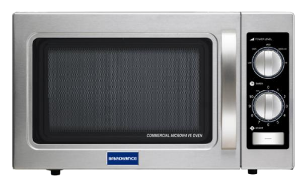

An interface is a trade-off between the overhead of learning the interface and the complexity it abstracts from the user. With this metric in mind, we gauge the value of the an interface. Some good interfaces include the steering wheel and dashboard of a car, which successfully abstract the mechanics of driving, the keyboard and mouse, which successfully convey the desktop metaphor, or even something as simple as an elevator call panel that abstracts the scheduling algorithm of the elevator bank into a single up or down button press.

We can also use this metric to condemn the bad interfaces of the world. A category despicable in every way, from electronic waste to user frustration. The world is absolutely rife with bad interfaces, and you know you've hit one when you walk away from the interfaced object asking, "why in the hell would they do it that way?" Out of all the bad interfaces in the world I would like to proffer the modern residential microwave as one of the absolute worst -- an interface that takes two simple parameters and explodes them into a dizzying array of useless and confusing buttons. 

When I say "two simple parameters" it might not even be apparent which I am referring to, but consider that the typical microwave has only two *real* parameters. These are the cooking time and the [duty cycle](https://en.wikipedia.org/wiki/Duty_cycle), which in sales parlance is usually called "power level". Even that renaming betrays confidence. To call it a power level suggests that the [magnetron](https://en.wikipedia.org/wiki/Cavity_magnetron) is capable of variable output, but it is not. It only cycles the power on and off.


With the above image as a reference, let's review the interface. Starting at the top, we have a digital clock, and I am already upset. A microwave is not a clock, and it does a poor job of keeping time. For most of us, it needs biannual adjustments to stay accurate which makes it more of a chore than a help. The same can be said of clocks embedded in ovens, fridges, and cars. To keep time reliably you need a periodic connection to the internet. Ergo, if you are not internet-connected, and a microwave definitely should not be, then you shouldn't try to be a clock, either. Whoever decided that every single appliance needs to also be a clock has earned my distain.

Moving down a section we begin with the most upsetting sections of all, labelled 'quick touch' and 'auto'. How exactly these differ is completely beyond me, but it doesn't matter. The functions are entirely useless anyway. I ask you, dear reader, have you ever used anything between the clock and the time buttons? The first three offer to cook us popcorn, potatoes, and 'dinner plate'. What is it doing when you select these? It is impossible to know without running the entire cycle and listening to the machine. This breaks the contract of the interface! It has made your life more difficult than simple. It should not exist.

Those first three are bad enough, with 'dinner plate' being the worst descriptor of all. Does it not matter at all what is on my dinner plate? Obviously it does, but the machine doesn't know or care. Below these we have the 'auto' section, which presumably uses some kind of sensor to detect the heating status. If you've ever tried to use one of these you probably either gave up trying to guess the function or learned by trial that they do not work. These items aren't even sorted in any kind of sensible way. Vegetable, pizza, frozen entree? What exactly does 'reheat' do that would be different from an initial heat? Isn't almost everything put into a microwave being reheated anyway? Defrost we can guess uses a lower duty cycle, e.g. lengthing the time it takes to deliver the same amount of energy into the food, but we also have soften/melt, the singular implied dual purpose setting. 

The final function row before the numerals is Cook Time, Cook Power, and Cook. Stupid. Nobody in history has ever touched these awful, plastic buttons with their unsatisfying lack of tactility. No, you go immediately for the numerals below them. As an aside, when you touch "Cook Power" on my unit, it flashes the following message across the screen an excruciatingly slow pace:
```The ... Current ... Power ... Level ... Is ... 10 ... Click ... To ... Adjust ... Power ... Level```
Thankfully I am a very balanced individual, but I fear for the weaker man who might possibly be driven insane by such a display of engineering incompetence. God forbid. As a second aside, on my model, the first 6 numerals can be pressed to start cooking for that number of seconds times 10, e.g. 3 corresponding to 30 seconds. However, the makers in all their wisdom ceased this functionality silently after 6. Obviously it would be too confusing for the user to convert from 70 seconds back to minutes and seconds.

By now you'll either have passed judgement upon me as an insane man, or you're nodding along [like Jack Nicholson in Anger Management](https://youtu.be/jA_j1WNDd_Q?t=48). Let's wrap it up.

The most important point here is that the numerals themselves are a bad interface. A microwave user wants to do one single thing, which is start cooking for a period of time. The correct interface choice for such input is a dial. It is faster, it is obvious to use, and it does away with the 27 buttons above it while delivering a better experience.



The appliance industry, meanwhile, [is focused on making the experience even worse](https://x.com/designslop/status/2000672210478944516).