How is it possible that commercial rents can be simultaneously high, while the successful businesses that drive it can sit directly next to vacant lots and derelict buildings? Using East Lake Street in Minneapolis as a microcosm example, let's explore what is happening with these properties to see if we can glean any broader insights about this midsized city and others like it.

Lake Street runs the entire width of Minneapolis, but I'm going to focus on the eastern portion that runs about a mile and a half between [Minnesota State Highway 55](https://en.wikipedia.org/wiki/Minnesota_State_Highway_55) and the Mississippi River. As an aside, MN 55 is dedicated to ["Skipper" Olson](https://en.wikipedia.org/wiki/Floyd_B._Olson), a left-wing populist, three-time governor, one-time [shabbos goy](https://en.wikipedia.org/wiki/Shabbos_goy), and member of the [Wobblies](https://en.wikipedia.org/wiki/Industrial_Workers_of_the_World). The primary source of information will be [Hennepin County's Property Map GIS system](https://gis.hennepin.us/property/). Also useful in this research is the fact that Google Maps street view has not been updated since 2020, wheras Apple Maps street view has been updated, providing great comparison images.

## a tour of east lake street
### minnehaha mall

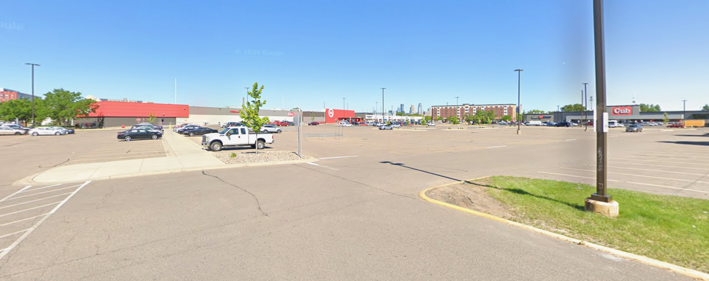

> 2500 Lake St E Owner: Thomas Burton Trustees Estimated market value: $10,716,000 Total net tax: $369,289.69

Our tour will run east to west, starting on the eastern end with a typical Midwest strip mall engulfed by a typical [enormous parking lot](https://maps.app.goo.gl/wduAHbqvBeL8nvfz8) that has never, ever been full. It looks like this lot [was considered for development](https://www.startribune.com/development-unlikely-at-lake-street-target-parking-lot/247877321) at one point in 2014, but it didn't pan out because the landowners were simply uninterested. We can start our discussion here -- when this mall first went up in 1976 the developer was likely by law required to dedicate a certain portion of their land area on parking lots. Thankfully, this regressive policy was struck from law in 2021 as part of [Minneapolis' Year 2040 Development Plan](https://minneapolis2040.com/implementation/parking-loading-and-mobility-regulations/). It also places some restrictions on car-focused retail like car shops on land near metro stations. We'll get more into that land use later.

I suspect my scant readership is already in agreement on this topic, but for the uninitiated [parking minimums](https://en.wikipedia.org/wiki/Parking_mandates) shape cities in unfortunate ways. It may be convenient to always have a parking spot available, but the wide expanses of asphalt essentially hollow out urban cores, leading to reduced tax revenue, inhumanly size (read: car sized) urban landscapes, and reduced investment in transit. You can also view them as a "hidden subsidy", because the ability to drive around a private vehicle and park it anywhere you like, for free, is something we take for granted. Abolishing those parking minimums enables developers to *begin* building the kinds of dense and pleasant urban spaces that Americans adore in Europe. The other issue is the long shadow cast by this policy: even though European style development is now legal, it has only just begun, and there is still little incentive for existing property owners to re-develop already steady income streams. To address *that* problem, some kind of tax scheme is usually suggested. There's the carrot of reduced taxes, and the stick of something like [Land Value Tax](https://en.wikipedia.org/wiki/Land_value_tax). Radicals will point to eminent domain and [Georgism](https://en.wikipedia.org/wiki/Georgism).

Notably in 2020, this entire mall was looted and/or burned due to proximity to MPD's [Third Precinct building](https://en.wikipedia.org/wiki/Arson_damage_during_the_George_Floyd_protests_in_Minneapolis%E2%80%93Saint_Paul), which we'll visit next. In total, [unrest damages](https://en.wikipedia.org/wiki/Aftermath_of_the_George_Floyd_protests_in_Minneapolis%E2%80%93Saint_Paul) were second in US history only to the Los Angeles 1992 riots. We could say the most obvious policy failure to shape Lake Street in my lifetime was ineffective police oversight. It has certainly done the most to physically change the landscape, as we will see.

### a democracy center

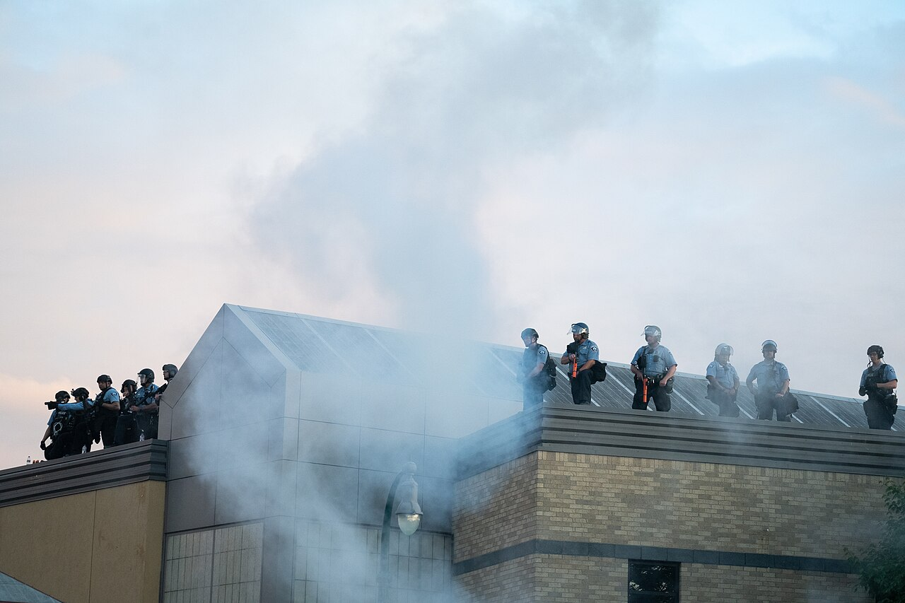

> 2300 Minnehaha Ave Owner: City of Minneapolis Market Value: Not assessed 2024 Taxes: $2,523.52

This lot is the site of the Third Precinct building which was looted and burned in the summer of 2020. It was left more or less unimproved from that state until 2023, when community feedback was solicited, and in early 2025 it was announced that it would serve as the *Minneapolis Democracy Center*, including a polling place, election warehouse, and general community space with initial tenants expected to be restaurants [Mama Sheila's House of Soul](https://mamasheilas.com/) and and the nonprofit [Change, Inc](https://changeinc.org/).

As another aside, I was in the crowd the night the precinct (and the entire surrounding block) went up in flames. I left as the first fires started and a rubber bullet passed by my eye a little too closely. It is hard to describe what that summer was like -- the air was thick, with humidity and smoke, politics and rage. It was not inconcievable to think the city was going to destroy itself in a fit of [Culture Fugue](https://en.wikipedia.org/wiki/Stars_in_My_Pocket_Like_Grains_of_Sand). At the time I was living in a high-rise apartment and was seriously considering how I would escape from the sixth floor if my building went up too... but I digress.

I don't have much commentary on this property except to say it is somewhat dismaying that it took the city six years to complete construction, and that is still only the *expected* completion date. There was speculation that it was a revenge tactic by the city or mayor; I think it is more likely the usual red tape coupled with it being an emotionally charged project. Regardless, I'll be happy to see the building rehabbed and reoccupied in the near future.

One last aside; in Japan we saw a number of [Kōban](https://en.wikipedia.org/wiki/K%C5%8Dban) which is an intriguing concept to me. Perhaps the smaller Kōban lends itself better to the "human-scale" city of my dreams than the mere five large precinct buildings we have today. They certainly seem more approachable.

### 2600 block north

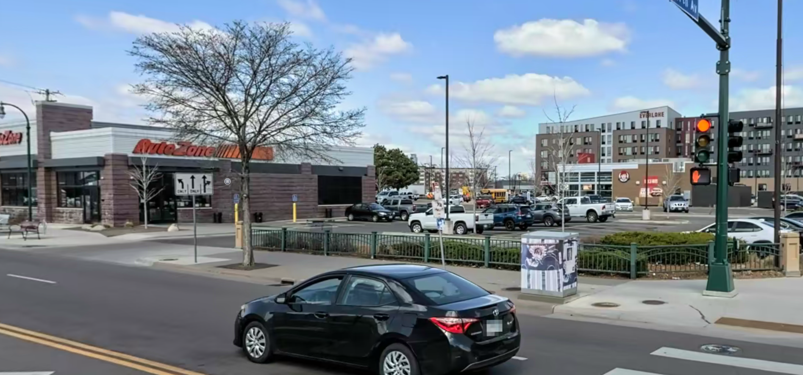

> 2610 Lake St E Owner: Longfellow Crossroads Llc Market Value: $2,400,000 2024 Taxes: $89,995

This entire block is an Autozone. It also burned down in 2020 and was rebuilt. The best thing I can say about it is that it provides a few jobs and pays taxes. I wonder if this location would be approved today under the Minneapolis 2040 Plan, given the restriction against automotive businesses using transit adjacent land. The only interesting tidbit I have on this property is that ["Umbrella Man"](https://en.wikipedia.org/wiki/Aftermath_of_the_George_Floyd_protests_in_Minneapolis%E2%80%93Saint_Paul#%22Umbrella_Man%22) started the looting at this AutoZone, something I witnessed in person. 

### 2600 block south

This block is split into four parcels, and all but the westernmost is owned by M & E, with taxes paid by a single family address south of Bde Maka Ska Lake.

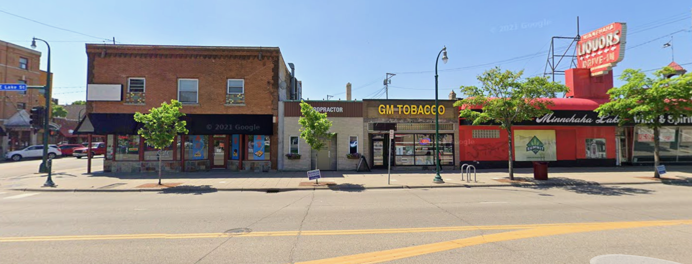

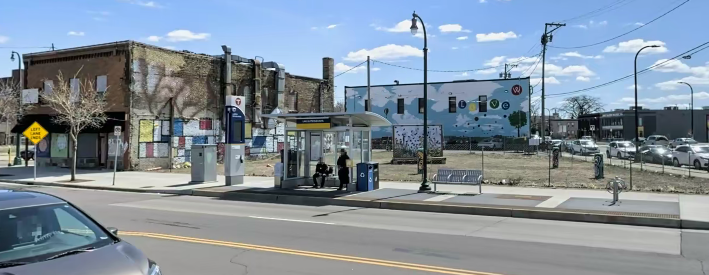

> 2613 to 2621 Lake St E Owner: M & E Inc Combined Market Value: $156,700 Combined Annual Taxation: $5,503

The remaining parcel, containing a condemned building, is registered to an individual as well.

> 2629 Lake St E Owner: Shoa Motamedi Estimated Market Value: 950,000 2024 taxes: $29,396

The south side of the street is in an unfortunate state. A 2019 street view image shows [Midori's Floating World](https://www.floatingworldcafe.com/), a chiropractor, a tobacco shop, and the infamous [Minnehaha Liquors building](https://www.forbes.com/sites/jackbrewster/2020/05/29/minneapolis-protests-burst-into-flames-photos/). Another victim of police violence and ensuing unrest, the entire block has been left fallow. Midori moved, but the remaining buildings are gone except for the shell that once housed Midori's. The Minnihaha Liquors owners [resolved to rebuild in 2021](https://www.fox9.com/news/renderings-of-damaged-lake-st-liquor-store-revealed-10-other-businesses-to-receive-grants), but no progress has been made on the site. 

To me, this result is another example of poor policy. One of the M&E registered lots is paying less than a thousand dollars per year in taxes, and the entire combined taxation of the M&E parcels is actually *less* than I pay as a single family homeowner. This provides no economic incentive to improve the lots -- it is enough to sit back and wait for their sale value to increase. In the meantime, this land is a blight for those who live around it. My proposed solution would be that land value tax, because by taxing the property regardless of improvements, improvements are incentivized. The parcels are right on a metro line, close to downtown, and sees a significant amount of traffic every day. A functional business should be able to turn a profit here, yet it sits unimproved. As for the Motamedi lot, I am perplexed. One would think $30,000 in taxes is incentive enough to either improve or sell the lot, unless they've been using the [secret loophole of not paying taxes](https://mn.gov/tax-court-stat/published%20orders/2020/Motamedi%20v%20Chisago%20Co%2001-15-20.pdf). Google also shows a [2021 court case](https://dockets.justia.com/docket/minnesota/mndce/0:2021cv02633/197945) against O'Reilly Auto Parts in the same name with no further details. 

### 2700 & 2800 block north
The south block is double-wide, so we'll do this one as a pair. 

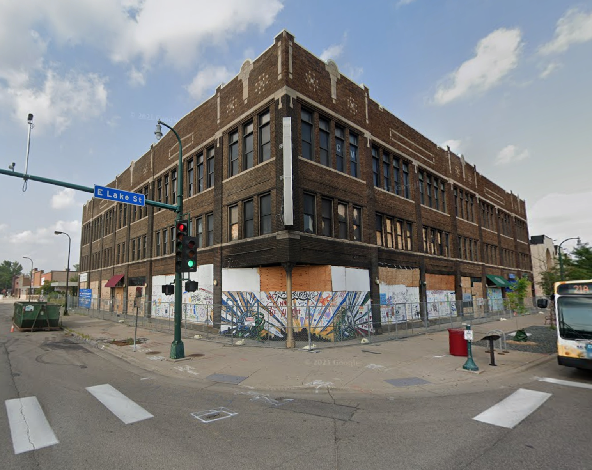

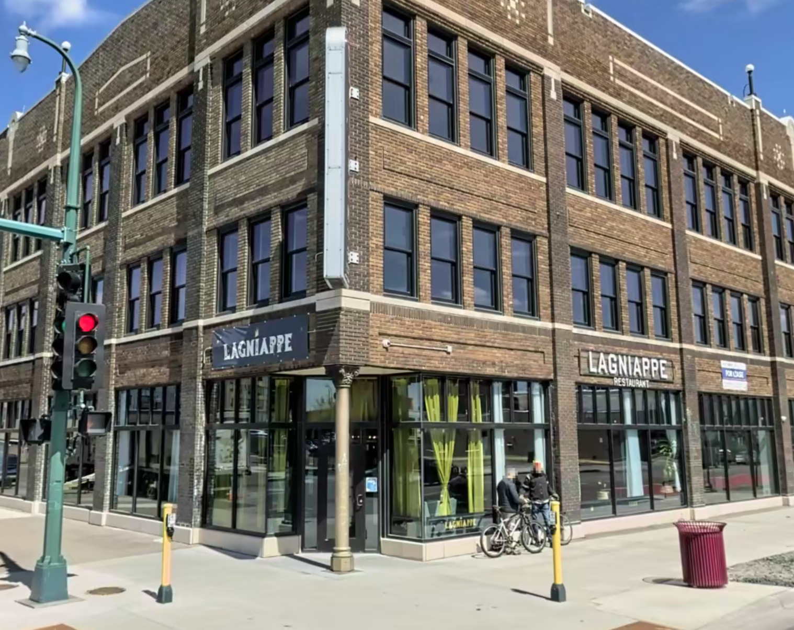

> 2708 Lake St E Owner: Coliseum 2708 Building Owner Llc Market Value: $2,521,400 2024 Taxes: $224,495

The Coliseum Building is one of the success stories of Lake Street. The building dates back to 1917 and is now a multi-tenant space completely renovated after a fire and looting damages in 2020. It is open today for commercial leasing, though one of the first lessees [went under in 2025](https://mspmag.com/eat-and-drink/foodie/chris-montana-du-nord-lagniappe-closes-lake-street/). It's a cool building connected to transit -- if I had a small business, I would be very interested in leasing here!

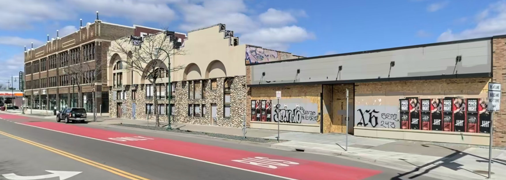

> 2716 Lake St E Owner: Mos Real Estate Llc (Hamoudi Sabri) Market Value: $266,500 2025 Taxes: $17,614.44

Next door, we have two lots worth of failures. Street view shows the Sabri building to the right vacant even *before* 2020, and it sits vacant and condemned today. In 2025, the landowner [permitted a encampment of unhoused persons](https://www.startribune.com/minneapolis-council-authorizes-lawsuit-to-close-landlords-private-homeless-encampment/601467245) to form in the parking lot before it became the site of a septuple shooting. I see no plans online for this property, and it frequently attracts deliquency that spills over to the library across the street. You can read the owner's interview with the Sahan Journal in September [here](https://sahanjournal.com/housing/hamoudi-sabri-minneapolis-landlord-five-things/). 

Color me unimpressed with Sabri -- the plan he pitched to the mayor to end homelessness seems very naive and does not address a fundamental problem with unhoused persons, which is how to handle the situations in which said people are *not* interested in moving to your supportive housing scheme. As another aside, this is another topic of interest I should like to properly research in a future post. How do the countries that enjoy more success in their efforts to end homelessness operate? What is the actual makeup of the unhoused population here, and what keeps them from accepting the housing that the city, county, and local nonprofits offer, assuming it is readily available?

> 2726 Lake St E Owner: Gray Dog Holdings Market Value:$1,092,500 2024 Taxes:$48,924

Curiously, the [Minneapolis condemned building dashboard](https://www.minneapolismn.gov/government/government-data/datasource/vacant-condemned-property-dashboard/) lists this as 2730 E Lake Street. Before 2020, it was a pawn shop, and like its neighbor it is also condemned today. It is not clear to me why this smaller lot and building has a valuation over four times that of Sabri's building above, except that it's a corner lot and comes with a smaller condemned structure to deal with. The windows and doors are currently boarded up, and the alcove entryway has been the site of frequent drug deals. The owner, Gray Dog Holdings, is registered to a single family home in Edina, MN.

> 2800 Lake St E Owner: 2800 East Lake Llc Market Value: $1,884,700 2024 Taxes: $67,792

This is now an empty lot. Prior to 2020 it was a US Bank branch. The single-purpose limited liability company that now owns it is registered to an address just a mile north on Franklin Avenue, which is currently Zipps Liquors. This seems like a time to interject that as an internet-snooping individual, I would love if commercial property owners were required to submit some kind of plan with their bids. Why has someone at Zipp's Liquors bought this massive lot? Do they plan to build a second liquor store? Is it just real-estate speculation? Did they actually pay almost two million for it? Questions abound.

### 2700 - 2800 block south

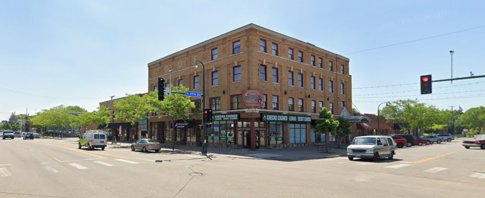

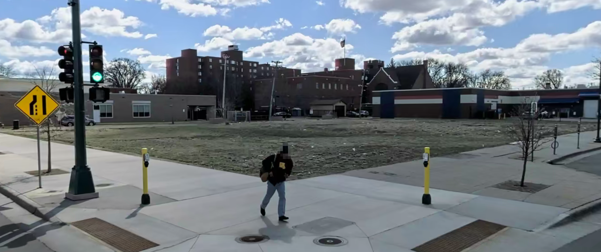

> 2709 Lake St E Owner: 2709 East Lake Llc Market Value: $405,800 2024 Taxes: $14,131.92

Prior to 2020, this lot was the site of a building with masonry spelling IOOF, indicating it was the home the [International Order of Odd Fellows](https://en.wikipedia.org/wiki/Odd_Fellows) lodge number 118, a freemason-style fraternal order in the early 20th century. It was last the site of a motley assortment of businesses, including a check cashing service, Integrated Staffing Solution, Town Talk Diner, Nuevo Rodeo Restaurante, and Addis Ababa Restaurant. It is now an empty lot with taxes paid by a business park address in Saint Paul.

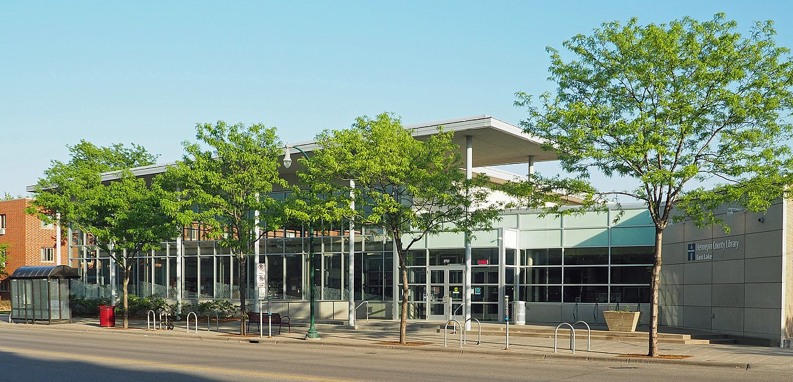

> 2727 Lake St E Owner: Hennepin County Market Value: Unassessed 2024 Taxes: $128.38

It's the [East Lake Library](https://en.wikipedia.org/wiki/East_Lake_Library)! Yay. Not a ton of investigation or commentary here either. What I will say is the surrounding derelict buildings and lots attract a lot of unhoused persons and drug use to the steps of this library, something that seems distinctly unfair to ask a librarian to manage. I'm also fascinated by the very small and very specific tax paid in 2024.

> 2805 & 2813 Lake St E Owner: Holy Trinity Lutheran Church Market Value: Unassessed 2024 Taxes: $1,173.75

This property is comprised of two lots owned by [Holy Trinity Lutheran Church](https://htlcmpls.org/). A single building spans the lots containing  [Trinity On Lake Apartments](https://htlcmpls.org/affordable-housing/) with 8 market rate, 8 affordable, and 8 special needs apartments.

> 2815 Lake St E Owner: Truher Llc Market Value: $125,800 2024 Taxes: $3,478.30

In a now-familiar story, this was a metroPCS before the 2020 and is now an empty lot. The taxpayer is someone headquartered at the East Side Arts Council & Gallery in Saint Paul, but as you can see they aren't paying much. This has been a recurring trend; the taxpayer being a single family home address or small local business park. Going into this research I expected to see real estate holdings like the Target/Cub lot.

> 2825 Lake St E Owner: The Volunteers of America in Minnesota 2024 Taxes: Unassessed 2024 Taxes: $1,616.33

This building is owned by the [Volunteers of America](https://en.wikipedia.org/wiki/Volunteers_of_America), which I've just learned was formed by a split in the Salvation Army leadership. Also, I've just learned that nonprofits and church properties pay token amounts of taxes. This is also surprising to me; I expected them to pay exactly zero dollars in taxes. 

This concludes part one of the project. Twenty blocks remain to the river... we'll see how far we can get! It may be necessary to hone in specifically on the problem properties and give the successful businesses shorter blurbs if I am to make it to the river before I run out of steam. As the research hopefully we can draw more conclusions about the current state of Lake Street, how so many lots have been left idle for over half a decade, and what might be done about it. I think the next string to pull is to try contacting these empty lot owners.